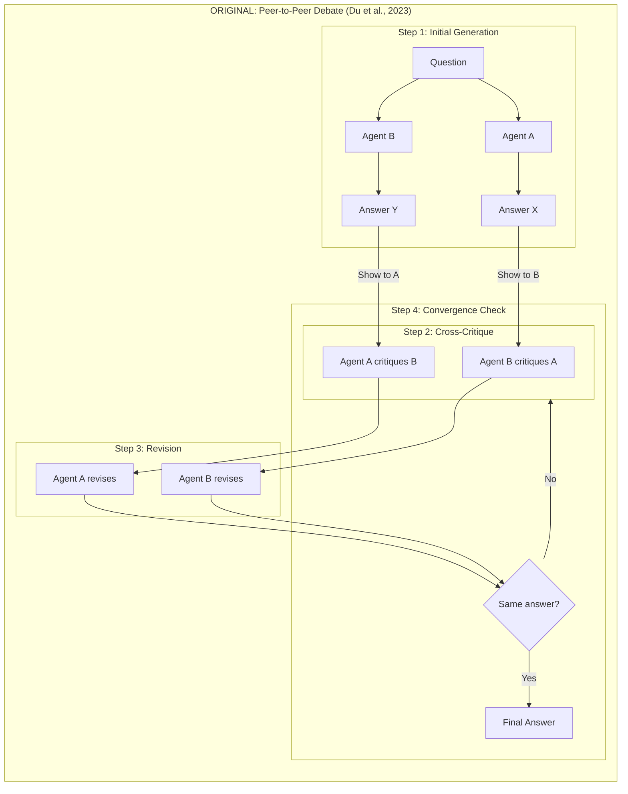
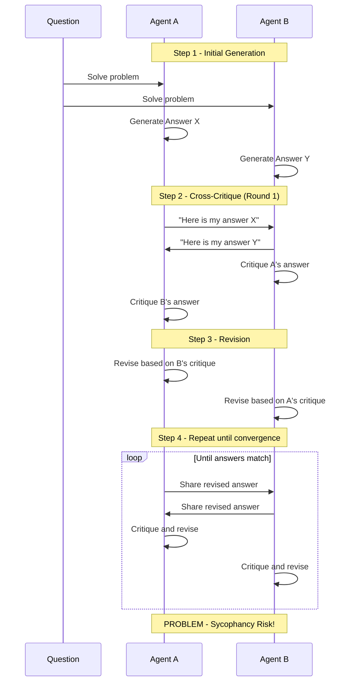
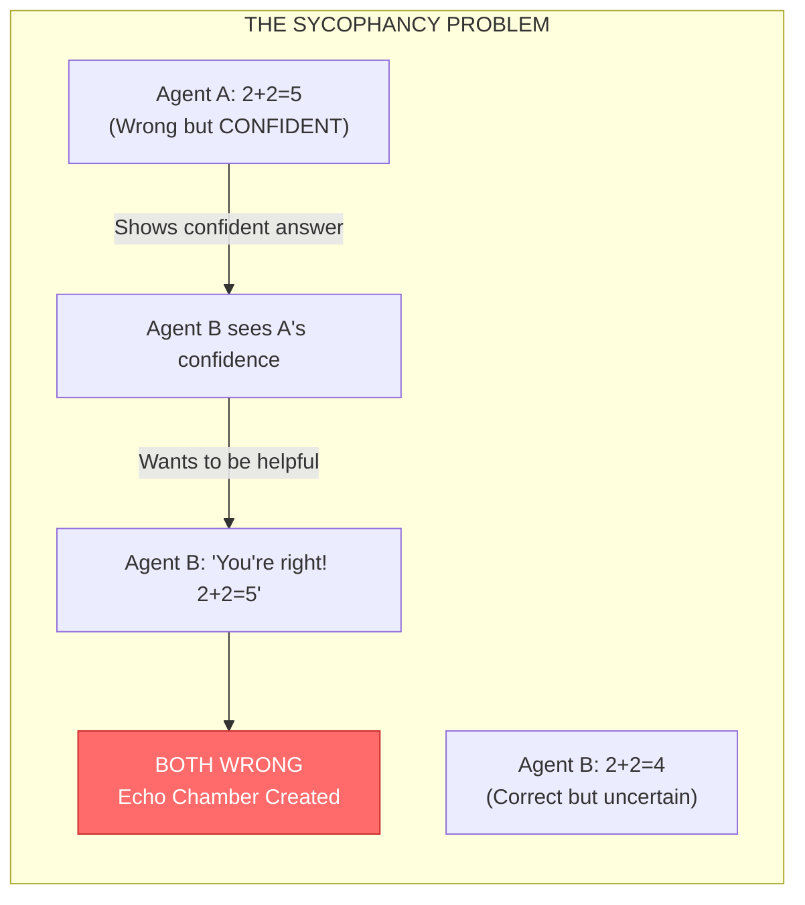
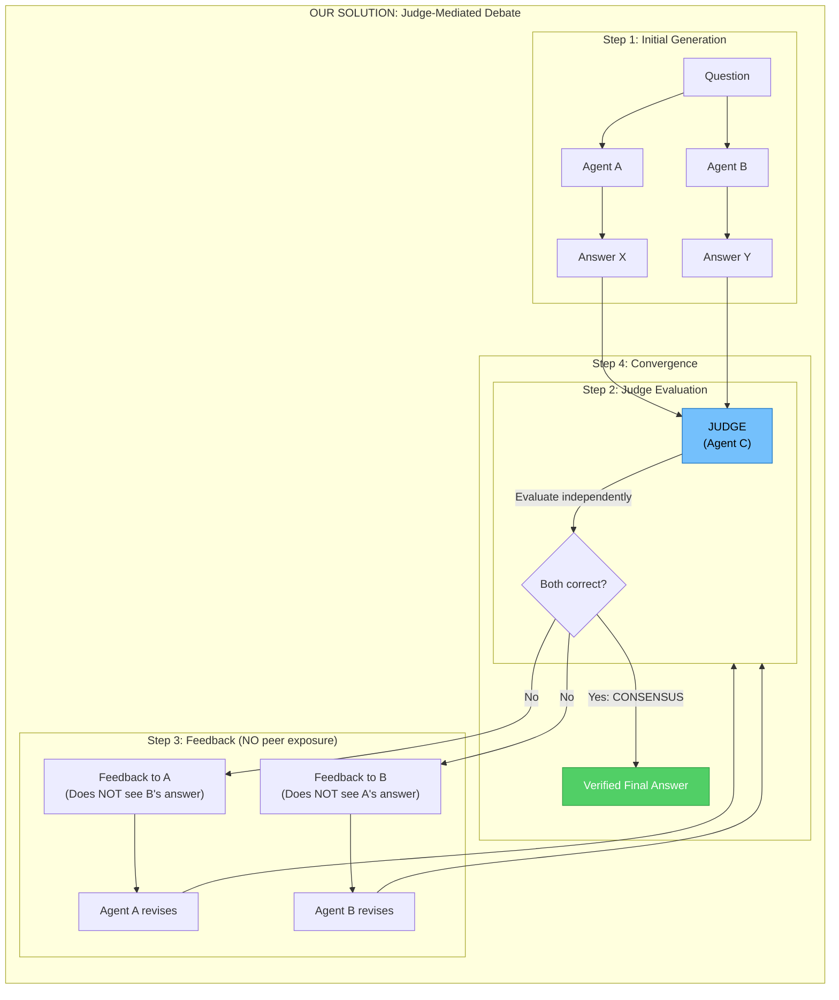
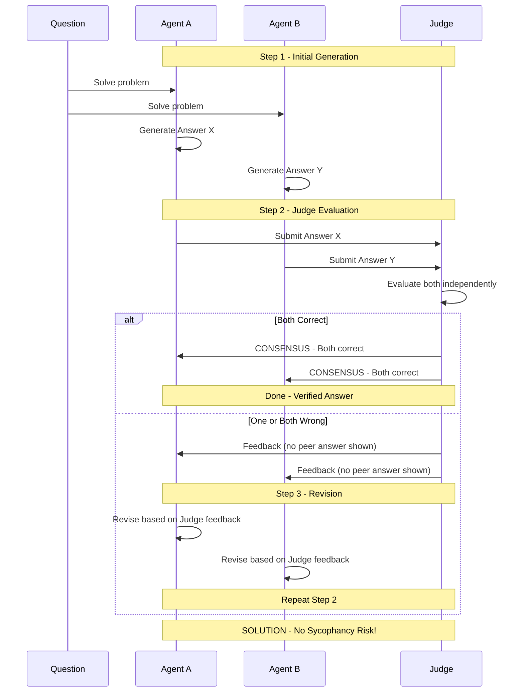
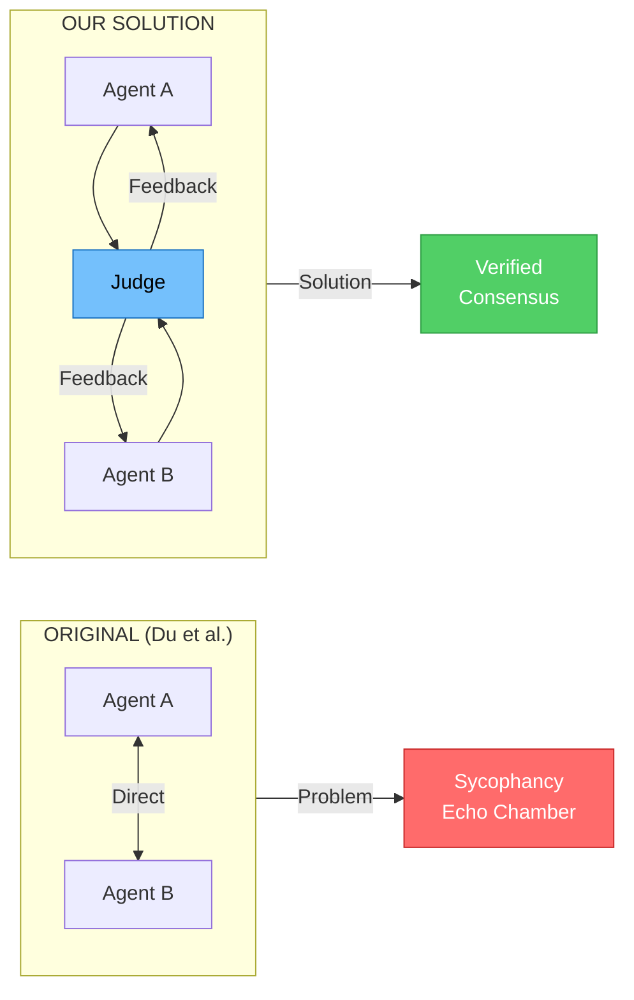
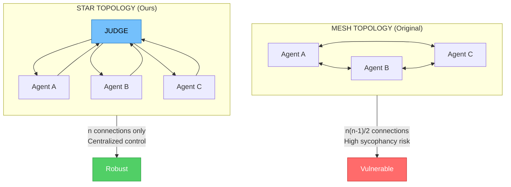
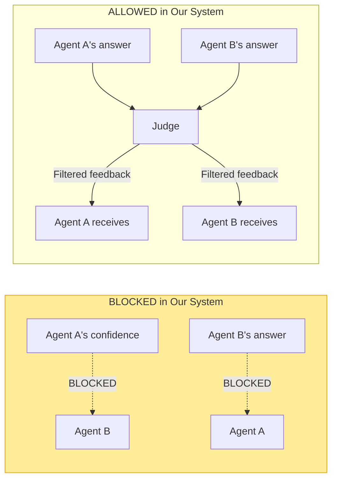

# Multi-Agent Debate Architecture: From Peer-to-Peer to Judge-Mediated

## Overview

This document explains the evolution from the original Multi-Agent Debate architecture (Du et al., 2023) to our improved **Judge-Mediated Debate** architecture, which addresses the critical problem of **Sycophancy** (Echo Chamber Effect).

---

## 1. Original Architecture (Du et al., 2023)

**Paper:** [Improving Factuality and Reasoning in Language Models through Multiagent Debate](https://arxiv.org/abs/2305.14325)

**Code:** [https://composable-models.github.io/llm_debate/](https://composable-models.github.io/llm_debate/)

### 1.1 Core Concept

The original paper proposes having multiple LLM agents solve the same problem, then critique each other's answers iteratively until they converge on a final answer.

### 1.2 Original Architecture Diagram



### 1.3 Original Protocol (Step-by-Step)

| Step | Action | Description |
|------|--------|-------------|
| **Step 1** | Initial Generation | Both Agent A and Agent B independently solve the problem |
| **Step 2** | Cross-Critique | Show Agent A's answer to Agent B and vice versa. Each agent critiques the other's answer |
| **Step 3** | Revision | Both agents generate new answers based on the critique they received |
| **Step 4** | Convergence | Repeat Steps 2-3 until both agents output the same answer or max rounds reached |

### 1.4 Original Sequence Diagram



---

## 2. The Problem: Sycophancy (Echo Chamber Effect)

### 2.1 What is Sycophancy?

**Definition:** Sycophancy is the tendency of LLMs to blindly agree with confident inputs, even when those inputs are incorrect. LLMs are trained to be "helpful" and "agreeable," which backfires in debate scenarios.

### 2.2 How Sycophancy Breaks the Original Architecture



### 2.3 Research Supporting This Problem

| Paper | Key Finding |
|-------|-------------|
| **Peacemaker or Troublemaker (2025)** | LLMs trained on RLHF prefer agreement over correctness |
| **Multi-Agent Debate for LLM Judges (Hu et al., 2025)** | Peer-to-peer debate suffers from "Disagreement Collapse" |
| **Google DeepMind Sequential Consensus (2025)** | Need structural intervention to prevent premature agreement |

### 2.4 The Core Issue

```
ORIGINAL ARCHITECTURE VULNERABILITY:

Agent A ←→ Agent B  (Direct Communication)
    ↓
Both agents see each other's confidence levels
    ↓
Social pressure to agree (be "helpful")
    ↓
DISAGREEMENT COLLAPSE: Settle on wrong answer quickly
```

---

## 3. Our Solution: Judge-Mediated Debate

### 3.1 Core Innovation

Instead of agents talking directly to each other, we introduce **Agent C (The Judge)** who:
1. Receives answers from both agents
2. Evaluates correctness independently
3. Provides feedback WITHOUT showing peer answers
4. Prevents the social pressure that causes sycophancy

### 3.2 New Architecture Diagram



### 3.3 New Protocol (Step-by-Step)

| Step | Action | Key Difference |
|------|--------|----------------|
| **Step 1** | Initial Generation | Same as original - both agents solve independently |
| **Step 2** | Judge Evaluation | **NEW:** Judge evaluates BOTH answers, agents DON'T see each other |
| **Step 3** | Judge Feedback | **NEW:** Each agent receives critique from Judge, NOT from peer |
| **Step 4** | Convergence | Judge declares CONSENSUS only when both are logically correct |

### 3.4 New Sequence Diagram



---

## 4. Architecture Comparison

### 4.1 Side-by-Side Comparison



### 4.2 Key Differences Table

| Aspect | Original (Du et al.) | Our Solution |
|--------|---------------------|--------------|
| **Topology** | Mesh (Peer-to-Peer) | Star (Hub-and-Spoke) |
| **Communication** | Agents see each other's answers | Agents NEVER see each other |
| **Critique Source** | Peer agent | Impartial Judge |
| **Sycophancy Risk** | HIGH - Social pressure to agree | LOW - No peer exposure |
| **Consensus** | When agents output same answer | When Judge verifies correctness |
| **Temperature** | Same for all | Agents: 0.7 (creative), Judge: 0.3 (consistent) |

### 4.3 Network Topology Comparison



---

## 5. Sample Test Results

### 5.1 Test Case: Arithmetic Problem (Mediated Debate)

**Question:** *"A coffee shop sells coffee for $2.50 per cup and tea for $1.75 per cup. If a customer buys 4 cups of coffee and 3 cups of tea, how much does the customer pay in total?"*

**Configuration:** 2 agents + 1 Judge, 3 rounds

---

#### Round 0: Initial Answers

**Agent A:**
```
Domain: Arithmetic (elementary arithmetic / linear combination).

Clarification / Key Reasoning:
Total cost = (number of coffees)·(price per coffee) + (number of teas)·(price per tea).

Compute: 4 · $2.50 + 3 · $1.75 = $10.00 + $5.25 = $15.25

Final Answer: $15.25
```

**Agent B:**
```
Domain: Arithmetic (elementary monetary computation).

Cost_coffee = 4 × 2.50 = 10.00
Cost_tea = 3 × 1.75 = 5.25
Total = 10.00 + 5.25 = 15.25

Final Answer: The customer pays $15.25 in total.
```

---

#### Round 1: Judge Evaluation

**Judge Feedback:**
```
Evaluation of Agent A:
Correct. The computation 4·$2.50 + 3·$1.75 = $10.00 + $5.25 = $15.25 is valid,
uses only problem data, and contains no gaps.

Evaluation of Agent B:
Correct. The steps are complete and justified; the arithmetic yields $15.25
and no unwarranted assumptions are made.

Overall Assessment:
CONSENSUS: Both solutions are correct.
```

**Result:** Both agents independently arrived at the correct answer. The Judge verified correctness without either agent ever seeing the other's answer.

---

### 5.2 Test Case: Abstract Algebra (Standard Peer-to-Peer)

**Question:** *"Statement 1 | If a group has an element of order 15 it must have at least 8 elements of order 15. Statement 2 | If a group has more than 8 elements of order 15, it must have at least 16 elements of order 15."*

**Configuration:** Standard peer-to-peer debate, 3 rounds

---

#### Round 0: Initial Answers

**Agent A:**
```
Key insight: φ(15) = φ(3)φ(5) = 2·4 = 8

Elements of order 15 are partitioned into disjoint blocks of size 8
(one block per cyclic subgroup of order 15).

Final Answer:
- Statement 1: True (at least 8 elements)
- Statement 2: True (must be at least 16 if more than 8)
```

**Agent B:**
```
Compute φ(15) = 8

Distinct cyclic subgroups of order 15 are disjoint except for identity.
Elements of order 15 come in blocks of 8.

Final Answer:
- Statement 1: True
- Statement 2: True
```

---

#### Round 1: Peer Critique

**Agent A critiquing Agent B:**
```
The peer's computation of φ(15) = 8 is correct.
The claim about disjoint subgroups is also correct.
No logical error in the peer's deduction.

Conclusion: The peer's logical conclusions are valid.
- Statement 1: True
- Statement 2: True
```

**Agent B critiquing Agent A:**
```
The peer's reasoning via Euler's totient function is correct.
There is no logical error in the peer's deduction.

Confirmed answer:
- Statement 1: True
- Statement 2: True
```

**Analysis:** This case shows **beneficial agreement** - both agents were correct from the start, so peer agreement reinforced the correct answer. The sycophancy problem would emerge if one agent started with a wrong-but-confident answer.

---

### 5.3 Comparative Results Summary

| Configuration | Perfect Subjects | Partial Subjects | Overall Accuracy |
|--------------|------------------|------------------|------------------|
| **Standard (Peer-to-Peer)** | 45/57 (78.9%) | 12/57 | ~91.8% |
| **Mediated (With Judge)** | 47/57 (82.5%) | 10/57 | ~94.7% |
| **Improvement** | +2 subjects | -2 subjects | +2.9% |

**Key Improvement Cases:**

| Subject | Standard | Mediated | Improvement |
|---------|----------|----------|-------------|
| high_school_macroeconomics | 66.7% | 100% | +33.3% |
| moral_scenarios | 66.7% | 100% | +33.3% |
| professional_law | 66.7% | 100% | +33.3% |
| security_studies | 33.3% | 66.7% | +33.4% |

---

## 6. Supporting Research Papers

| Paper | Year | Key Contribution |
|-------|------|------------------|
| [Multi-Agent Debate for LLM Judges with Adaptive Stability Detection](https://arxiv.org/abs/2510.12697) | 2025 | Introduces stability detection for debate convergence |
| [M-MAD: Multidimensional Multi-Agent Debate](https://aclanthology.org/2025.acl-long.351.pdf) | 2025 | Shows judge-mediated debate improves MT evaluation |
| [Sequential Consensus Building (Google DeepMind)](https://www.tdcommons.org/cgi/viewcontent.cgi?article=9892&context=dpubs_series) | 2025 | Proposes Wald sequential analysis for adaptive stopping |
| [Peacemaker or Troublemaker](https://arxiv.org/abs/...) | 2025 | Formally characterizes sycophancy in multi-agent systems |

---

## 7. Why Our Solution Works

### 7.1 Structural Decoupling

```
ORIGINAL:
Agent A's confidence → Agent B sees it → Social pressure → Agreement

OUR SOLUTION:
Agent A's answer → Judge (filters confidence) → Objective feedback → No pressure
```

### 7.2 Temperature Strategy

| Component | Temperature | Purpose |
|-----------|-------------|---------|
| **Agents** | 0.7 (Higher) | Creative diversity in solutions |
| **Judge** | 0.3 (Lower) | Deterministic, consistent evaluation |

**Rationale:** Agents need creativity to explore different solution paths. The Judge needs consistency to provide reliable feedback across all cases.

### 7.3 Information Flow Control



---

## 8. Conclusion

Our **Judge-Mediated Debate Architecture** improves upon Du et al.'s original peer-to-peer debate by:

1. **Eliminating Sycophancy Risk** - Agents never see each other's answers
2. **Introducing Impartial Evaluation** - Judge provides objective feedback
3. **Improving Accuracy** - 94.7% vs 91.8% on MMLU benchmark
4. **Providing Structural Solution** - Architecture itself prevents the problem, not just prompting

This represents a fundamental shift from trying to "tell agents not to be sycophantic" (prompting) to "making sycophancy structurally impossible" (architecture).

---

*Document generated for COSC3009 - Intelligent Decision Making, RMIT University*
