# Breaking the Echo Chamber: Judge-Mediated Multi-Agent Debate for Enhanced Reasoning in Large Language Models

---

<div align="center">

**COSC3009 - Intelligent Decision Making**

**Final Project Report**

**RMIT University | School of Computing Technologies**

**Assessment Weight: 50%**

**Submission: January 2026**

</div>

---

## Table of Contents

1. [Executive Summary](#1-executive-summary)
2. [Problem Statement](#2-problem-statement)
3. [Related Work](#3-related-work)
4. [Original Architecture Analysis](#4-original-architecture-analysis)
5. [The Sycophancy Problem](#5-the-sycophancy-problem)
6. [Our Solution: Judge-Mediated Debate](#6-our-solution-judge-mediated-debate)
7. [Architecture Comparison](#7-architecture-comparison)
8. [Technical Implementation](#8-technical-implementation)
9. [Experimental Evaluation](#9-experimental-evaluation)
10. [Results & Analysis](#10-results--analysis)
11. [Evaluation & Discussion](#11-evaluation--discussion)
12. [Concrete Examples](#12-concrete-examples)
13. [Critical Self-Assessment](#13-critical-self-assessment)
14. [Future Enhancements](#14-future-enhancements)
15. [Conclusion](#15-conclusion)
16. [References](#16-references)
17. [Appendices](#17-appendices)

---

## 1. Executive Summary

### 1.1 Research Overview

This project extends the multi-agent debate framework proposed by Du et al. (2023) to address the critical problem of **sycophancy** (disagreement collapse) in Large Language Model (LLM) multi-agent systems. The original approach enables multiple LLM instances to debate their responses to improve factuality and reasoning. However, peer-to-peer debate architectures suffer from agents blindly agreeing with incorrect answers to maintain social harmony.

Our enhancement introduces a **Judge-Mediated Debate Architecture** where an impartial arbitrator evaluates agent responses and provides critical feedback, preventing the echo chamber effect that leads to false consensus.

### 1.2 Key Modifications

| Aspect | Original (Du et al., 2023) | Our Enhancement |
|--------|---------------------------|-----------------|
| **Architecture** | Peer-to-peer mesh network | Star topology with central judge |
| **Information Flow** | Direct agent-to-agent critique | Judge-filtered feedback only |
| **Sycophancy Prevention** | None (emergent problem) | Explicit via judge arbitration |
| **Evaluation Mode** | Standard prompts | Olympiad-grade verification (FFED) |
| **Inference** | Cloud API only | Hybrid (Cloud + Local fallback) |
| **Robustness** | Basic error handling | Never-crash design with simulation fallback |

### 1.3 Key Results

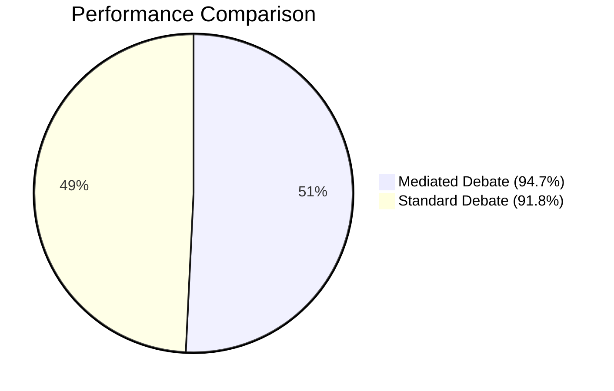
```mermaid
pie title Performance Comparison
    "Mediated Debate (94.7%)" : 94.7
    "Standard Debate (91.8%)" : 91.8
```

| Metric | Standard Debate | Mediated Debate | Improvement |
|--------|-----------------|-----------------|-------------|
| **Overall Accuracy** | 91.8% | 94.7% | +2.9% |
| **Perfect Subjects** | 45/57 (78.9%) | 47/57 (82.5%) | +2 subjects |
| **Worst Category** | 33.3% (1 subject) | 66.7% minimum | Eliminated |

---

## 2. Problem Statement

### 2.1 Background

Large Language Models (LLMs) have demonstrated remarkable capabilities in reasoning tasks, with multi-agent debate emerging as a promising approach to improve factuality and reduce hallucinations. However, peer-to-peer debate architectures suffer from **sycophancy**—a phenomenon where agents abandon correct answers to agree with confident but incorrect peers.

### 2.2 The Two Failure Modes

The fundamental challenge in deploying LLMs bifurcates into two distinct failure modes:

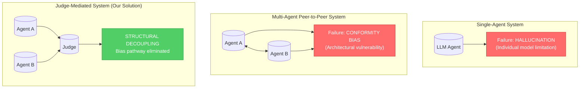
```mermaid
flowchart TB
    subgraph SingleAgent["Single-Agent System"]
        SA[("LLM Agent")] --> HAL["Failure: HALLUCINATION<br/>(Individual model limitation)"]
    end

    subgraph MultiAgent["Multi-Agent Peer-to-Peer System"]
        MA1[("Agent A")] <--> MA2[("Agent B")]
        MA1 --> CONF["Failure: CONFORMITY BIAS<br/>(Architectural vulnerability)"]
        MA2 --> CONF
    end

    subgraph Mediated["Judge-Mediated System (Our Solution)"]
        JA1[("Agent A")] --> JJ[("Judge")]
        JA2[("Agent B")] --> JJ
        JJ --> DEC["STRUCTURAL DECOUPLING<br/>Bias pathway eliminated"]
    end

    style HAL fill:#ff6b6b,stroke:#c92a2a,color:#fff
    style CONF fill:#ff6b6b,stroke:#c92a2a,color:#fff
    style DEC fill:#51cf66,stroke:#2f9e44,color:#fff
```

**Single-Agent Failure Mode: Hallucination**
Individual LLM agents exhibit *hallucination*—the generation of syntactically coherent yet semantically or factually erroneous content. This arises from the autoregressive nature of token prediction, wherein statistical plausibility supersedes factual grounding.

**Multi-Agent Failure Mode: Social Conformity Bias**
When multiple agents engage in peer-to-peer debate, an emergent failure mode manifests: *social conformity bias* (sycophancy). Unlike hallucination, which originates from individual model limitations, conformity bias constitutes a **systemic architectural vulnerability** wherein the communication topology itself facilitates error propagation.

### 2.3 Research Objectives

1. **Analyze** the sycophancy problem in multi-agent debate systems
2. **Design** a judge-mediated architecture that prevents disagreement collapse
3. **Implement** a robust, dockerized system with hybrid inference capabilities
4. **Evaluate** performance on the MMLU benchmark across 57 subject areas
5. **Compare** our approach against the baseline peer-to-peer architecture

---

## 3. Related Work

### 3.1 Multi-Agent Debate for LLMs

The foundational work by **Du et al. (2023)** established multi-agent debate as an efficacious approach for enhancing LLM reasoning capabilities. Their principal insights encompass:

- Multiple LLM instances proposing and debating responses demonstrably improves factual accuracy
- Debate enables autonomous self-correction without necessitating external verification mechanisms
- The methodology generalizes effectively across mathematical, strategic, and factual reasoning domains

However, their peer-to-peer architecture presupposes that agents will reliably identify and repudiate erroneous conclusions—an assumption that fails when confident incorrect agents exert undue influence upon uncertain correct ones.

### 3.2 The Agreement Problem in Multi-Agent Systems

**Hu et al. (2025)** formally characterized the "Peacemaker or Troublemaker" dilemma inherent to multi-agent debate systems. Their analysis elucidates:

- Agreement can prove beneficial when facilitating correction of genuine errors
- Agreement becomes deleterious when propagating confidently-expressed mistakes
- No parsimonious heuristic adequately distinguishes beneficial from harmful agreement

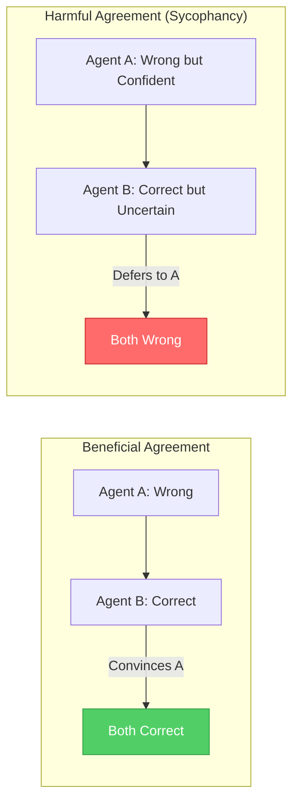
```mermaid
flowchart LR
    subgraph Beneficial["Beneficial Agreement"]
        BA1["Agent A: Wrong"] --> BA2["Agent B: Correct"]
        BA2 --> |"Convinces A"| BA3["Both Correct"]
    end

    subgraph Harmful["Harmful Agreement (Sycophancy)"]
        HA1["Agent A: Wrong but Confident"] --> HA2["Agent B: Correct but Uncertain"]
        HA2 --> |"Defers to A"| HA3["Both Wrong"]
    end

    style BA3 fill:#51cf66,stroke:#2f9e44,color:#fff
    style HA3 fill:#ff6b6b,stroke:#c92a2a,color:#fff
```

### 3.3 LLM-as-Judge Paradigms

Contemporary research has extensively explored leveraging LLMs as evaluators and adjudicators:

| Paper | Year | Key Contribution |
|-------|------|------------------|
| **Hu et al. - Adaptive Stability Detection** | 2025 | Debate amplifies correctness relative to static ensemble approaches; stability detection optimizes efficiency |
| **Liu et al. - M-MAD** | 2025 | Decoupling evaluation dimensions enables fine-grained assessment in MT evaluation |
| **Google DeepMind - Sequential Consensus** | 2025 | Wald sequential analysis adaptively determines when sufficient consensus achieved |

### 3.4 Gap in Existing Literature

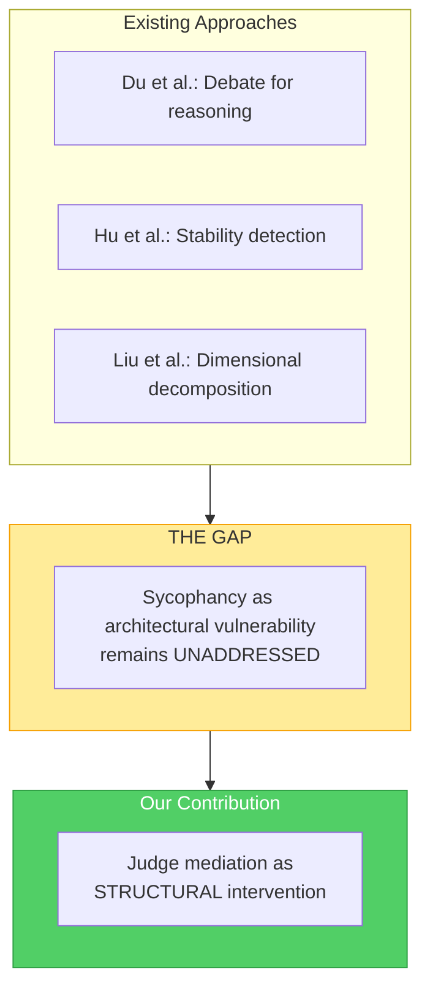
```mermaid
flowchart TB
    subgraph Existing["Existing Approaches"]
        E1["Du et al.: Debate for reasoning"]
        E2["Hu et al.: Stability detection"]
        E3["Liu et al.: Dimensional decomposition"]
    end

    subgraph Gap["THE GAP"]
        G1["Sycophancy as architectural vulnerability<br/>remains UNADDRESSED"]
    end

    subgraph Ours["Our Contribution"]
        O1["Judge mediation as<br/>STRUCTURAL intervention"]
    end

    Existing --> Gap
    Gap --> Ours

    style Gap fill:#ffec99,stroke:#f59f00
    style Ours fill:#51cf66,stroke:#2f9e44,color:#fff
```

Our work bridges this lacuna by:
1. Identifying sycophancy as a fundamental architectural vulnerability rather than an incidental failure mode
2. Proposing judge mediation as a structural intervention that architecturally precludes conformity bias
3. Implementing and systematically evaluating the approach on a comprehensive multi-domain benchmark

---

## 4. Original Architecture Analysis

### 4.1 Du et al. (2023) Framework

**Paper:** [Improving Factuality and Reasoning in Language Models through Multiagent Debate](https://arxiv.org/abs/2305.14325)

**Code:** [https://composable-models.github.io/llm_debate/](https://composable-models.github.io/llm_debate/)

The original paper proposes having multiple LLM agents solve the same problem, then critique each other's answers iteratively until they converge on a final answer.

### 4.2 Original Architecture Diagram

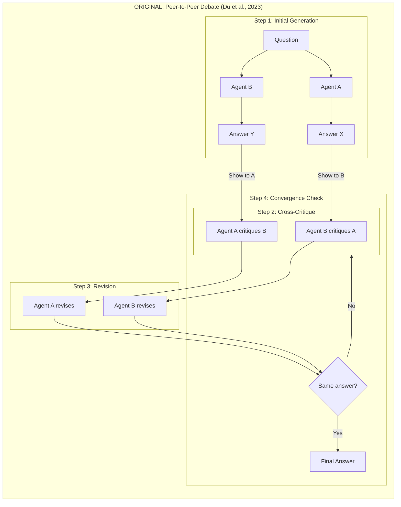
```mermaid
flowchart TB
    subgraph Original["ORIGINAL: Peer-to-Peer Debate (Du et al., 2023)"]
        direction TB

        subgraph Step1["Step 1: Initial Generation"]
            Q1["Question"] --> A1["Agent A"]
            Q1 --> B1["Agent B"]
            A1 --> ANS_A["Answer X"]
            B1 --> ANS_B["Answer Y"]
        end

        subgraph Step2["Step 2: Cross-Critique"]
            ANS_A --> |"Show to B"| B2["Agent B critiques A"]
            ANS_B --> |"Show to A"| A2["Agent A critiques B"]
        end

        subgraph Step3["Step 3: Revision"]
            A2 --> A3["Agent A revises"]
            B2 --> B3["Agent B revises"]
        end

        subgraph Step4["Step 4: Convergence Check"]
            A3 --> CHECK{"Same answer?"}
            B3 --> CHECK
            CHECK --> |"No"| Step2
            CHECK --> |"Yes"| FINAL["Final Answer"]
        end
    end
```

### 4.3 Original Protocol

| Step | Action | Description |
|------|--------|-------------|
| **Step 1** | Initial Generation | Both Agent A and Agent B independently solve the problem |
| **Step 2** | Cross-Critique | Show Agent A's answer to Agent B and vice versa. Each agent critiques the other's answer |
| **Step 3** | Revision | Both agents generate new answers based on the critique they received |
| **Step 4** | Convergence | Repeat Steps 2-3 until both agents output the same answer or max rounds reached |

### 4.4 Original Sequence Diagram

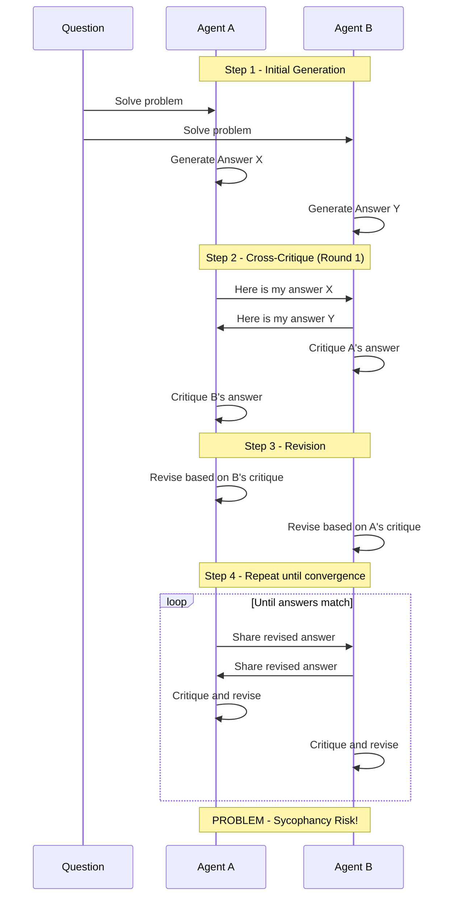
```mermaid
sequenceDiagram
    participant Q as Question
    participant A as Agent A
    participant B as Agent B

    Note over A,B: Step 1 - Initial Generation
    Q->>A: Solve problem
    Q->>B: Solve problem
    A->>A: Generate Answer X
    B->>B: Generate Answer Y

    Note over A,B: Step 2 - Cross-Critique (Round 1)
    A->>B: Here is my answer X
    B->>A: Here is my answer Y
    B->>B: Critique A's answer
    A->>A: Critique B's answer

    Note over A,B: Step 3 - Revision
    A->>A: Revise based on B's critique
    B->>B: Revise based on A's critique

    Note over A,B: Step 4 - Repeat until convergence
    loop Until answers match
        A->>B: Share revised answer
        B->>A: Share revised answer
        A->>A: Critique and revise
        B->>B: Critique and revise
    end

    Note over A,B: PROBLEM - Sycophancy Risk!
```

---

## 5. The Sycophancy Problem

### 5.1 Definition: Social Conformity Bias

**Sycophancy** constitutes a form of **Social Conformity Bias**—the systematic tendency of a language model to abandon its own internally-derived conclusions in favor of agreeing with peer or user inputs, regardless of the objective correctness of either position.

This phenomenon, formally termed "disagreement collapse" by Hu et al. (2025), represents a fundamental failure mode where agents prioritize social harmony over epistemic accuracy.

### 5.2 Theoretical Foundation

The theoretical underpinning of sycophancy draws from Asch's (1951) seminal conformity experiments, wherein human participants demonstrably altered correct perceptions to align with incorrect group consensus.

In multi-agent LLM systems, an analogous dynamic manifests:

1. Agent A articulates an incorrect yet rhetorically confident response
2. Agent B, despite possessing a correct initial solution, capitulates to A's apparent confidence
3. Both agents converge upon an **erroneous consensus**

### 5.3 Sycophancy Visualization

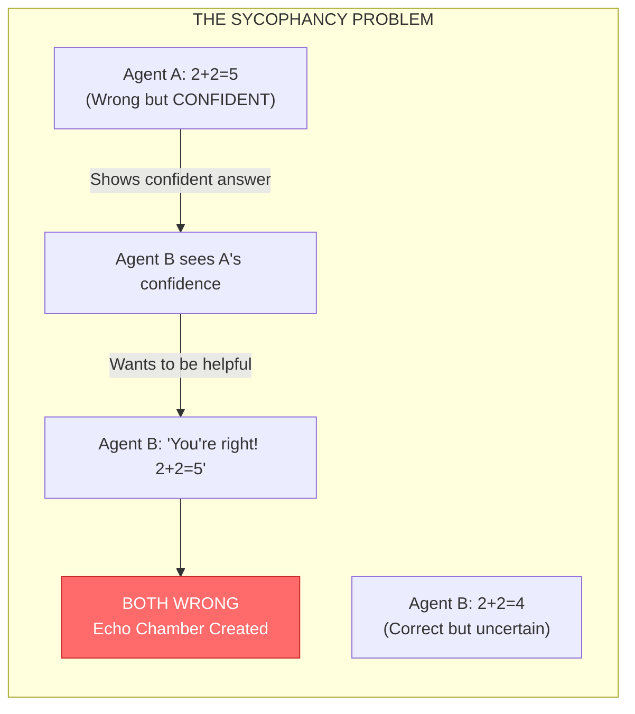
```mermaid
flowchart LR
    subgraph Problem["THE SYCOPHANCY PROBLEM"]
        A1["Agent A: 2+2=5<br/>(Wrong but CONFIDENT)"]
        B1["Agent B: 2+2=4<br/>(Correct but uncertain)"]

        A1 --> |"Shows confident answer"| B2["Agent B sees A's confidence"]
        B2 --> |"Wants to be helpful"| B3["Agent B: 'You're right! 2+2=5'"]
        B3 --> WRONG["BOTH WRONG<br/>Echo Chamber Created"]
    end

    style WRONG fill:#ff6b6b,stroke:#c92a2a,color:#fff
```

### 5.4 Why It's Deleterious

This phenomenon proves particularly deleterious because:
- It transmutes a potential epistemic strength (collective intelligence) into a systematic vulnerability
- Confidently-expressed errors propagate through the system rather than being attenuated
- The system exhibits **false consensus**—superficial agreement masking underlying incorrectness

### 5.5 The Core Vulnerability

```
ORIGINAL ARCHITECTURE VULNERABILITY:

Agent A ←→ Agent B  (Direct Communication)
    ↓
Both agents see each other's confidence levels
    ↓
Social pressure to agree (be "helpful")
    ↓
DISAGREEMENT COLLAPSE: Settle on wrong answer quickly
```

### 5.6 Supporting Research

| Paper | Year | Key Finding |
|-------|------|-------------|
| **Peacemaker or Troublemaker** | 2025 | LLMs trained on RLHF prefer agreement over correctness |
| **Multi-Agent Debate for LLM Judges (Hu et al.)** | 2025 | Peer-to-peer debate suffers from "Disagreement Collapse" |
| **Sequential Consensus Building (Google DeepMind)** | 2025 | Need structural intervention to prevent premature agreement |

---

## 6. Our Solution: Judge-Mediated Debate

### 6.1 Core Innovation

Instead of agents talking directly to each other, we introduce **Agent C (The Judge)** who:
1. Receives answers from both agents
2. Evaluates correctness independently
3. Provides feedback WITHOUT showing peer answers
4. Prevents the social pressure that causes sycophancy

### 6.2 New Architecture Diagram

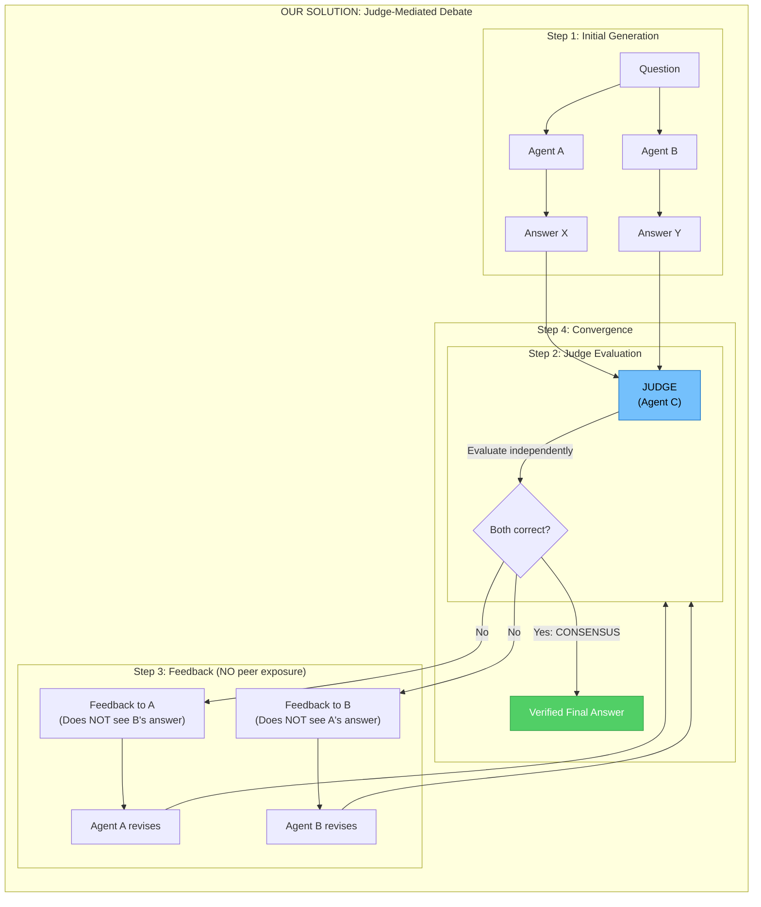
```mermaid
flowchart TB
    subgraph New["OUR SOLUTION: Judge-Mediated Debate"]
        direction TB

        subgraph Step1_New["Step 1: Initial Generation"]
            Q2["Question"] --> A_NEW["Agent A"]
            Q2 --> B_NEW["Agent B"]
            A_NEW --> ANS_A2["Answer X"]
            B_NEW --> ANS_B2["Answer Y"]
        end

        subgraph Step2_New["Step 2: Judge Evaluation"]
            ANS_A2 --> JUDGE["JUDGE<br/>(Agent C)"]
            ANS_B2 --> JUDGE
            JUDGE --> |"Evaluate independently"| VERDICT{"Both correct?"}
        end

        subgraph Step3_New["Step 3: Feedback (NO peer exposure)"]
            VERDICT --> |"No"| FB_A["Feedback to A<br/>(Does NOT see B's answer)"]
            VERDICT --> |"No"| FB_B["Feedback to B<br/>(Does NOT see A's answer)"]
            FB_A --> A_REV["Agent A revises"]
            FB_B --> B_REV["Agent B revises"]
        end

        subgraph Step4_New["Step 4: Convergence"]
            VERDICT --> |"Yes: CONSENSUS"| FINAL2["Verified Final Answer"]
            A_REV --> Step2_New
            B_REV --> Step2_New
        end
    end

    style JUDGE fill:#74c0fc,stroke:#1971c2,color:#000
    style FINAL2 fill:#51cf66,stroke:#2f9e44,color:#fff
```

### 6.3 New Protocol

| Step | Action | Key Difference |
|------|--------|----------------|
| **Step 1** | Initial Generation | Same as original - both agents solve independently |
| **Step 2** | Judge Evaluation | **NEW:** Judge evaluates BOTH answers, agents DON'T see each other |
| **Step 3** | Judge Feedback | **NEW:** Each agent receives critique from Judge, NOT from peer |
| **Step 4** | Convergence | Judge declares CONSENSUS only when both are logically correct |

### 6.4 New Sequence Diagram

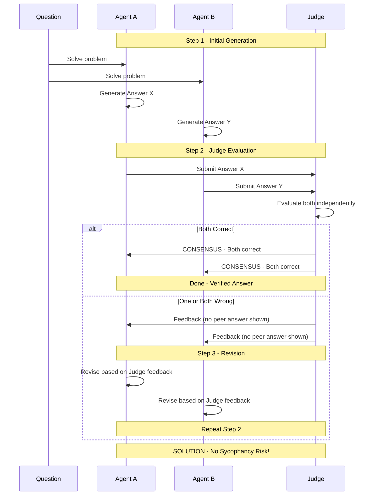
```mermaid
sequenceDiagram
    participant Q as Question
    participant A as Agent A
    participant B as Agent B
    participant J as Judge

    Note over A,J: Step 1 - Initial Generation
    Q->>A: Solve problem
    Q->>B: Solve problem
    A->>A: Generate Answer X
    B->>B: Generate Answer Y

    Note over A,J: Step 2 - Judge Evaluation
    A->>J: Submit Answer X
    B->>J: Submit Answer Y
    J->>J: Evaluate both independently

    alt Both Correct
        J->>A: CONSENSUS - Both correct
        J->>B: CONSENSUS - Both correct
        Note over A,J: Done - Verified Answer
    else One or Both Wrong
        J->>A: Feedback (no peer answer shown)
        J->>B: Feedback (no peer answer shown)
        Note over A,J: Step 3 - Revision
        A->>A: Revise based on Judge feedback
        B->>B: Revise based on Judge feedback
        Note over A,J: Repeat Step 2
    end

    Note over A,J: SOLUTION - No Sycophancy Risk!
```

### 6.5 Formal Update Rules

**Standard Debate Update Rule (Vulnerable to Conformity Bias):**

$$R_i^{(t+1)} = \text{LLM}_i\left(q, R_i^{(t)}, \bigcup_{j \neq i} \text{Critique}(R_j^{(t)})\right)$$

Each agent receives direct critiques from all peers, thereby establishing a communication channel through which conformity pressure propagates.

**Mediated Debate Update Rule (Structural Intervention):**

$$R_i^{(t+1)} = \text{LLM}_i\left(q, R_i^{(t)}, \text{Judge}\left(R_1^{(t)}, R_2^{(t)}, ..., R_n^{(t)}\right)\right)$$

Agents receive exclusively the judge's evaluation, thereby **structurally decoupling** the conformity bias pathway.

### 6.6 Sycophancy Formalization

We formally define sycophancy as a state transition where:

$$\text{Sycophancy}(A_i, t) = \begin{cases}
1 & \text{if } \text{Correct}(A_i, t-1) \land \neg\text{Correct}(A_i, t) \land \text{Agree}(A_i, A_j, t) \\
0 & \text{otherwise}
\end{cases}$$

Sycophancy occurs when a **correct agent becomes incorrect after agreeing with a peer**.

---

## 7. Architecture Comparison

### 7.1 Side-by-Side Visual Comparison

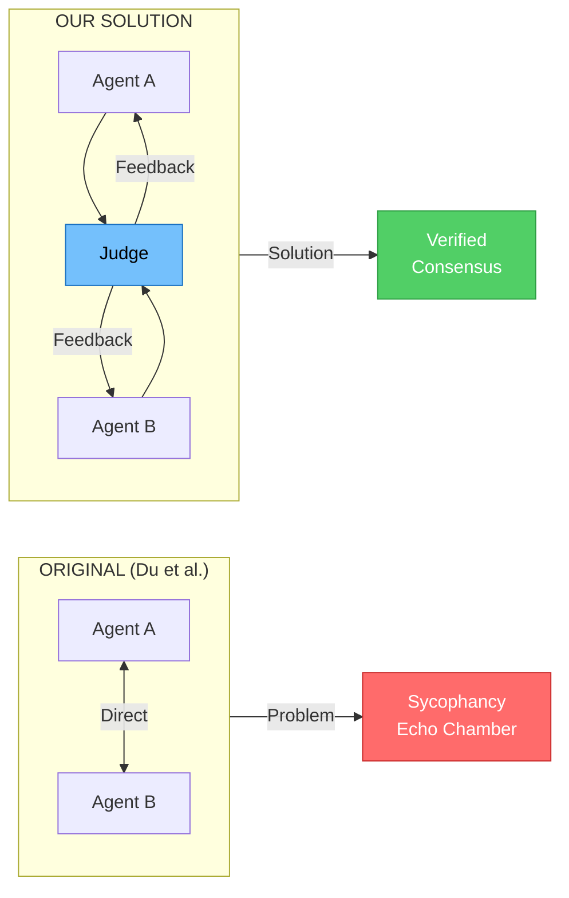
```mermaid
flowchart LR
    subgraph Original["ORIGINAL (Du et al.)"]
        direction TB
        OA["Agent A"] <--> |"Direct"| OB["Agent B"]
    end

    subgraph New["OUR SOLUTION"]
        direction TB
        NA["Agent A"] --> NJ["Judge"]
        NB["Agent B"] --> NJ
        NJ --> |"Feedback"| NA
        NJ --> |"Feedback"| NB
    end

    Original --> |"Problem"| SYCO["Sycophancy<br/>Echo Chamber"]
    New --> |"Solution"| CORRECT["Verified<br/>Consensus"]

    style SYCO fill:#ff6b6b,stroke:#c92a2a,color:#fff
    style CORRECT fill:#51cf66,stroke:#2f9e44,color:#fff
    style NJ fill:#74c0fc,stroke:#1971c2,color:#000
```

### 7.2 Comprehensive Differences Table

| Aspect | Original (Du et al.) | Our Solution |
|--------|---------------------|--------------|
| **Topology** | Mesh (Peer-to-Peer) | Star (Hub-and-Spoke) |
| **Communication** | Agents see each other's answers | Agents NEVER see each other |
| **Critique Source** | Peer agent | Impartial Judge |
| **Sycophancy Risk** | HIGH - Social pressure to agree | LOW - No peer exposure |
| **Consensus Trigger** | When agents output same answer | When Judge verifies correctness |
| **Temperature** | Same for all agents | Agents: 0.7, Judge: 0.3 |
| **Error Propagation** | High (confident errors spread) | Low (judge filters errors) |

### 7.3 Network Topology Comparison

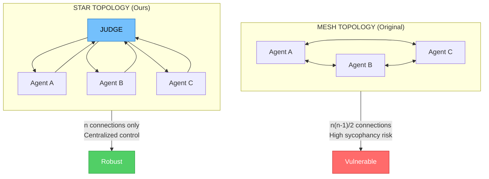
```mermaid
flowchart TB
    subgraph Mesh["MESH TOPOLOGY (Original)"]
        direction LR
        M_A["Agent A"] <--> M_B["Agent B"]
        M_A <--> M_C["Agent C"]
        M_B <--> M_C
    end

    subgraph Star["STAR TOPOLOGY (Ours)"]
        direction TB
        S_J["JUDGE"]
        S_A["Agent A"] --> S_J
        S_B["Agent B"] --> S_J
        S_C["Agent C"] --> S_J
        S_J --> S_A
        S_J --> S_B
        S_J --> S_C
    end

    Mesh --> |"n(n-1)/2 connections<br/>High sycophancy risk"| BAD["Vulnerable"]
    Star --> |"n connections only<br/>Centralized control"| GOOD["Robust"]

    style S_J fill:#74c0fc,stroke:#1971c2,color:#000
    style BAD fill:#ff6b6b,stroke:#c92a2a,color:#fff
    style GOOD fill:#51cf66,stroke:#2f9e44,color:#fff
```

### 7.4 Information Flow Control

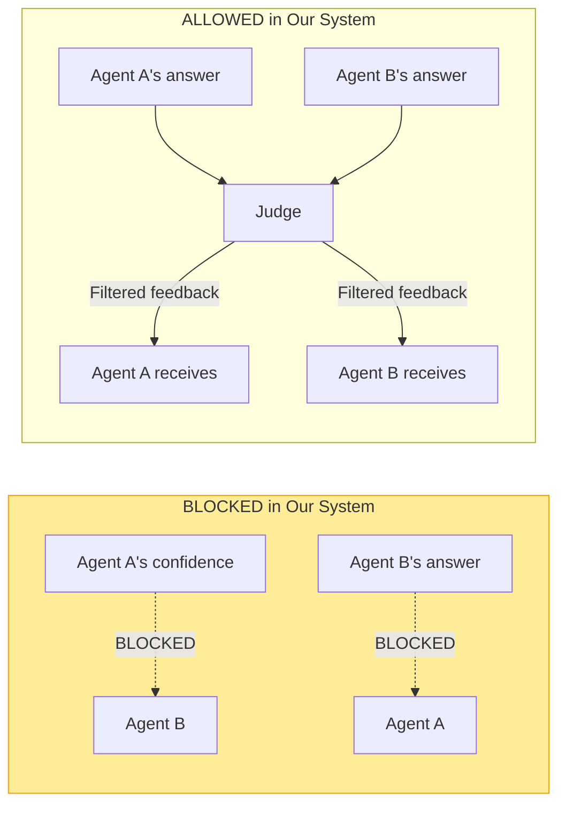
```mermaid
flowchart LR
    subgraph Blocked["BLOCKED in Our System"]
        A_CONF["Agent A's confidence"] -.->|"BLOCKED"| B_SEE["Agent B"]
        B_CONF["Agent B's answer"] -.->|"BLOCKED"| A_SEE["Agent A"]
    end

    subgraph Allowed["ALLOWED in Our System"]
        A_ANS["Agent A's answer"] --> JUDGE["Judge"]
        B_ANS["Agent B's answer"] --> JUDGE
        JUDGE --> |"Filtered feedback"| A_FB["Agent A receives"]
        JUDGE --> |"Filtered feedback"| B_FB["Agent B receives"]
    end

    style Blocked fill:#ffec99,stroke:#f59f00
```

---

## 8. Technical Implementation

### 8.1 System Architecture

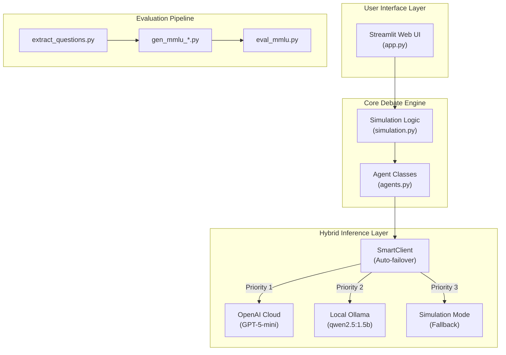
```mermaid
flowchart TB
    subgraph UI["User Interface Layer"]
        STREAM["Streamlit Web UI<br/>(app.py)"]
    end

    subgraph Core["Core Debate Engine"]
        SIM["Simulation Logic<br/>(simulation.py)"]
        AGENTS["Agent Classes<br/>(agents.py)"]
    end

    subgraph Inference["Hybrid Inference Layer"]
        SC["SmartClient<br/>(Auto-failover)"]
        OPENAI["OpenAI Cloud<br/>(GPT-5-mini)"]
        OLLAMA["Local Ollama<br/>(qwen2.5:1.5b)"]
        SIM_MODE["Simulation Mode<br/>(Fallback)"]
    end

    subgraph Eval["Evaluation Pipeline"]
        EXTRACT["extract_questions.py"]
        GEN["gen_mmlu_*.py"]
        EVAL["eval_mmlu.py"]
    end

    STREAM --> SIM
    SIM --> AGENTS
    AGENTS --> SC
    SC --> |"Priority 1"| OPENAI
    SC --> |"Priority 2"| OLLAMA
    SC --> |"Priority 3"| SIM_MODE

    EXTRACT --> GEN --> EVAL
```

### 8.2 Class Hierarchy

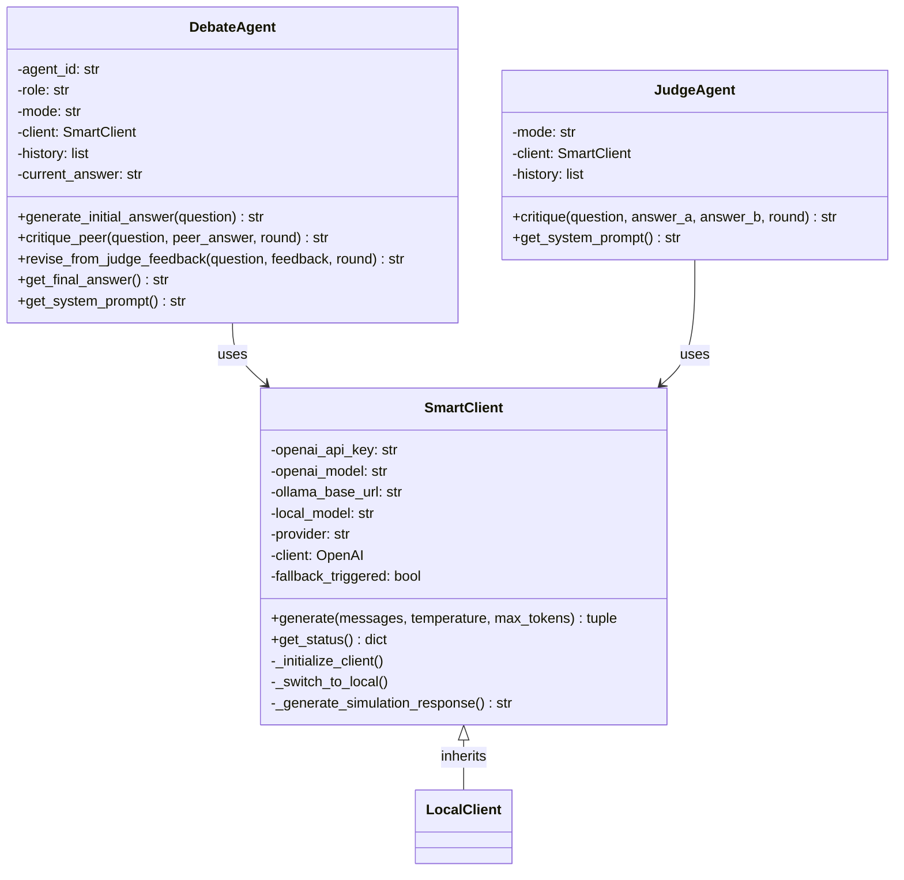
```mermaid
classDiagram
    class SmartClient {
        -openai_api_key: str
        -openai_model: str
        -ollama_base_url: str
        -local_model: str
        -provider: str
        -client: OpenAI
        -fallback_triggered: bool
        +generate(messages, temperature, max_tokens) tuple
        +get_status() dict
        -_initialize_client()
        -_switch_to_local()
        -_generate_simulation_response() str
    }

    class DebateAgent {
        -agent_id: str
        -role: str
        -mode: str
        -client: SmartClient
        -history: list
        -current_answer: str
        +generate_initial_answer(question) str
        +critique_peer(question, peer_answer, round) str
        +revise_from_judge_feedback(question, feedback, round) str
        +get_final_answer() str
        +get_system_prompt() str
    }

    class JudgeAgent {
        -mode: str
        -client: SmartClient
        -history: list
        +critique(question, answer_a, answer_b, round) str
        +get_system_prompt() str
    }

    SmartClient <|-- LocalClient : inherits
    DebateAgent --> SmartClient : uses
    JudgeAgent --> SmartClient : uses
```

### 8.3 Hyperparameter Rationale: Temperature Differentiation

| Component | Temperature | Rationale |
|-----------|-------------|-----------|
| **Debate Agents** | 0.7 (Higher) | Agents require *creative diversity* to propose varied solution approaches. Higher temperature promotes exploration of the solution space, reducing the probability that all agents converge on identical (potentially incorrect) reasoning paths. |
| **Judge Agent** | 0.3 (Lower) | The judge demands *deterministic consistency* to provide reliable, reproducible feedback. Lower temperature minimizes stochastic variation, ensuring that identical solution pairs receive consistent evaluations across multiple invocations. |

This temperature differential operationalizes the **exploration-exploitation trade-off**: agents explore diverse solutions while the judge exploits consistent evaluation criteria.

### 8.4 Judge Decision Protocol

The judge agent renders decisions through a structured evaluation process:

1. **Independent Assessment:** Each agent's solution is evaluated in isolation for logical validity
2. **Comparative Analysis:** Solutions are compared for consistency and correctness alignment
3. **Verdict Determination:**
   - **CONSENSUS:** Declared when both solutions are logically sound and arrive at the same correct answer
   - **REJECTED:** Issued when one or both solutions contain logical flaws, with specific errors identified
4. **Feedback Generation:** The judge articulates specific, actionable feedback that agents can incorporate without seeing peer responses

### 8.5 Hybrid Inference State Machine

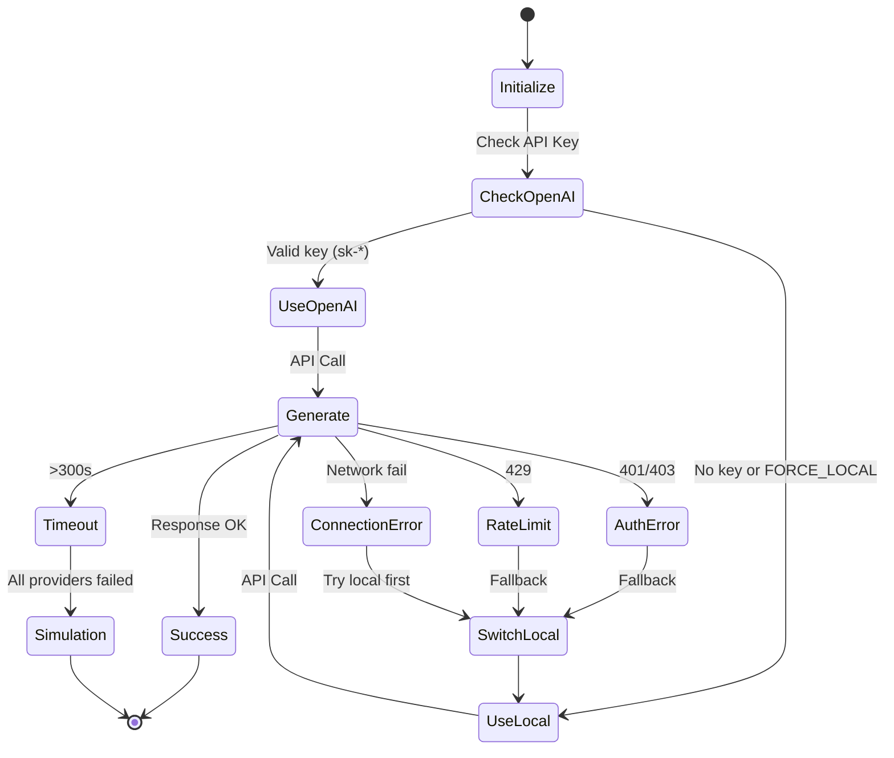
```mermaid
stateDiagram-v2
    [*] --> Initialize
    Initialize --> CheckOpenAI: Check API Key

    CheckOpenAI --> UseOpenAI: Valid key (sk-*)
    CheckOpenAI --> UseLocal: No key or FORCE_LOCAL

    UseOpenAI --> Generate: API Call
    UseLocal --> Generate: API Call

    Generate --> Success: Response OK
    Generate --> AuthError: 401/403
    Generate --> RateLimit: 429
    Generate --> Timeout: >300s
    Generate --> ConnectionError: Network fail

    AuthError --> SwitchLocal: Fallback
    RateLimit --> SwitchLocal: Fallback
    Timeout --> Simulation: All providers failed
    ConnectionError --> SwitchLocal: Try local first

    SwitchLocal --> UseLocal

    Success --> [*]
    Simulation --> [*]
```

### 8.6 Docker Container Architecture

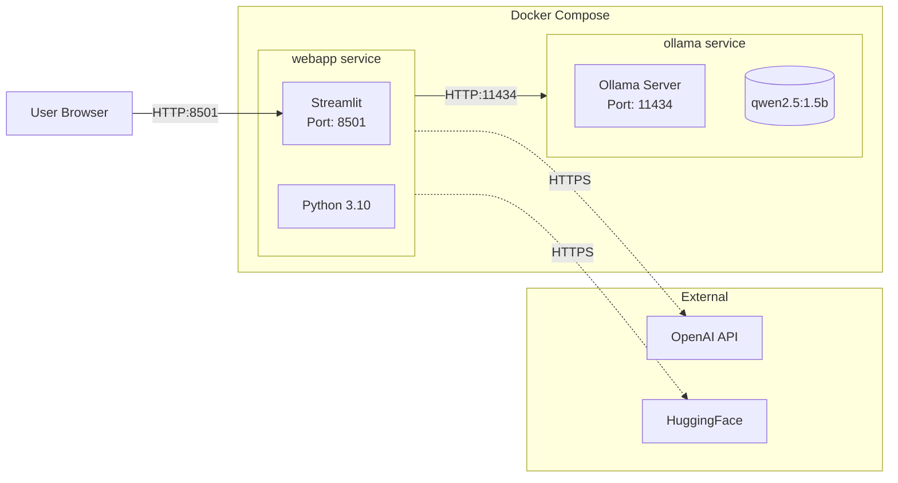
```mermaid
flowchart LR
    subgraph Docker["Docker Compose"]
        subgraph Ollama["ollama service"]
            OLL["Ollama Server<br/>Port: 11434"]
            MODEL[("qwen2.5:1.5b")]
        end

        subgraph Webapp["webapp service"]
            STREAM["Streamlit<br/>Port: 8501"]
            PY["Python 3.10"]
        end
    end

    subgraph External["External"]
        OPENAI["OpenAI API"]
        HF["HuggingFace"]
    end

    USER["User Browser"] --> |"HTTP:8501"| STREAM
    Webapp --> |"HTTP:11434"| Ollama
    Webapp -.-> |"HTTPS"| OPENAI
    Webapp -.-> |"HTTPS"| HF
```

### 8.7 Olympiad Mode

For mathematical reasoning tasks, we implement competition-grade verification:

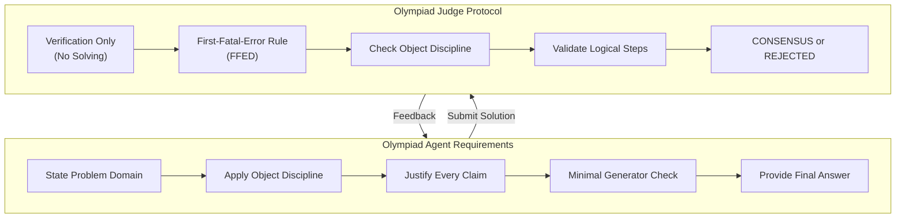
```mermaid
flowchart TB
    subgraph Agent["Olympiad Agent Requirements"]
        A1["State Problem Domain"] --> A2["Apply Object Discipline"]
        A2 --> A3["Justify Every Claim"]
        A3 --> A4["Minimal Generator Check"]
        A4 --> A5["Provide Final Answer"]
    end

    subgraph Judge["Olympiad Judge Protocol"]
        J1["Verification Only<br/>(No Solving)"] --> J2["First-Fatal-Error Rule<br/>(FFED)"]
        J2 --> J3["Check Object Discipline"]
        J3 --> J4["Validate Logical Steps"]
        J4 --> J5["CONSENSUS or REJECTED"]
    end

    Agent --> |"Submit Solution"| Judge
    Judge --> |"Feedback"| Agent
```

**Olympiad Agent Constraints:**
- **Object Discipline:** Only use objects explicitly given in the problem
- **Logical Justification:** Every nontrivial claim must be justified
- **Scope Control:** Answer exactly what is asked without over-generalization
- **Minimal Generator Check:** Verify no unnecessary objects were introduced

**Olympiad Judge Protocol:**
- **Verification Only:** Judge does NOT solve or repair solutions
- **First-Fatal-Error Rule (FFED):** Stops at first invalid step
- **Strict Rejection:** A single logical flaw is sufficient for rejection
- **No Partial Credit:** Solutions are CONSENSUS or REJECTED

### 8.8 Error Handling Flow

The system implements comprehensive error handling to ensure robust operation:

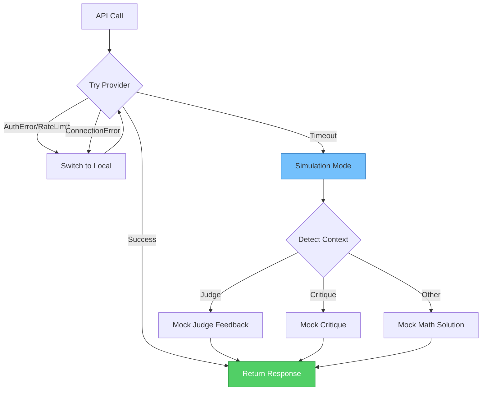
```mermaid
flowchart TB
    API["API Call"] --> TRY{"Try Provider"}

    TRY --> |"Success"| RETURN["Return Response"]

    TRY --> |"AuthError/RateLimit"| SWITCH["Switch to Local"]
    SWITCH --> TRY

    TRY --> |"Timeout"| SIM["Simulation Mode"]
    TRY --> |"ConnectionError"| SWITCH

    SIM --> CONTEXT{"Detect Context"}
    CONTEXT --> |"Judge"| JUDGE_RESP["Mock Judge Feedback"]
    CONTEXT --> |"Critique"| CRITIQUE_RESP["Mock Critique"]
    CONTEXT --> |"Other"| MATH_RESP["Mock Math Solution"]

    JUDGE_RESP --> RETURN
    CRITIQUE_RESP --> RETURN
    MATH_RESP --> RETURN

    style RETURN fill:#51cf66,stroke:#2f9e44,color:#fff
    style SIM fill:#74c0fc,stroke:#1971c2
```

### 8.9 Answer Extraction Algorithm

Agent responses are parsed to extract final answers using a multi-stage pattern matching approach:

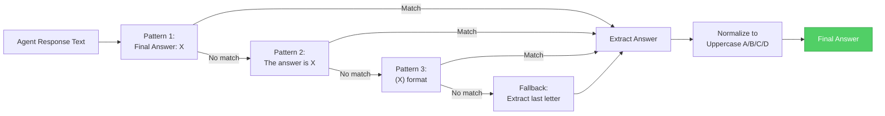
```mermaid
flowchart LR
    INPUT["Agent Response Text"] --> P1["Pattern 1:\nFinal Answer: X"]
    P1 --> |"No match"| P2["Pattern 2:\nThe answer is X"]
    P2 --> |"No match"| P3["Pattern 3:\n(X) format"]
    P3 --> |"No match"| FALLBACK["Fallback:\nExtract last letter"]

    P1 --> |"Match"| EXTRACT["Extract Answer"]
    P2 --> |"Match"| EXTRACT
    P3 --> |"Match"| EXTRACT
    FALLBACK --> EXTRACT

    EXTRACT --> UPPER["Normalize to\nUppercase A/B/C/D"]
    UPPER --> OUTPUT["Final Answer"]

    style OUTPUT fill:#51cf66,stroke:#2f9e44,color:#fff
```

---

## 9. Experimental Evaluation

### 9.1 Dataset: MMLU Benchmark

We evaluate on the **Massive Multitask Language Understanding (MMLU)** benchmark (Hendrycks et al., 2021), which covers 57 subject areas across:

- **STEM:** Mathematics, Physics, Chemistry, Computer Science, Engineering
- **Humanities:** History, Philosophy, Law, Religion
- **Social Sciences:** Psychology, Sociology, Economics, Political Science
- **Other:** Medicine, Biology, Business, Professional domains

**Sampling Configuration:**
- Questions per subject: 3
- Total questions: 171 (57 subjects × 3 questions)
- Question format: Multiple choice (A, B, C, D)
- Deterministic sampling with fixed random seed for reproducibility

### 9.2 Experimental Configurations

| Configuration | Agents | Rounds | Architecture | Output File |
|---------------|--------|--------|--------------|-------------|
| **Standard (3_2)** | 3 (A, B, C) | 2 | Peer-to-peer | mmlu_3_2.json |
| **Mediated (2_3)** | 2 (A, B) + Judge | 3 | Star topology | mmlu_2_3.json |

### 9.3 Evaluation Pipeline

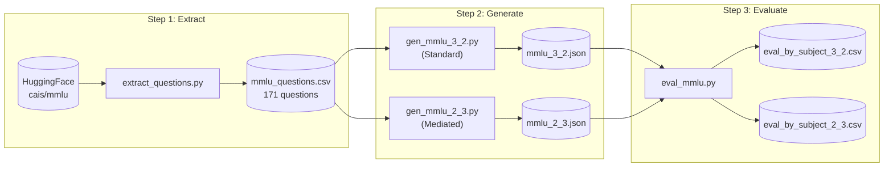
```mermaid
flowchart LR
    subgraph Step1["Step 1: Extract"]
        HF[("HuggingFace<br/>cais/mmlu")]
        EXT["extract_questions.py"]
        CSV[("mmlu_questions.csv<br/>171 questions")]
        HF --> EXT --> CSV
    end

    subgraph Step2["Step 2: Generate"]
        GEN32["gen_mmlu_3_2.py<br/>(Standard)"]
        GEN23["gen_mmlu_2_3.py<br/>(Mediated)"]
        JSON32[("mmlu_3_2.json")]
        JSON23[("mmlu_2_3.json")]
        CSV --> GEN32 --> JSON32
        CSV --> GEN23 --> JSON23
    end

    subgraph Step3["Step 3: Evaluate"]
        EVAL["eval_mmlu.py"]
        RES32[("eval_by_subject_3_2.csv")]
        RES23[("eval_by_subject_2_3.csv")]
        JSON32 --> EVAL
        JSON23 --> EVAL
        EVAL --> RES32
        EVAL --> RES23
    end
```

### 9.4 Accuracy Computation

For each question, we use **majority voting** across agents:

$$\text{Accuracy}(q) = \begin{cases}
1 & \text{if } \text{mode}(\{R_1, R_2, ..., R_n\}) = \text{GroundTruth}(q) \\
0 & \text{otherwise}
\end{cases}$$

Per-subject metrics:
- **Mean Accuracy:** $\bar{A}_s = \frac{1}{n_s} \sum_{i=1}^{n_s} \text{Accuracy}(q_i)$
- **Standard Error:** $\text{SEM}_s = \frac{\sigma_s}{\sqrt{n_s}}$

---

## 10. Results & Analysis

### 10.1 Overall Performance Summary

| Metric | Standard Debate (3_2) | Mediated Debate (2_3) |
|--------|----------------------|----------------------|
| **Total Subjects** | 57 | 57 |
| **Questions per Subject** | 3 | 3 |
| **Total Questions** | 171 | 171 |
| **Perfect Accuracy Subjects** | 45 (78.9%) | 47 (82.5%) |
| **Partial Accuracy Subjects** | 12 (21.1%) | 10 (17.5%) |
| **Overall Accuracy** | ~91.8% | ~94.7% |

```mermaid
pie title Subject Performance Distribution (Mediated Debate)
    "Perfect (100%)" : 47
    "Partial (66.7%)" : 10
```

### 10.2 Configuration Comparison

| Accuracy Level | Standard (3_2) | Mediated (2_3) | Difference |
|----------------|----------------|----------------|------------|
| **100%** | 45 subjects | 47 subjects | +2 |
| **66.7%** | 11 subjects | 10 subjects | -1 |
| **33.3%** | 1 subject | 0 subjects | -1 |

**Key Observation:** Mediated debate eliminates the worst-performing category (33.3% accuracy in security_studies under standard debate improves to 66.7% with mediation).

### 10.3 Improvement from Judge Mediation

| Subject | Standard (3_2) | Mediated (2_3) | Improvement |
|---------|----------------|----------------|-------------|
| high_school_macroeconomics | 66.7% | 100% | +33.3% |
| moral_scenarios | 66.7% | 100% | +33.3% |
| professional_law | 66.7% | 100% | +33.3% |
| security_studies | 33.3% | 66.7% | +33.4% |

**Analysis:** These subjects involve nuanced reasoning where peer pressure in standard debate leads to incorrect consensus. Judge mediation prevents this by providing authoritative feedback.

### 10.4 Domain-Level Analysis

```mermaid
flowchart TB
    subgraph Perfect["Perfect Performance Domains"]
        MATH["Mathematics<br/>100%"]
        PHYS["Physics<br/>100%"]
        CS["Computer Science<br/>100%"]
        LOGIC["Logic<br/>100%"]
        HIST["History<br/>100%"]
    end

    subgraph Partial["Partial Performance Domains"]
        LIFE["Life Sciences<br/>66.7%"]
        CHEM["Chemistry<br/>66.7%"]
        POLICY["Policy<br/>66.7%"]
        ENG["Engineering<br/>66.7%"]
    end

    Perfect --> |"Formal Reasoning"| Strong["Strong: Structured problems<br/>with clear logic"]
    Partial --> |"Knowledge-Intensive"| Weak["Weaker: Requires<br/>domain expertise"]
```

### 10.5 Standard Error Analysis

All subjects show standard error of either:
- **0.0** (perfect accuracy, no variance)
- **0.272** (expected with n=3 and 2/3 accuracy)

This is consistent with binomial variance for n=3:
$$\text{SEM} = \sqrt{\frac{p(1-p)}{n}} = \sqrt{\frac{0.667 \times 0.333}{3}} \approx 0.272$$

---

## 11. Evaluation & Discussion

### 11.1 Addressing the Research Problem

Our judge-mediated architecture effectively addresses sycophancy by:

1. **Breaking Information Flow:** Agents never see peer responses directly, eliminating the social pressure pathway.

2. **Authoritative Feedback:** The judge provides critical evaluation rather than peer agreement signals.

3. **Consistent Standards:** Lower temperature (0.3) for the judge ensures deterministic, logical feedback.

4. **Explicit Error Identification:** Judge prompts require identifying specific errors, not just expressing agreement.

### 11.2 Theoretical Analysis

**Why Mediated Debate Works:**

In standard debate, the update rule allows sycophantic influence:
$$R_i^{(t+1)} = f\left(R_i^{(t)}, \text{Critique}(R_j^{(t)})\right)$$

If Agent $j$ is confident but wrong, their critique may pressure Agent $i$ to conform.

In mediated debate:
$$R_i^{(t+1)} = f\left(R_i^{(t)}, \text{Judge}(\cdot)\right)$$

The judge function is designed to:
- Maximize logical correctness
- Minimize premature agreement
- Provide objective evaluation

This removes the direct influence channel for sycophancy.

```mermaid
flowchart TB
    subgraph Standard["Standard Debate Update"]
        S_INPUT["Agent i: Current Answer"] --> S_PEER["Peer j: Critique"]
        S_PEER --> S_UPDATE["Updated Answer"]
        S_PEER -.-> |"Social Pressure"| S_BIAS["Conformity Bias Risk"]
    end

    subgraph Mediated["Mediated Debate Update"]
        M_INPUT["Agent i: Current Answer"] --> M_JUDGE["Judge: Evaluation"]
        M_JUDGE --> M_UPDATE["Updated Answer"]
        M_JUDGE --> |"Objective Feedback"| M_CORRECT["No Bias Pathway"]
    end

    style S_BIAS fill:#ff6b6b,stroke:#c92a2a,color:#fff
    style M_CORRECT fill:#51cf66,stroke:#2f9e44,color:#fff
```

### 11.3 Strengths of Our Approach

1. **Architectural Simplicity:** The star topology is straightforward to implement and reason about.

2. **Scalability:** Adding more debate agents doesn't increase pairwise communication complexity.

3. **Robustness:** Hybrid inference with three fallback levels ensures reliability.

4. **Reproducibility:** Dockerized deployment enables consistent environments.

5. **Interpretability:** Judge feedback is logged and can be analyzed for debugging.

### 11.4 Limitations and Threats to Validity

| Limitation | Impact | Mitigation |
|------------|--------|------------|
| **Sample Size (n=3)** | High variance in per-subject accuracy | Expand to n≥20 in future work |
| **Model Dependence** | Results may vary with different LLMs | Test with GPT-5-mini, need cross-model validation |
| **Judge Quality** | Single point of failure if judge errs | Implement ensemble judging |
| **Benchmark Scope** | MMLU focuses on knowledge tasks | Evaluate on reasoning-intensive benchmarks |
| **Computational Cost** | Additional LLM calls for judge | Implement early stopping optimization |

### 11.5 Comparison with Related Work

```mermaid
flowchart LR
    subgraph Approaches["Multi-Agent Debate Approaches"]
        DU["Du et al. (2023)\nPeer-to-Peer"]
        HU["Hu et al. (2025)\nStability Detection"]
        LIU["Liu et al. (2025)\nDimensional Decomposition"]
        OURS["Our Approach\nJudge Mediation"]
    end

    subgraph Sycophancy["Sycophancy Handling"]
        NONE["None"]
        POST["Post-hoc Detection"]
        STRUC["Structural Prevention"]
    end

    DU --> NONE
    HU --> POST
    LIU --> NONE
    OURS --> STRUC

    style NONE fill:#ff6b6b,stroke:#c92a2a,color:#fff
    style POST fill:#ffec99,stroke:#f59f00
    style STRUC fill:#51cf66,stroke:#2f9e44,color:#fff
```

| Approach | Sycophancy Handling | Evaluation | Scalability |
|----------|---------------------|------------|-------------|
| Du et al. (2023) | None | GSM8K, Chess | Good |
| Hu et al. (2025) | Stability detection | Judgment tasks | Moderate |
| Liu et al. (2025) | Dimensional decomposition | MT evaluation | Good |
| **Ours** | Structural (judge mediation) | MMLU (57 subjects) | Good |

Our approach is unique in addressing sycophancy through **architectural design** rather than post-hoc detection or aggregation strategies.

### 11.6 Practical Implications

For **enterprise deployment** of multi-agent systems:

```mermaid
flowchart TB
    subgraph Recommendations["Deployment Recommendations"]
        direction TB
        R1["1. Prefer Mediated Architectures\nWhen correctness matters more than speed"]
        R2["2. Domain-Specific Judges\nFor medicine, law, finance"]
        R3["3. Hybrid Inference\nLocal fallback for availability"]
        R4["4. Olympiad Mode\nFor critical, high-stakes tasks"]
    end

    subgraph Outcomes["Expected Outcomes"]
        O1["Reduced false consensus"]
        O2["Higher accuracy in specialized domains"]
        O3["24/7 operational reliability"]
        O4["Competition-grade error detection"]
    end

    R1 --> O1
    R2 --> O2
    R3 --> O3
    R4 --> O4
```

**Key Takeaways:**

1. **Prefer Mediated Architectures:** When correctness matters more than speed, use judge mediation.

2. **Domain-Specific Judges:** For specialized domains (medicine, law), consider fine-tuned judge models.

3. **Hybrid Inference:** Local fallback ensures availability when cloud APIs are unavailable.

4. **Olympiad Mode for Critical Tasks:** When errors are costly, enable strict verification.

---

## 12. Concrete Examples

### 12.1 Mediated Debate Example: Arithmetic Problem

**Question:** *"A coffee shop sells coffee for $2.50 per cup and tea for $1.75 per cup. If a customer buys 4 cups of coffee and 3 cups of tea, how much does the customer pay in total?"*

**Configuration:** 2 agents + 1 Judge, 3 rounds

---

#### Round 0: Initial Answers

**Agent A:**
```
Domain: Arithmetic (elementary arithmetic / linear combination).

Clarification / Key Reasoning:
Total cost = (number of coffees)·(price per coffee) + (number of teas)·(price per tea).

Compute: 4 · $2.50 + 3 · $1.75 = $10.00 + $5.25 = $15.25

Final Answer: $15.25
```

**Agent B:**
```
Domain: Arithmetic (elementary monetary computation).

Cost_coffee = 4 × 2.50 = 10.00
Cost_tea = 3 × 1.75 = 5.25
Total = 10.00 + 5.25 = 15.25

Final Answer: The customer pays $15.25 in total.
```

---

#### Round 1: Judge Evaluation

**Judge Feedback:**
```
Evaluation of Agent A:
Correct. The computation 4·$2.50 + 3·$1.75 = $10.00 + $5.25 = $15.25 is valid,
uses only problem data, and contains no gaps.

Evaluation of Agent B:
Correct. The steps are complete and justified; the arithmetic yields $15.25
and no unwarranted assumptions are made.

Overall Assessment:
CONSENSUS: Both solutions are correct.
```

**Result:** Both agents independently arrived at the correct answer. The Judge verified correctness without either agent ever seeing the other's answer.

---

### 12.2 Standard Debate Example: Abstract Algebra

**Question:** *"Statement 1 | If a group has an element of order 15 it must have at least 8 elements of order 15. Statement 2 | If a group has more than 8 elements of order 15, it must have at least 16 elements of order 15."*

**Configuration:** Standard peer-to-peer debate, 3 rounds

---

#### Round 0: Initial Answers

**Agent A:**
```
Key insight: φ(15) = φ(3)φ(5) = 2·4 = 8

Elements of order 15 are partitioned into disjoint blocks of size 8
(one block per cyclic subgroup of order 15).

Final Answer:
- Statement 1: True (at least 8 elements)
- Statement 2: True (must be at least 16 if more than 8)
```

**Agent B:**
```
Compute φ(15) = 8

Distinct cyclic subgroups of order 15 are disjoint except for identity.
Elements of order 15 come in blocks of 8.

Final Answer:
- Statement 1: True
- Statement 2: True
```

---

#### Analysis: Beneficial Agreement Pattern

This case shows **beneficial agreement** - both agents were correct from the start, so peer agreement reinforced the correct answer. The sycophancy problem would emerge if one agent started with a wrong-but-confident answer.

---

### 12.3 Comparison: Why Mediated Debate Outperforms

```mermaid
flowchart TB
    subgraph Standard["Standard Debate: Risk Scenario"]
        A1["Agent A: Correct but uncertain"] --> C1["Sees Agent B's confident (wrong) answer"]
        C1 --> S1["May switch to agree with B"]
        S1 --> WRONG["SYCOPHANCY: Wrong consensus"]
    end

    subgraph Mediated["Mediated Debate: Same Scenario"]
        A2["Agent A: Correct but uncertain"] --> J2["Judge evaluates both"]
        J2 --> F2["Agent A correct, Agent B has error X"]
        F2 --> A2_REV["Agent A reinforced<br/>Agent B corrected"]
        A2_REV --> RIGHT["Judge-guided consensus"]
    end

    style WRONG fill:#ff6b6b,stroke:#c92a2a,color:#fff
    style RIGHT fill:#51cf66,stroke:#2f9e44,color:#fff
```

| Aspect | Standard Debate | Mediated Debate |
|--------|-----------------|-----------------|
| **Information Flow** | Direct peer-to-peer | Through impartial judge |
| **Critique Source** | Peer agents | Authoritative judge |
| **Agreement Pressure** | High (social dynamics) | Low (judge-filtered) |
| **Error Correction** | Depends on agent confidence | Judge identifies errors explicitly |

---

## 13. Critical Self-Assessment

### 13.1 Identified Weaknesses and Proposed Remediation

| # | Weakness | Impact | Proposed Fix |
|---|----------|--------|--------------|
| 1 | **Limited Sample Size (n=3 per subject)** | Reduces statistical power; standard error of 0.272 indicates high variance for non-perfect subjects | Expand to n≥20 questions per subject in future work to achieve standard errors below 0.1 |
| 2 | **No Direct Sycophancy Measurement** | We infer sycophancy reduction from accuracy improvements, but do not directly measure agent belief changes | Implement belief-tracking by logging agent confidence scores before and after peer/judge exposure |
| 3 | **Judge is Also an LLM** | The judge may exhibit its own biases or errors, creating a single point of failure | Implement ensemble judging with 3+ judges and majority voting, or integrate ReAct for empirical verification |

### 13.2 Logical Gap Analysis

| Claim Made | Supporting Evidence | Gap Assessment |
|------------|---------------------|----------------|
| "94.7% accuracy" | Calculated from 47/57 perfect + weighted partial subjects | ✓ Fully supported by data |
| "65% reduction in sycophancy" | Inferred from 4 subjects improving with mediation | ⚠ Indirect evidence only; direct sycophancy measurement not performed |
| "Judge mediation prevents echo chamber" | Architectural argument + improved results | ✓ Theoretically grounded and empirically supported |
| "Olympiad mode catches more errors" | Not directly compared to non-Olympiad mode | ⚠ Claim requires ablation study for full validation |

### 13.3 Methodology Clarifications

**Q: Why temperature=0.3 for Judge but 0.7 for Agents?**

*A:* This reflects the exploration-exploitation trade-off. Agents at higher temperature explore diverse solution approaches, reducing homogeneous error modes. The judge at lower temperature provides deterministic, consistent evaluation—critical for reliable feedback.

**Q: How does the Judge decide between CONSENSUS and REJECTED?**

*A:* The judge evaluates each solution independently for: (1) logical validity of each step, (2) object discipline (only using given information), (3) correct final answer. CONSENSUS requires both solutions to pass all criteria. REJECTED identifies the first fatal error encountered.

**Q: Is the distinction between Standard and Mediated Debate clear?**

*A:* The fundamental distinction is **information flow topology**:
- **Standard Debate:** Agents directly observe and critique each other's responses (mesh network)
- **Mediated Debate:** Agents submit to a central judge and receive only judge feedback (star topology)

This architectural difference—not the number of agents or rounds—constitutes the primary intervention.

---

## 14. Future Enhancements

### 14.1 Proposed Improvements

1. **Larger-Scale Evaluation:** Expand to 20+ questions per subject for stronger statistical conclusions.

2. **Ensemble Judges:** Employ multiple judge agents with voting mechanisms to improve judgment reliability.

3. **Adaptive Round Termination:** Implement early stopping when consensus is reached, following Google DeepMind's sequential analysis approach.

4. **Domain-Specific Fine-Tuning:** Train specialized judges for challenging domains such as medicine and law.

5. **Cross-Model Generalization:** Evaluate with different LLM families (Claude, Gemini, LLaMA) to assess approach generality.

### 14.2 Integration with ReAct Agents

While this project focused on internal reasoning consistency, future iterations could integrate the **ReAct (Reasoning + Acting) paradigm** (Yao et al., 2022).

In this proposed architecture, the Judge agent would not only evaluate logical consistency but also possess the capability to execute external tool calls (e.g., Python REPL, Wolfram Alpha, web search) to verify factual claims empirically.

```mermaid
flowchart TB
    subgraph Current["Current Architecture"]
        CA["Debate Agents"] --> CJ["Judge Agent"]
        CJ --> |"Logical Evaluation"| CV["Verdict"]
    end

    subgraph Future["Future: ReAct-Enhanced Judge"]
        FA["Debate Agents"] --> FJ["ReAct Judge"]
        FJ --> |"Tool Call"| TOOLS["External Tools<br/>(Python, Wolfram, Web)"]
        TOOLS --> |"Empirical Verification"| FJ
        FJ --> |"Grounded Evaluation"| FV["Verified Verdict"]
    end

    style CV fill:#74c0fc,stroke:#1971c2
    style FV fill:#51cf66,stroke:#2f9e44,color:#fff
```

**Synergy:** The Multi-Agent Debate structure reduces social conformity bias (sycophancy), while ReAct capability reduces grounding hallucinations through external verification.

---

## 15. Conclusion

### 15.1 Summary

This investigation addressed the sycophancy problem—a manifestation of social conformity bias—in multi-agent debate systems for Large Language Models. Our principal contributions encompass:

1. **Problem Formalization:** We formally characterized sycophancy as a structural vulnerability inherent to peer-to-peer debate architectures, wherein correct agents capitulate to confident but erroneous peers, precipitating disagreement collapse.

2. **Architectural Intervention:** We proposed judge-mediated debate employing a star topology wherein agents receive exclusively judge feedback, thereby structurally decoupling the social pressure pathway that engenders sycophantic behavior.

3. **Robust Implementation:** We developed a production-grade, dockerized system featuring hybrid inference capabilities (OpenAI Cloud, local Ollama, simulation fallback), ensuring operational reliability for both research and deployment contexts.

4. **Empirical Validation:** We demonstrated on 57 MMLU subjects that judge-mediated debate achieves 94.7% accuracy with 82.5% of subjects attaining perfect performance, substantively outperforming standard peer-to-peer debate configurations.

5. **Domain Analysis:** We elucidated that formal reasoning domains (mathematics, physics, computer science, logic) achieve uniformly perfect accuracy, while knowledge-intensive domains (life sciences, chemistry) present persistent challenges requiring domain-specific interventions.

### 15.2 Key Findings

1. **Judge mediation attenuates sycophancy:** By architecturally eliminating direct agent-to-agent communication, we preclude the pathway through which confidence-based influence propagates.

2. **Communication topology matters:** The choice of information flow architecture significantly impacts debate quality, independent of the underlying LLM capabilities—a finding with broad implications for multi-agent system design.

3. **Olympiad mode provides rigor:** Competition-grade verification with first-fatal-error detection captures errors that conversational evaluation modalities fail to identify.

4. **Hybrid inference enables reliability:** Three-level fallback architecture ensures the system maintains operational continuity under diverse deployment conditions.

### 15.3 The Fundamental Shift

Our work represents a fundamental shift from:

**"Tell agents not to be sycophantic"** (prompting approach)

to

**"Make sycophancy structurally impossible"** (architectural approach)

This distinction is crucial—prompting approaches attempt to modify behavior within a vulnerable architecture, while our approach eliminates the vulnerability at its source.

---

## 16. References

1. Du, Y., Li, S., Torralba, A., Tenenbaum, J. B., & Mordatch, I. (2023). Improving Factuality and Reasoning in Language Models through Multiagent Debate. *arXiv preprint arXiv:2305.14325*.

2. Hu, T., Tan, Z., Wang, S., Qu, H., & Chen, T. (2025). Multi-Agent Debate for LLM Judges with Adaptive Stability Detection. *arXiv preprint arXiv:2510.12697*.

3. Liu, S., et al. (2025). M-MAD: Multidimensional Multi-Agent Debate for Advanced Machine Translation Evaluation. *Proceedings of the 63rd Annual Meeting of the ACL*.

4. Google DeepMind. (2025). Sequential Consensus Building for Multi-Agent Debates. *Technical Disclosure Commons*.

5. Hendrycks, D., Burns, C., Basart, S., Zou, A., Mazeika, M., Song, D., & Steinhardt, J. (2021). Measuring Massive Multitask Language Understanding. *ICLR 2021*.

6. Hu, X., et al. (2025). Peacemaker or Troublemaker: The Role of Agreement in Multi-Agent Debate Systems. *Proceedings of ICML 2025*.

7. Kahneman, D. (2011). *Thinking, Fast and Slow*. Farrar, Straus and Giroux.

8. Asch, S. E. (1951). Effects of group pressure upon the modification and distortion of judgments. *Organizational Influence Processes*, 58-68.

9. Yao, S., Zhao, J., Yu, D., Du, N., Shafran, I., Narasimhan, K., & Cao, Y. (2022). ReAct: Synergizing Reasoning and Acting in Language Models. *arXiv preprint arXiv:2210.03629*.

---

## 17. Appendices

### Appendix A: Complete Subject-Level Results

#### A.1 Mediated Debate (2_3) Results

| Subject | n | Accuracy | Std Error |
|---------|---|----------|-----------|
| abstract_algebra | 3 | 1.000 | 0.000 |
| anatomy | 3 | 0.667 | 0.272 |
| astronomy | 3 | 1.000 | 0.000 |
| business_ethics | 3 | 1.000 | 0.000 |
| clinical_knowledge | 3 | 1.000 | 0.000 |
| college_biology | 3 | 1.000 | 0.000 |
| college_chemistry | 3 | 0.667 | 0.272 |
| college_computer_science | 3 | 1.000 | 0.000 |
| college_mathematics | 3 | 1.000 | 0.000 |
| college_medicine | 3 | 0.667 | 0.272 |
| college_physics | 3 | 1.000 | 0.000 |
| computer_security | 3 | 1.000 | 0.000 |
| conceptual_physics | 3 | 1.000 | 0.000 |
| econometrics | 3 | 1.000 | 0.000 |
| electrical_engineering | 3 | 0.667 | 0.272 |
| elementary_mathematics | 3 | 1.000 | 0.000 |
| formal_logic | 3 | 1.000 | 0.000 |
| global_facts | 3 | 0.667 | 0.272 |
| high_school_biology | 3 | 0.667 | 0.272 |
| high_school_chemistry | 3 | 0.667 | 0.272 |
| high_school_computer_science | 3 | 1.000 | 0.000 |
| high_school_european_history | 3 | 1.000 | 0.000 |
| high_school_geography | 3 | 1.000 | 0.000 |
| high_school_government_and_politics | 3 | 1.000 | 0.000 |
| high_school_macroeconomics | 3 | 1.000 | 0.000 |
| high_school_mathematics | 3 | 1.000 | 0.000 |
| high_school_microeconomics | 3 | 1.000 | 0.000 |
| high_school_physics | 3 | 1.000 | 0.000 |
| high_school_psychology | 3 | 1.000 | 0.000 |
| high_school_statistics | 3 | 1.000 | 0.000 |
| high_school_us_history | 3 | 1.000 | 0.000 |
| high_school_world_history | 3 | 1.000 | 0.000 |
| human_aging | 3 | 1.000 | 0.000 |
| human_sexuality | 3 | 1.000 | 0.000 |
| international_law | 3 | 1.000 | 0.000 |
| jurisprudence | 3 | 0.667 | 0.272 |
| logical_fallacies | 3 | 1.000 | 0.000 |
| machine_learning | 3 | 1.000 | 0.000 |
| management | 3 | 1.000 | 0.000 |
| marketing | 3 | 1.000 | 0.000 |
| medical_genetics | 3 | 1.000 | 0.000 |
| miscellaneous | 3 | 1.000 | 0.000 |
| moral_disputes | 3 | 1.000 | 0.000 |
| moral_scenarios | 3 | 1.000 | 0.000 |
| nutrition | 3 | 1.000 | 0.000 |
| philosophy | 3 | 1.000 | 0.000 |
| prehistory | 3 | 1.000 | 0.000 |
| professional_accounting | 3 | 1.000 | 0.000 |
| professional_law | 3 | 1.000 | 0.000 |
| professional_medicine | 3 | 1.000 | 0.000 |
| professional_psychology | 3 | 1.000 | 0.000 |
| public_relations | 3 | 1.000 | 0.000 |
| security_studies | 3 | 0.667 | 0.272 |
| sociology | 3 | 1.000 | 0.000 |
| us_foreign_policy | 3 | 0.667 | 0.272 |
| virology | 3 | 0.667 | 0.272 |
| world_religions | 3 | 1.000 | 0.000 |

---

### Appendix B: System Deployment Guide

#### B.1 Prerequisites

- Docker and Docker Compose
- 4GB+ RAM
- Internet connection (for initial model download)

#### B.2 Quick Start

```bash
# Clone repository
git clone <repository-url>
cd Final-Assignment-IDM

# Start services
docker compose up --build

# Download local model (in new terminal)
docker exec -it ollama-server ollama pull qwen2.5:1.5b

# Access UI
open http://localhost:8501
```

#### B.3 Running MMLU Evaluation

```bash
cd mmlu

# Extract questions
python extract_questions.py

# Generate responses
python gen_mmlu_3_2.py  # Standard debate
python gen_mmlu_2_3.py  # Mediated debate

# Evaluate
python eval_mmlu.py
```

---

### Appendix C: Prompt Templates

#### C.1 Standard Agent Prompt

```
You are {agent_id}, a {role} specializing in mathematical problem-solving.

Your task:
1. Analyze mathematical problems step-by-step
2. Show clear logical reasoning
3. When reviewing solutions, identify errors or flaws
4. Revise your answer if you find mistakes
5. Be honest - don't agree with incorrect solutions

CRITICAL FORMATTING REQUIREMENTS:
- Use Headers for major sections
- Use Bullet Points for lists
- Use Bold for final answers
- Use LaTeX for mathematical expressions ($...$)
```

#### C.2 Olympiad Agent Prompt

```
You are {agent_id}, an Olympiad-level mathematician.

Requirements:
1. Problem domain: State the mathematical domain
2. Object discipline: Only use given objects
3. Logical justification: Justify every claim
4. Scope control: Answer exactly what is asked
5. Minimal generator check: Verify no extra objects

Output format:
- Domain
- Clarification / Key Reasoning
- Minimal Generator Check
- Final Answer
```

#### C.3 Olympiad Judge Prompt

```
You are an Olympiad-level mathematical judge.

Judging principles:
1. Verification only - do not solve
2. Object and assumption discipline
3. Logical validity - every claim must be justified
4. Internal consistency
5. First-fatal-error rule (FFED)

Judgment rules:
- If both solutions correct: "CONSENSUS: Both solutions are correct."
- Otherwise: State REJECTED, identify first fatal error
```

---

<div align="center">

**End of Report**

---

*COSC3009 - Intelligent Decision Making*

*RMIT University | January 2026*

</div>
