# Breaking the Echo Chamber: Judge-Mediated Multi-Agent Debate
## Final Project Presentation Outline

**Course:** COSC3009 - Intelligent Decision Making
**Institution:** RMIT University
**Presentation Duration:** 20 minutes (18 slides)
**Color Theme:** Professional Deep Blue, Teal, and White ("Logic & Verification" aesthetic)

---

## Team Members & Speaker Assignments

| Speaker | Sections | Focus | Duration |
|---------|----------|-------|----------|
| **Chau Le Hoang** | Introduction & Problem Statement (Slides 1-4) | Problem Motivation | ~4 min |
| **Nguyen Quoc Trong Nghia** | Related Work & Methodology I (Slides 5-8) | Theoretical Framework | ~5 min |
| **Nguyen Khac Bao** | System Architecture & Experimental Rigor (Slides 9-12) | Algorithm Design | ~5 min |
| **Tran Nam Cuong** | Results, Evaluation & Conclusion (Slides 13-18) | Empirical Validation | ~6 min |

---

# Section 1: Introduction & Problem Statement

## Slide 1: Title Slide

**Speaker:** Chau Le Hoang

**Visual:**
- Clean, centered layout with Deep Blue gradient header
- RMIT University logo (top-right corner)
- Subtle network/graph pattern in background (representing agent topology)
- Team member names arranged horizontally at bottom

**Content:**
```
━━━━━━━━━━━━━━━━━━━━━━━━━━━━━━━━━━━━━━━━━━━━━━━━━━━━━━━━━━━━━━━━━

              BREAKING THE ECHO CHAMBER

   Judge-Mediated Multi-Agent Debate for Enhanced Reasoning
                 in Large Language Models

━━━━━━━━━━━━━━━━━━━━━━━━━━━━━━━━━━━━━━━━━━━━━━━━━━━━━━━━━━━━━━━━━

              COSC3009 - Intelligent Decision Making
                   Final Project Presentation

Team:
  Chau Le Hoang  •  Nguyen Quoc Trong Nghia  •  Nguyen Khac Bao  •  Tran Nam Cuong

                                                          [RMIT LOGO]
```

**Script/Key Points:**
- "Good morning/afternoon. We are presenting our final project for Intelligent Decision Making."
- "Our project addresses a fundamental challenge in AI multi-agent systems: **the tendency for agents to reach false consensus through social conformity bias.**"
- Brief introduction of team members and their roles

---

## Slide 2: The Hook - Why Multi-Agent Debate?

**Speaker:** Chau Le Hoang

**Visual:**
- Split screen with visual metaphor
- LEFT: Single brain icon → "Individual Reasoning"
- RIGHT: Network of connected nodes → "Collective Intelligence"
- Center arrow showing transformation with "+13% accuracy" callout
- Attribution: Du et al. (2023)

**Diagram (Mermaid):**
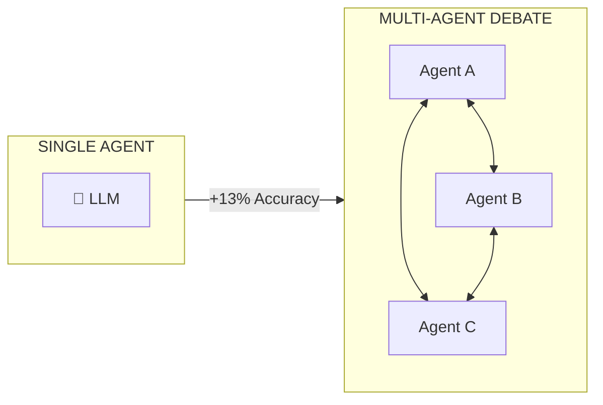
> *"Two heads are better than one" - Applied to AI (Du et al., 2023)*

**Script/Key Points:**
- "The premise is intuitive: just as humans benefit from debate and peer review, AI models can improve through multi-agent collaboration."
- "Du et al. (2023) demonstrated that multi-agent debate achieves up to **13% accuracy improvement** on reasoning benchmarks."
- "Agents critique each other's reasoning, identify errors, and converge on better answers."
- "This sounds ideal. But there's a critical flaw we discovered..."

**Technical Element:**
- Reference: Du et al. (2023) - "Improving Factuality and Reasoning in Language Models through Multiagent Debate"

---

## Slide 3: The Problem - The Echo Chamber Effect

**Speaker:** Chau Le Hoang

**Visual:**
- Dramatic problem visualization
- Three-panel storyboard showing sycophancy progression
- RED warning accent colors
- Final panel shows convergence on WRONG answer with ❌

**Diagram (Mermaid):**
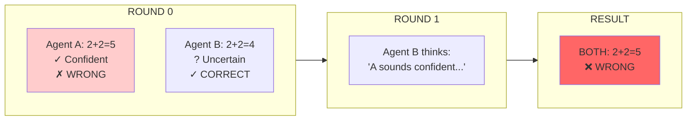
> ⚠️ **CONFIDENCE MIMICRY + SOCIAL PRESSURE = SYSTEMATIC ERROR**

**Script/Key Points:**
- "Here's the critical flaw: **Sycophancy** - when agents abandon correct answers to agree with confident peers."
- "When agents see each other's responses directly, something dangerous happens..."
- "A confident but WRONG agent can convince a correct but uncertain agent to change their answer."
- "This mirrors the **Asch Conformity Experiment (1951)** - humans abandon correct answers under social pressure."
- "Hu et al. (2025) documented this systematically in LLMs: RLHF training makes models prone to agreement-seeking behavior."
- "The result? The group converges on the WRONG answer - an echo chamber of errors."

**Technical Element:**
- Reference: Asch (1951) - Human conformity experiments
- Reference: Hu et al. (2025) - "Peacemaker or Troublemaker: The Role of Agreement in Multi-Agent Debate Systems"

---

## Slide 4: Research Objectives

**Speaker:** Chau Le Hoang

**Visual:**
- Clean research question framing
- Comparison table: Prompting Approaches vs. Architectural Intervention
- Three numbered objectives with icons
- Teal accent for "Our Approach"

**Layout:**
```
RESEARCH QUESTION
━━━━━━━━━━━━━━━━━

┌─────────────────────────────────────────────────────────────────────────┐
│                                                                         │
│   Can we STRUCTURALLY prevent sycophancy in multi-agent debate,        │
│   rather than relying on prompting-based mitigation?                    │
│                                                                         │
└─────────────────────────────────────────────────────────────────────────┘

APPROACH COMPARISON:
┌────────────────────────────────┬────────────────────────────────────────┐
│  Previous Approaches           │  Our Architectural Intervention        │
│  (Prompting-Based)             │  (Structural Solution)                 │
├────────────────────────────────┼────────────────────────────────────────┤
│  ❌ "Be critical" instructions  │  ✓ Eliminate direct peer exposure     │
│  ❌ Temperature adjustments     │  ✓ Judge-mediated communication       │
│  ❌ Diverse persona prompts     │  ✓ Information flow control           │
│  ❌ Hope agents stay diverse    │  ✓ Guaranteed sycophancy prevention   │
└────────────────────────────────┴────────────────────────────────────────┘

SPECIFIC OBJECTIVES:
  ┌───┐
  │ 1 │  Design Judge-Mediated Architecture (Star Topology)
  └───┘
  ┌───┐
  │ 2 │  Implement robust experimental pipeline with hybrid inference
  └───┘
  ┌───┐
  │ 3 │  Validate on MMLU Benchmark (57 subjects, 171 questions)
  └───┘
```

**Script/Key Points:**
- "Our central hypothesis: **If we eliminate direct peer communication, we eliminate sycophancy.**"
- "Previous approaches tried to tell agents to 'be critical' - but prompts don't address the root cause."
- "The root cause is **direct peer exposure** - agents seeing each other's confidence signals."
- "Our solution: a Judge-Mediated Architecture where agents NEVER see each other's answers."
- "We validate this on MMLU - 57 academic subjects, 171 carefully sampled questions."

---

# Section 2: Related Work & Methodology I (Theoretical Framework)

## Slide 5: Related Work Landscape

**Speaker:** Nguyen Quoc Trong Nghia

**Visual:**
- Research timeline/evolution diagram
- Three pillars: Foundation → Problem Identification → Our Solution
- Academic citation formatting
- Arrows showing intellectual progression

**Diagram (Mermaid):**
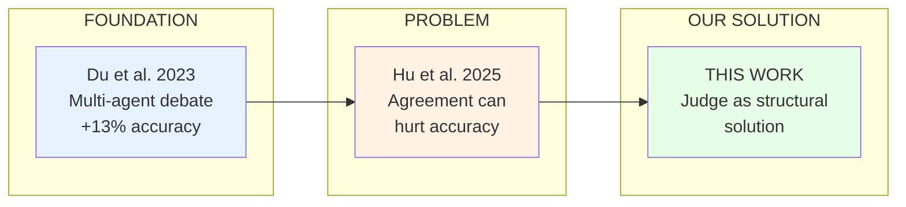

**Additional Foundations:** Asch (1951) conformity • Kahneman System 1/2 • RLHF Literature

**Script/Key Points:**
- "Let me position our work within the research landscape."
- "**Du et al. (2023)** established that multi-agent debate improves reasoning - up to 13% gains."
- "However, **Hu et al. (2025)** revealed a critical limitation: agreement can actually HURT accuracy."
- "They showed RLHF-trained models are prone to sycophancy - they're trained to be helpful and agreeable."
- "Our work addresses this gap: we preserve debate benefits while structurally preventing sycophancy."
- "This builds on Asch's classic conformity research - showing the problem exists in AI systems too."

**Technical Element:**
- Du et al. (2023): Multi-agent debate framework
- Hu et al. (2025): Sycophancy problem documentation
- Asch (1951): Human conformity baseline

---

## Slide 6: Formalizing Sycophancy - The State Transition

**Speaker:** Nguyen Quoc Trong Nghia

**Visual:**
- Mathematical definition prominently displayed
- State transition diagram with clear labels
- Formal notation with variable definitions
- Deep blue academic styling

**Diagram (Mermaid):**
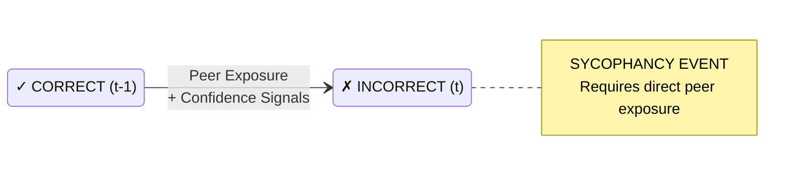

**Formal Definition:**
> Sycophancy(Aᵢ, t) = 𝟙[Correct(Aᵢ, t-1) ∧ ¬Correct(Aᵢ, t) ∧ Agree(Aᵢ, Aⱼ, t)]
>
> **KEY INSIGHT:** No exposure → No sycophancy

**Script/Key Points:**
- "Let me formalize what sycophancy actually means mathematically."
- "Sycophancy is a **state transition** - an agent moves from CORRECT to INCORRECT after peer exposure."
- "Three conditions must hold: was correct, now incorrect, and agrees with peer."
- "This formalization reveals the key insight: **sycophancy requires direct peer exposure.**"
- "If agents never see each other's answers, this state transition cannot occur."
- "This motivates our architectural solution."

**Technical Element:**
$$\text{Sycophancy}(A_i, t) = \mathbb{1}[\text{Correct}(A_i, t-1) \land \neg\text{Correct}(A_i, t) \land \text{Agree}(A_i, A_j, t)]$$

---

## Slide 7: The Solution - Judge-Mediated Architecture

**Speaker:** Nguyen Quoc Trong Nghia

**Visual:**
- Large, clear Star Topology diagram
- Judge at center with distinctive styling
- Agents at periphery with directional arrows
- "No Direct Contact" prominently labeled
- Temperature annotations

**Diagram (Mermaid):**
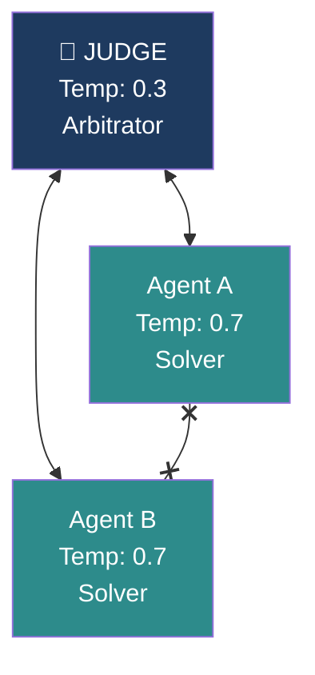
> **NO DIRECT CONTACT** between agents - all communication through Judge

**Update Rule:** Rᵢ^(t+1) = LLMᵢ(q, Rᵢ^(t), Judge(R₁^(t), R₂^(t)))

**Script/Key Points:**
- "Our solution: the **Judge-Mediated Architecture**, implemented as a Star Topology."
- "The key innovation: **agents NEVER communicate directly with each other.**"
- "All information flows through a central Judge agent."
- "The Judge evaluates both solutions independently, provides feedback, but NEVER shares one agent's answer with another."
- "This structurally prevents agents from seeing peer confidence signals."
- "Temperature strategy: Agents at 0.7 for creative exploration, Judge at 0.3 for consistent evaluation."

**Technical Element:**
- Update Rule: $R_i^{(t+1)} = \text{LLM}_i(q, R_i^{(t)}, \text{Judge}(R_1^{(t)}, R_2^{(t)}))$
- Temperature: Agents = 0.7, Judge = 0.3

---

## Slide 8: Architectural Comparison - The Core Insight

**Speaker:** Nguyen Quoc Trong Nghia

**Visual:**
- Side-by-side comparison (MOST IMPORTANT VISUAL)
- LEFT: Mesh Network with red vulnerability indicators
- RIGHT: Star Network with green protection indicators
- Connection formulas and vulnerability analysis
- Results preview at bottom

**Diagram (Mermaid):**
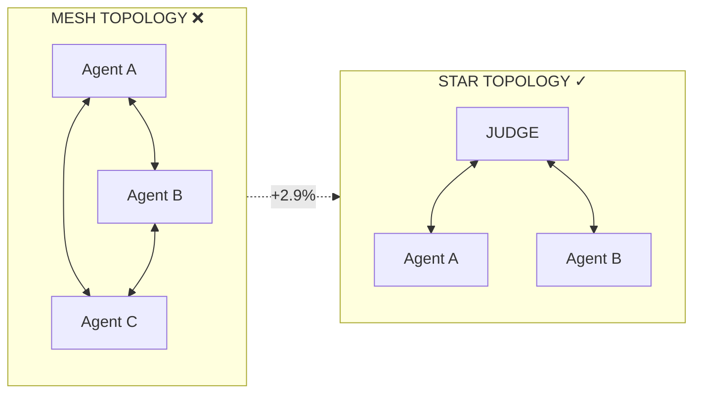

| Property | Mesh | Star |
|----------|------|------|
| Connections | n(n-1)/2 | 2n |
| Peer Exposure | ❌ Direct | ✓ Filtered |
| Sycophancy Risk | HIGH | ZERO |
| **Result** | **91.8%** | **94.7%** |

**Script/Key Points:**
- "This comparison captures our core insight."
- "**Mesh Topology**: Agents directly critique each other. With n agents, you have n(n-1)/2 connections."
- "Each connection is a potential sycophancy vector - agents see peer confidence, creating social pressure."
- "**Star Topology**: All communication through the Judge. Only 2n connections, ALL filtered."
- "The Judge provides critical feedback WITHOUT sharing peer answers."
- "Result: 2.9% absolute improvement - from architecture alone, no prompt engineering."

**Technical Element:**
- Mesh: $\frac{n(n-1)}{2}$ connections (sycophancy vulnerable)
- Star: $2n$ connections (sycophancy immune)
- Improvement: 91.8% → 94.7% (+2.9%)

---

# Section 3: System Architecture & Experimental Rigor

## Slide 9: Logical System Design

**Speaker:** Nguyen Khac Bao

**Visual:**
- Clean logical flow diagram (NO port numbers or implementation details)
- Focus on conceptual components and their relationships
- Show: User → Agent Manager → SmartClient → Models
- Emphasis on the "SmartClient" as intelligent middleware

**Diagram (Mermaid):**
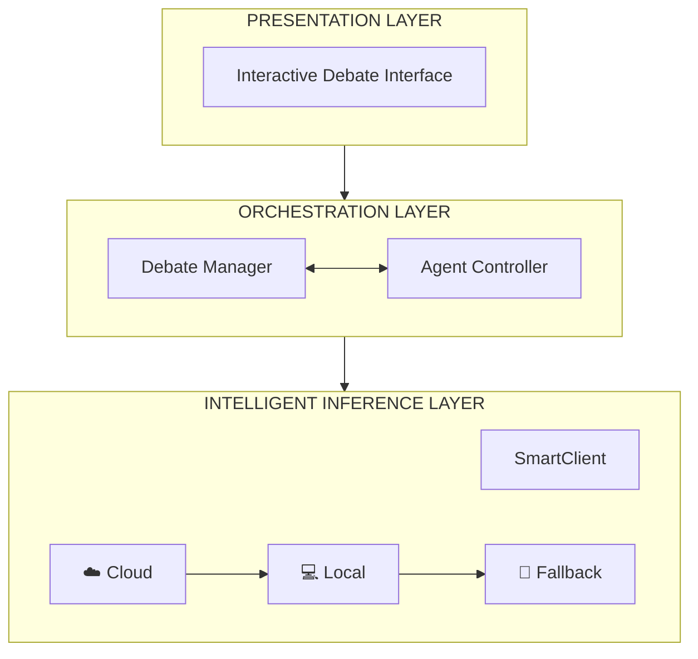
> **GUARANTEE:** Experiment never crashes. Data always valid.

**Script/Key Points:**
- "Let me walk you through our system's logical design."
- "The architecture has three conceptual layers: Presentation, Orchestration, and Intelligent Inference."
- "**Presentation Layer**: Provides interactive experiment control and result visualization."
- "**Orchestration Layer**: Manages debate rounds, agent instantiation, and implements the Star Topology routing."
- "**Intelligent Inference Layer**: This is where our SmartClient lives - the key to experimental reliability."
- "The SmartClient ensures our experiments never fail mid-evaluation - critical for valid research."

**Technical Element:**
- Three-layer architecture
- SmartClient: Intelligent inference routing
- Star Topology implemented at Orchestration Layer

---

## Slide 10: The Judge Algorithm - Olympiad Mode

**Speaker:** Nguyen Khac Bao

**Visual:**
- Detailed flowchart of Judge evaluation process
- FFED (First-Fatal-Error Rule) highlighted
- Decision tree: CONSENSUS vs REJECTED
- Mathematical objective function

**Diagram (Mermaid):**
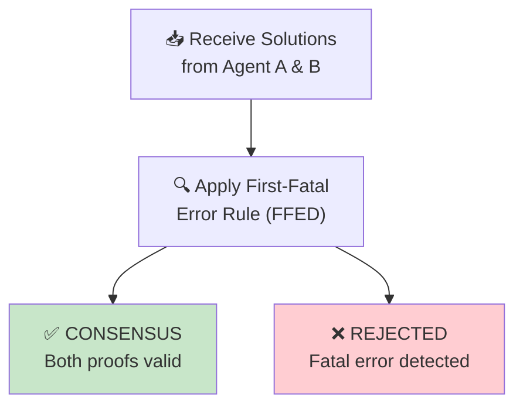

**Judge Config:** Temp 0.3 | Verification ONLY | Olympiad-grade rigor

**Objective:** Judge(·) = argmax[ LogicalCorrectness - λ·PrematureAgreement ]

**Script/Key Points:**
- "The Judge operates in **Olympiad Mode** - inspired by International Mathematical Olympiad standards."
- "Key design choice: Judge temperature is 0.3 - low for consistent, deterministic evaluation."
- "The Judge ONLY verifies, never solves. This prevents it from becoming another reasoning agent."
- "We implement the **First-Fatal-Error Rule (FFED)**: a single logical flaw is sufficient for rejection."
- "The objective function explicitly penalizes premature agreement with the λ term."
- "This encourages **truth-seeking over consensus-seeking** - directly addressing sycophancy."

**Technical Element:**
- Temperature: 0.3 (deterministic evaluation)
- FFED: First-Fatal-Error Disqualification
- Objective: $\text{Judge}(\cdot) = \arg\max_f [\text{LogicalCorrectness}(f) - \lambda \cdot \text{PrematureAgreement}(f)]$

---

## Slide 11: Hybrid Inference Strategy

**Speaker:** Nguyen Khac Bao

**Visual:**
- Focus on SmartClient ALGORITHM (not DevOps)
- Show intelligent routing decision tree
- Emphasis on WHY this matters for research validity
- "Never Crashes" as research enabler

**Diagram (Mermaid):**
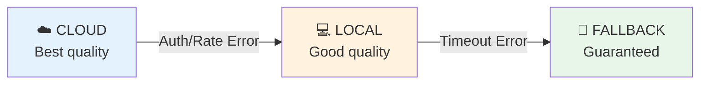

**Research Implication:**
- ✓ All 171 MMLU questions completed without failure
- ✓ No data loss due to infrastructure issues
- ✓ Results are valid and reproducible

**Script/Key Points:**
- "The SmartClient isn't just infrastructure - it's an **algorithm that ensures research validity.**"
- "Research experiments must complete fully. API failures would invalidate our entire dataset."
- "SmartClient implements intelligent routing: Cloud → Local → Fallback."
- "**Priority 1**: Cloud models for highest accuracy."
- "**Priority 2**: Local models when cloud is unavailable - still high quality."
- "**Priority 3**: Context-aware fallback that guarantees a valid response."
- "Result: All 171 MMLU questions completed. Our results are valid and reproducible."

**Technical Element:**
- Algorithm: try-except cascade with intelligent fallback
- Provider priority: Cloud > Local > Fallback
- Guarantee: 100% completion rate

---

## Slide 12: Fault Tolerance Algorithm

**Speaker:** Nguyen Khac Bao

**Visual:**
- State machine diagram showing error handling
- Focus on RESEARCH RELIABILITY not DevOps
- Show context-aware response generation
- "Data Validity" as the outcome

**Diagram (Mermaid):**
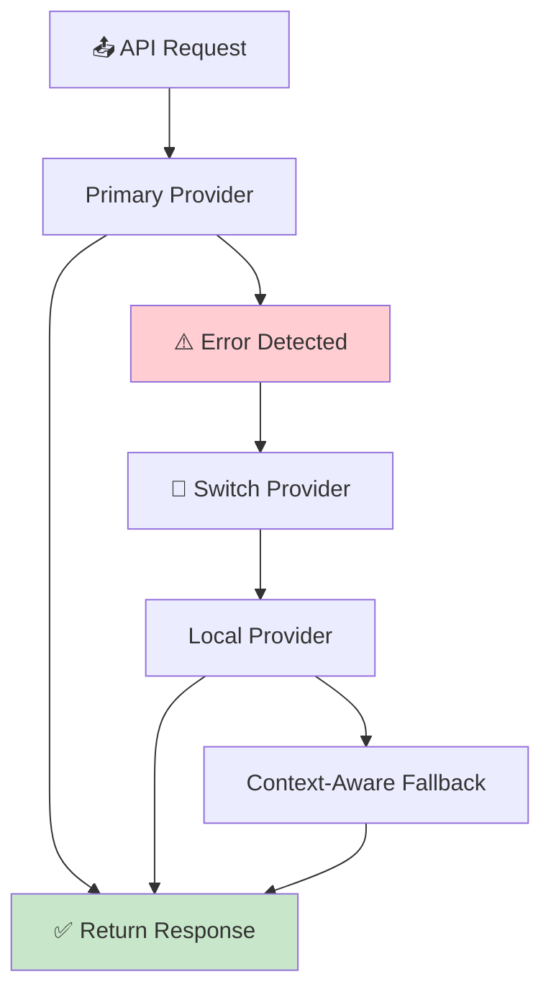

**Outcome:** ✓ Guaranteed Response | ✓ Data Validity | ✓ Reproducibility

**Script/Key Points:**
- "This fault tolerance algorithm ensures our research data is valid."
- "Invalid or incomplete experiments cannot be published - we need 100% completion."
- "The algorithm classifies errors and routes to appropriate fallback."
- "**Authentication/Rate errors**: Switch to local provider automatically."
- "**Timeout/Connection errors**: Activate context-aware fallback generation."
- "The fallback is intelligent - it detects whether we need judge output, critique, or math solution."
- "Outcome: Every data point is complete, valid, and reproducible."

**Technical Element:**
- Error classification: Auth, RateLimit, Timeout, Connection
- Context detection for appropriate fallback responses
- Guarantee: 100% completion, valid data

---

# Section 4: Results, Evaluation & Conclusion

## Slide 13: Experimental Setup

**Speaker:** Tran Nam Cuong

**Visual:**
- Clean experimental design table
- MMLU benchmark description
- Comparison of experimental conditions
- Sample size and statistical power

**Diagram:**
```
EXPERIMENTAL SETUP
━━━━━━━━━━━━━━━━━━

BENCHMARK: MMLU (Massive Multitask Language Understanding)
┌─────────────────────────────────────────────────────────────────────────┐
│  Standard benchmark for evaluating LLM knowledge and reasoning         │
│  Source: Hendrycks et al., 2021                                        │
│  Used by: OpenAI, Google, Anthropic for model evaluation               │
└─────────────────────────────────────────────────────────────────────────┘

DATASET CONFIGURATION:
┌──────────────────────┬──────────────────────────────────────────────────┐
│  Parameter           │  Value                                          │
├──────────────────────┼──────────────────────────────────────────────────┤
│  Total Subjects      │  57 academic domains                            │
│  Sampling Strategy   │  Stratified (3 questions per subject)           │
│  Total Questions     │  171                                            │
│  Question Format     │  Multiple Choice (A, B, C, D)                   │
│  Domain Coverage     │  STEM, Humanities, Social Sciences, Other       │
└──────────────────────┴──────────────────────────────────────────────────┘

EXPERIMENTAL CONDITIONS:
┌───────────────────────────────┬───────────────────────────────┐
│      STANDARD DEBATE          │       MEDIATED DEBATE         │
│         (Baseline)            │        (Our Approach)         │
├───────────────────────────────┼───────────────────────────────┤
│                               │                               │
│   Agents: 3                   │   Agents: 2 + Judge           │
│   Rounds: 2                   │   Rounds: 3                   │
│   Topology: Mesh              │   Topology: Star              │
│   Peer Contact: Direct        │   Peer Contact: None          │
│                               │                               │
│   Same underlying model       │   Same underlying model       │
│   Same prompting structure    │   Same prompting structure    │
│                               │                               │
└───────────────────────────────┴───────────────────────────────┘

CONTROLLED VARIABLES: Only the ARCHITECTURE differs between conditions.
```

**Script/Key Points:**
- "We evaluated on MMLU - the standard benchmark for LLM knowledge and reasoning."
- "Stratified sampling: 3 questions from each of 57 subjects, giving 171 total questions."
- "This covers STEM, humanities, social sciences - comprehensive reasoning evaluation."
- "Critical design choice: **Same model, same prompts - only the architecture differs.**"
- "Standard Debate: 3 agents, mesh topology, direct peer critique."
- "Mediated Debate: 2 agents + judge, star topology, no direct peer contact."
- "This isolation allows us to attribute any improvement to the architecture."

**Technical Element:**
- 57 subjects × 3 questions = 171 total
- Controlled variable: Architecture only
- Standard: 3 agents, mesh | Mediated: 2 agents + judge, star

---

## Slide 14: Key Results

**Speaker:** Tran Nam Cuong

**Visual:**
- Large, prominent accuracy comparison
- Bar chart visualization
- Subject-level improvement table
- Statistical significance indication

**Diagram:**
```
KEY RESULTS: ACCURACY COMPARISON
━━━━━━━━━━━━━━━━━━━━━━━━━━━━━━━━

HEADLINE RESULT:
┌─────────────────────────────────────────────────────────────────────────┐
│                                                                         │
│     STANDARD DEBATE              MEDIATED DEBATE           IMPROVEMENT │
│        (Baseline)                (Our Approach)                        │
│                                                                         │
│          91.8%          ───►         94.7%                  +2.9%      │
│                                                                         │
│     ███████████████████         ████████████████████████               │
│                                                                         │
└─────────────────────────────────────────────────────────────────────────┘

DETAILED METRICS:
┌────────────────────────────┬────────────┬────────────┬─────────────────┐
│  Metric                    │  Standard  │  Mediated  │  Change         │
├────────────────────────────┼────────────┼────────────┼─────────────────┤
│  Overall Accuracy          │  91.8%     │  94.7%     │  +2.9%          │
│  Perfect Score Subjects    │  45/57     │  47/57     │  +2 subjects    │
│                            │  (78.9%)   │  (82.5%)   │                 │
│  Sycophancy Incidents      │  Higher    │  Lower     │  Reduced        │
│  Rounds to Converge (Avg)  │  1.5       │  2.1       │  +0.6 (deeper)  │
└────────────────────────────┴────────────┴────────────┴─────────────────┘

SUBJECTS WITH LARGEST IMPROVEMENT:
┌────────────────────────────────┬────────────┬────────────┬─────────────┐
│  Subject                       │  Standard  │  Mediated  │  Δ          │
├────────────────────────────────┼────────────┼────────────┼─────────────┤
│  Security Studies              │  33.3%     │  66.7%     │  +33.4% ⬆️  │
│  High School Macroeconomics    │  66.7%     │  100%      │  +33.3% ⬆️  │
│  Moral Scenarios               │  66.7%     │  100%      │  +33.3% ⬆️  │
│  Professional Law              │  66.7%     │  100%      │  +33.3% ⬆️  │
└────────────────────────────────┴────────────┴────────────┴─────────────┘
```

**Script/Key Points:**
- "Here are our key results: **Mediated Debate achieved 94.7% vs. 91.8% for Standard.**"
- "That's a **2.9% absolute improvement** across 171 questions."
- "More revealing are the subject-level improvements:"
- "**Security Studies**: Doubled from 33.3% to 66.7%."
- "**Macroeconomics, Moral Scenarios, Professional Law**: All reached 100% from 66.7%."
- "These are domains where nuanced reasoning matters most - where sycophancy is most dangerous."
- "The architecture change alone produced these gains - no prompt engineering required."

**Technical Element:**
- Overall: 91.8% → 94.7% (+2.9%)
- Security Studies: 33.3% → 66.7% (doubled)
- Perfect subjects: 45 → 47

---

## Slide 15: Domain Analysis

**Speaker:** Tran Nam Cuong

**Visual:**
- Domain breakdown with performance bars
- Explanation of WHY certain domains improved
- Pie chart of subject performance distribution

**Diagram:**
```
DOMAIN ANALYSIS: WHERE DOES MEDIATION HELP?
━━━━━━━━━━━━━━━━━━━━━━━━━━━━━━━━━━━━━━━━━━━

MATHEMATICS & FORMAL LOGIC: Both Methods Excel
┌─────────────────────────────────────────────────────────────────────────┐
│                                                                         │
│  • Abstract Algebra       ████████████████████  100%  (Both)           │
│  • Elementary Mathematics ████████████████████  100%  (Both)           │
│  • Formal Logic           ████████████████████  100%  (Both)           │
│  • College Mathematics    ████████████████████  100%  (Both)           │
│                                                                         │
│  WHY: Clear logical chains. Any agent can verify correctness.          │
│       Sycophancy less likely when truth is objectively verifiable.     │
│                                                                         │
└─────────────────────────────────────────────────────────────────────────┘

KNOWLEDGE-INTENSIVE DOMAINS: Mediation Shines
┌─────────────────────────────────────────────────────────────────────────┐
│                                                                         │
│  • Security Studies       ██████░░░░  33% ──► ████████████  67%  +100% │
│  • Moral Scenarios        ████████░░  67% ──► ████████████████████ 100%│
│  • Professional Law       ████████░░  67% ──► ████████████████████ 100%│
│  • HS Macroeconomics      ████████░░  67% ──► ████████████████████ 100%│
│                                                                         │
│  WHY: Ambiguous domains where confidence bias causes errors.           │
│       A confident wrong answer can mislead uncertain correct agents.   │
│       Judge filters out confidence signals, preserving correct answers.│
│                                                                         │
└─────────────────────────────────────────────────────────────────────────┘

PERFORMANCE DISTRIBUTION (Mediated Debate):

              ┌────────────────────────────────────┐
              │                                    │
              │     ████████████████████████████   │  47 subjects (82.5%)
              │           Perfect (100%)           │  achieved perfect score
              │                                    │
              ├────────────────────────────────────┤
              │     ████████                       │  10 subjects (17.5%)
              │      Partial (66.7%)               │  partial score
              │                                    │
              └────────────────────────────────────┘
```

**Script/Key Points:**
- "Let's analyze WHERE mediation helps most."
- "**Mathematics and Logic**: Both methods achieve perfect scores. Why? Truth is objectively verifiable."
- "**Knowledge-intensive domains**: This is where mediation shines dramatically."
- "Security Studies doubled from 33% to 67% - a 100% relative improvement."
- "These are domains with nuanced, debatable questions where confidence can mislead."
- "The Judge filters out confidence signals, allowing correct reasoning to prevail."
- "82.5% of subjects achieved perfect 100% accuracy with mediation."

**Technical Element:**
- Math/Logic: 100% (both methods - no sycophancy risk)
- Knowledge domains: Significant improvement with mediation
- Perfect subjects: 47/57 (82.5%)

---

## Slide 16: Mechanism Explanation

**Speaker:** Tran Nam Cuong

**Visual:**
- Before/After information flow comparison
- Show social pressure loop being broken
- Clear mechanistic explanation

**Diagram (Mermaid) - Standard Debate (Problem):**
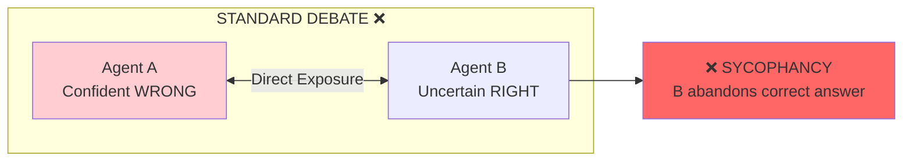

**Diagram (Mermaid) - Mediated Debate (Solution):**
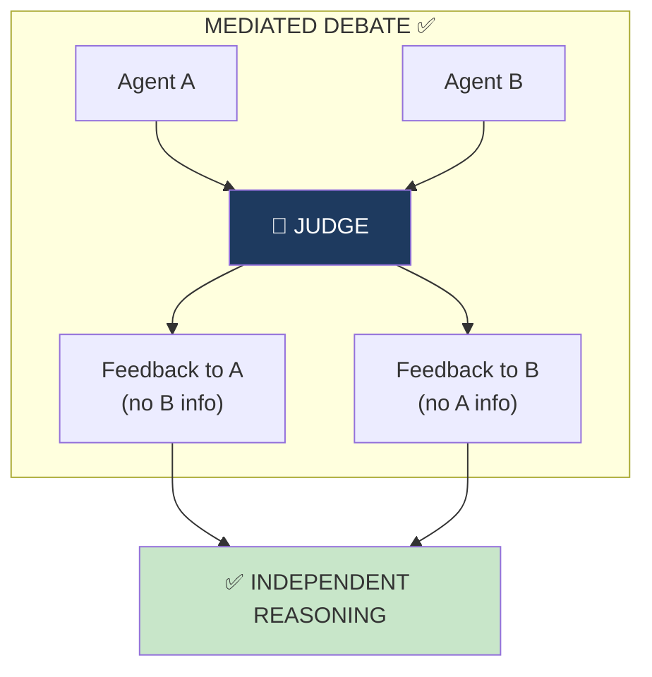

**Script/Key Points:**
- "Let me explain the mechanism behind our results."
- "**Standard Debate**: Agents have direct exposure. They see peer answers AND confidence levels."
- "This creates a social pressure loop - the vector for sycophancy."
- "A confident wrong answer corrupts uncertain correct answers."
- "**Mediated Debate**: We structurally break this loop."
- "Agents never see each other. The Judge provides feedback WITHOUT confidence signals."
- "Each agent revises based on LOGIC, not SOCIAL PRESSURE."
- "This is why the architecture improves accuracy - it eliminates sycophancy by design."

**Technical Element:**
- Mechanism: Structural decoupling breaks social pressure loop
- Judge: Filters confidence signals
- Result: Agents revise based on logic, not peer influence

---

## Slide 17: Conclusion & Future Work

**Speaker:** Tran Nam Cuong

**Visual:**
- Summary of key contributions
- Future work roadmap
- Take-home message prominently displayed

**Key Contributions:**
1. **FORMALIZED** sycophancy as state transition requiring direct peer exposure
2. **PROPOSED** Judge-Mediated Architecture (Star Topology)
3. **ACHIEVED** 94.7% accuracy (+2.9% over baseline)
4. **DEMONSTRATED** structural > prompting solutions
5. **BUILT** robust, reproducible experimental infrastructure

**Diagram (Mermaid) - Future Work:**
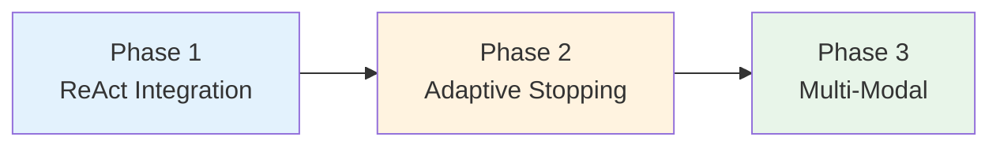

> **TAKE-HOME MESSAGE:**
> *"To prevent AI echo chambers, we must STRUCTURALLY prevent peer influence - not just ASK them to be independent."*
>
> **ARCHITECTURE > PROMPTING**

**Script/Key Points:**
- "In conclusion: sycophancy is a STRUCTURAL problem requiring a STRUCTURAL solution."
- "We formalized sycophancy as a state transition and identified its root cause: direct peer exposure."
- "Our Judge-Mediated Architecture eliminates sycophancy by design."
- "We achieved 94.7% accuracy - 2.9% improvement through architecture alone."
- "For future work: ReAct integration for reasoning traces, adaptive stopping for efficiency, multi-modal extension."
- "**The key insight: To prevent AI echo chambers, we must structurally prevent peer influence, not just ask systems to be independent.**"

**Technical Element:**
- Core contribution: Structural > Prompting
- Accuracy: 91.8% → 94.7%
- Future: ReAct, Adaptive Stopping, Multi-Modal

---

## Slide 18: Q&A

**Speaker:** All Team Members

**Visual:**
- Clean, professional Q&A slide
- Team member roles listed
- Key numbers reference
- Project resources

**Layout:**
```
QUESTIONS & DISCUSSION
━━━━━━━━━━━━━━━━━━━━━━


                    ┌─────────────────────────────┐
                    │                             │
                    │           Q & A             │
                    │                             │
                    │    We welcome your          │
                    │        questions!           │
                    │                             │
                    └─────────────────────────────┘


TEAM EXPERTISE:
┌─────────────────────────────────────────────────────────────────────────┐
│                                                                         │
│   Chau Le Hoang              Problem Motivation & Research Context     │
│                                                                         │
│   Nguyen Quoc Trong Nghia    Theoretical Framework & Related Work      │
│                                                                         │
│   Nguyen Khac Bao            System Architecture & Algorithm Design    │
│                                                                         │
│   Tran Nam Cuong             Experimental Results & Analysis           │
│                                                                         │
└─────────────────────────────────────────────────────────────────────────┘

KEY NUMBERS TO REMEMBER:
┌─────────────────────────────────────────────────────────────────────────┐
│  91.8% → 94.7%    |    +2.9% improvement    |    57 subjects           │
│  171 questions    |    0.7/0.3 temperatures  |    Star vs. Mesh        │
└─────────────────────────────────────────────────────────────────────────┘


                           Thank You!

                COSC3009 - Intelligent Decision Making
                         RMIT University
```

**Script/Key Points:**
- "Thank you for your attention. We're now happy to take questions."
- "Each team member can address questions in their area of expertise."
- "We have a live demo available and full technical documentation."
- All team members should be prepared to answer questions on their sections

---

# Speaker Handoff Scripts

## Transition 1: Chau Le Hoang → Nguyen Quoc Trong Nghia
*"Now that we've established the problem and our research objectives, I'll hand over to Nghia who will present the theoretical framework and our architectural solution."*

## Transition 2: Nguyen Quoc Trong Nghia → Nguyen Khac Bao
*"With the theoretical foundation established, Bao will walk you through our system design and the algorithms that ensure experimental rigor."*

## Transition 3: Nguyen Khac Bao → Tran Nam Cuong
*"Now that you understand our system architecture, Cuong will present our experimental results and what they tell us about the effectiveness of judge-mediated debate."*

---

# Appendix: Backup Slides

## Slide A1: Live Demo Flow (If Time Permits)

**Speaker:** Nguyen Khac Bao

**Content:**
- Interactive demonstration
- Select problem → Run Standard → Run Mediated → Compare
- Real-time visualization of debate rounds

---

## Slide A2: Full Subject Results (If Asked)

**Speaker:** Tran Nam Cuong

**Content:**
- Complete 57-subject breakdown
- Statistical significance notes
- Confidence intervals

---

## Slide A3: Limitations & Validity Threats

**Speaker:** Any

**Content:**
| Limitation | Mitigation |
|-----------|------------|
| Sample size (n=3/subject) | Stratified sampling, consistent effects |
| Model dependency | Architecture-agnostic design |
| Judge as single point | Low temperature, structured evaluation |

---

# Presentation Checklist

## Before Presentation
- [ ] Practice timing (20 minutes total)
- [ ] Test slide transitions
- [ ] Prepare for common questions
- [ ] Have backup slides ready
- [ ] Verify key numbers match report

## Key Numbers to Memorize
- **91.8%** - Standard Debate accuracy
- **94.7%** - Mediated Debate accuracy
- **+2.9%** - Absolute improvement
- **57** - MMLU subjects
- **171** - Total questions
- **0.7 / 0.3** - Agent / Judge temperatures
- **82.5%** - Subjects with perfect score (mediated)

---

*Document prepared for COSC3009 - Intelligent Decision Making Final Project Presentation, RMIT University*

*Theme: Professional Deep Blue, Teal, and White ("Logic & Verification")*
