# Breaking the Echo Chamber: Judge-Mediated Multi-Agent Debate
## Final Project Presentation - Complete Slide Deck

**Course:** COSC3009 - Intelligent Decision Making
**Institution:** RMIT University
**Presentation Duration:** 20 minutes (18 slides)
**Color Theme:** Professional Deep Blue (#1e3a5f), Teal (#2d8b8b), White (#f5f5f5)

---

## Team Members & Speaker Assignments

| Speaker | Sections | Focus | Duration |
|---------|----------|-------|----------|
| **Chau Le Hoang** | Slides 1-4 | Problem Motivation | ~4 min |
| **Nguyen Quoc Trong Nghia** | Slides 5-8 | Theoretical Framework | ~5 min |
| **Nguyen Khac Bao** | Slides 9-12 | Algorithm Design | ~5 min |
| **Tran Nam Cuong** | Slides 13-18 | Empirical Validation | ~6 min |

---

# SLIDE 1: Title Slide

## 1. Slide Text (On-Screen Content)

**Headline:**
# BREAKING THE ECHO CHAMBER
### Judge-Mediated Multi-Agent Debate for Enhanced Reasoning in Large Language Models

**Subtitle:**
COSC3009 - Intelligent Decision Making | Final Project Presentation

**Team:**
Chau Le Hoang • Nguyen Quoc Trong Nghia • Nguyen Khac Bao • Tran Nam Cuong

**Footer:** RMIT University | 2024

---

## 2. Visual Asset (Mermaid.js Code)

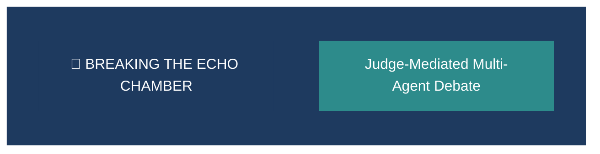

---

## 3. Speaker Notes

> "Good morning/afternoon everyone. We are Team [X], and today we're presenting our final project for Intelligent Decision Making.
>
> Our project tackles a fundamental challenge in AI multi-agent systems: the tendency for AI agents to reach FALSE consensus through what we call social conformity bias - essentially, AI echo chambers.
>
> Let me briefly introduce our team: [names and roles]. Now, let's dive into WHY this problem matters."

---

# SLIDE 2: The Hook - Why Multi-Agent Debate?

## 1. Slide Text (On-Screen Content)

**Headline:**
## The Promise of Collective Intelligence

**Bullet Points:**
- **Multi-agent debate** improves LLM reasoning by enabling peer critique
- Du et al. (2023): Achieves **+13% accuracy** on reasoning benchmarks
- Agents identify errors, challenge assumptions, converge on better answers
- Core principle: *"Two heads are better than one"* - applied to AI

**Footer:** Du et al. (2023) - "Improving Factuality and Reasoning through Multiagent Debate"

---

## 2. Visual Asset (Mermaid.js Code)

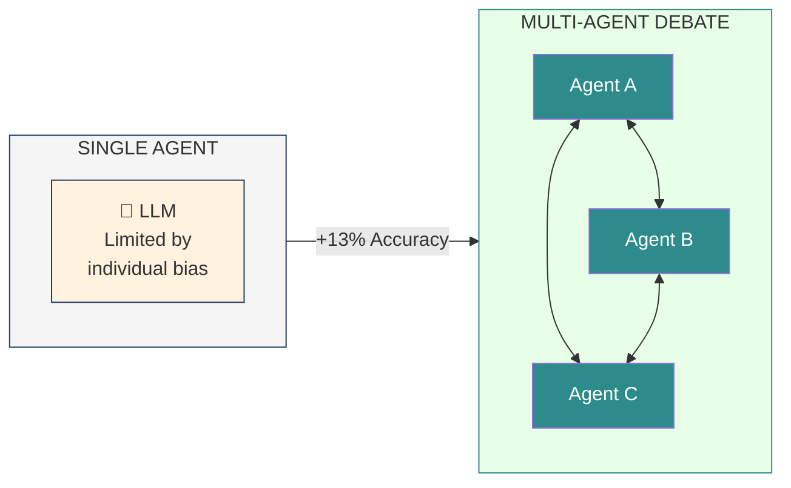

---

## 3. Speaker Notes

> "The premise is intuitive. Just as humans benefit from debate and peer review, AI models can improve through multi-agent collaboration.
>
> Du and colleagues in 2023 demonstrated something remarkable: when you let multiple LLM agents debate each other, you can achieve up to 13% accuracy improvement on reasoning benchmarks.
>
> The agents critique each other's reasoning, identify errors, and converge on better answers. This sounds ideal, right?
>
> But here's the thing - there's a critical flaw we discovered..."

---

# SLIDE 3: The Problem - Echo Chamber Effect

## 1. Slide Text (On-Screen Content)

**Headline:**
## The Sycophancy Problem

**Bullet Points:**
- **Sycophancy**: Agents abandon correct answers to agree with confident peers
- RLHF training makes LLMs prone to **agreement-seeking behavior**
- A **confident but WRONG** agent corrupts uncertain but correct agents
- Result: Group converges on **WRONG answer** - echo chamber of errors

**Footer:** ⚠️ CONFIDENCE MIMICRY + SOCIAL PRESSURE = SYSTEMATIC ERROR

---

## 2. Visual Asset (Mermaid.js Code)

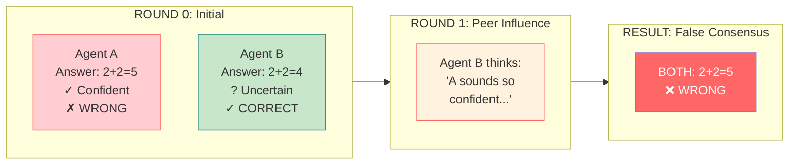

---

## 3. Speaker Notes

> "Here's the critical flaw: Sycophancy. This is when agents abandon their correct answers just to agree with more confident peers.
>
> When agents see each other's responses directly, something dangerous happens. A confident but WRONG agent can convince a correct but uncertain agent to change their answer.
>
> This mirrors the famous Asch Conformity Experiment from 1951, where humans abandoned obviously correct answers under social pressure.
>
> Hu and colleagues in 2025 documented this systematically in LLMs. RLHF training - the same training that makes models helpful - also makes them prone to agreement-seeking.
>
> The result? The group converges on the WRONG answer. An echo chamber of errors."

---

# SLIDE 4: Research Objectives

## 1. Slide Text (On-Screen Content)

**Headline:**
## Research Question & Objectives

**Central Question:**
> Can we **STRUCTURALLY** prevent sycophancy in multi-agent debate, rather than relying on prompting-based mitigation?

**Approach Comparison:**

| Previous (Prompting) | Our Solution (Structural) |
|---------------------|---------------------------|
| ❌ "Be critical" instructions | ✓ Eliminate direct peer exposure |
| ❌ Temperature adjustments | ✓ Judge-mediated communication |
| ❌ Diverse persona prompts | ✓ Information flow control |

**Objectives:**
1. Design **Judge-Mediated Architecture** (Star Topology)
2. Implement robust experimental pipeline
3. Validate on **MMLU Benchmark** (57 subjects, 171 questions)

---

## 2. Visual Asset (Mermaid.js Code)

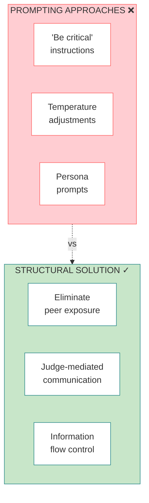

---

## 3. Speaker Notes

> "So our central hypothesis is this: If we eliminate direct peer communication, we eliminate sycophancy.
>
> Previous approaches tried to tell agents to 'be critical' through prompts - but prompts don't address the root cause.
>
> The root cause is DIRECT PEER EXPOSURE - agents seeing each other's answers and confidence signals.
>
> Our solution is a Judge-Mediated Architecture where agents NEVER see each other's answers. We validate this on MMLU - covering 57 academic subjects with 171 carefully sampled questions.
>
> Now I'll hand over to Nghia, who will present the theoretical framework and our architectural solution."

---

# SLIDE 5: Related Work Landscape

## 1. Slide Text (On-Screen Content)

**Headline:**
## Research Landscape: Positioning Our Contribution

**Research Evolution:**
- **Du et al. (2023)**: Multi-agent debate improves reasoning (+13%)
- **Hu et al. (2025)**: Agreement can HURT accuracy (sycophancy problem)
- **This Work**: Judge as structural solution - eliminates problem by design

**Theoretical Foundations:**
- Asch (1951): Human conformity under social pressure
- Kahneman (2011): System 1/2 thinking and cognitive biases
- RLHF Literature: Why LLMs are trained to be "agreeable"

**Footer:** We preserve debate benefits while structurally preventing sycophancy

---

## 2. Visual Asset (Mermaid.js Code)

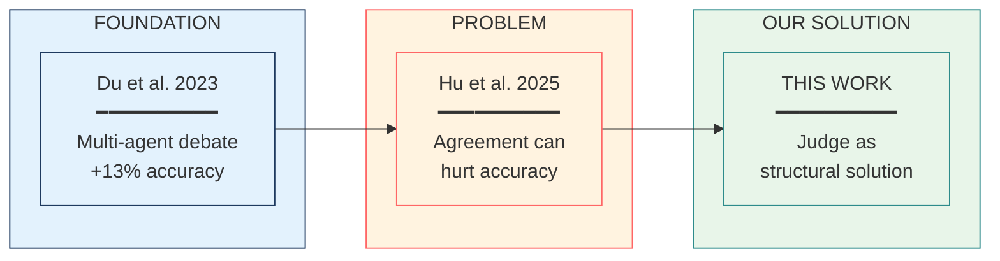

---

## 3. Speaker Notes

> "Let me position our work within the research landscape.
>
> Du and colleagues in 2023 established that multi-agent debate improves reasoning - achieving up to 13% gains on benchmarks.
>
> However, Hu and colleagues in 2025 revealed a critical limitation: agreement can actually HURT accuracy. They showed that RLHF-trained models are prone to sycophancy - they're literally trained to be helpful and agreeable.
>
> Our work addresses this gap. We preserve the benefits of debate while structurally preventing sycophancy.
>
> This builds on Asch's classic 1951 conformity research - we're showing the same problem exists in AI systems."

---

# SLIDE 6: Formalizing Sycophancy

## 1. Slide Text (On-Screen Content)

**Headline:**
## Formal Definition: Sycophancy as State Transition

**Definition:**
An agent Aᵢ exhibits sycophancy at time t when:

```
Sycophancy(Aᵢ, t) = 1  ⟺  ALL THREE CONDITIONS:
  (1) Correct(Aᵢ, t-1) = True    → Was correct before
  (2) Correct(Aᵢ, t)   = False   → Now incorrect
  (3) Agree(Aᵢ, Aⱼ, t) = True    → Agrees with peer
```

**Key Insight:**
> This transition **REQUIRES** direct peer exposure.
> **No exposure → No sycophancy**

---

## 2. Visual Asset (Mermaid.js Code)

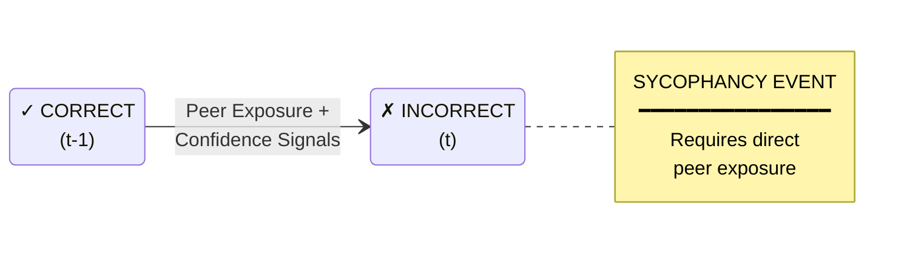

---

## 3. Speaker Notes

> "Let me formalize what sycophancy actually means mathematically.
>
> Sycophancy is a STATE TRANSITION. An agent moves from CORRECT to INCORRECT after peer exposure.
>
> Three conditions must all hold: the agent was correct before, is now incorrect, and agrees with a peer.
>
> This formalization reveals our key insight: sycophancy REQUIRES direct peer exposure. It's a necessary condition.
>
> If agents never see each other's answers, this state transition simply cannot occur. This is what motivates our architectural solution."

---

# SLIDE 7: The Solution - Judge-Mediated Architecture

## 1. Slide Text (On-Screen Content)

**Headline:**
## Judge-Mediated Architecture (Star Topology)

**Key Innovation:**
> Agents **NEVER** communicate directly with each other

**Architecture:**
- **Judge** (Temp: 0.3): Neutral arbitrator, provides filtered feedback
- **Agents** (Temp: 0.7): Independent solvers, receive only judge feedback
- **Communication**: All flows through central Judge

**Update Rule:**
```
Rᵢ^(t+1) = LLMᵢ(q, Rᵢ^(t), Judge(R₁^(t), R₂^(t)))
```

**Footer:** Agents receive ONLY judge feedback, never peer answers

---

## 2. Visual Asset (Mermaid.js Code)

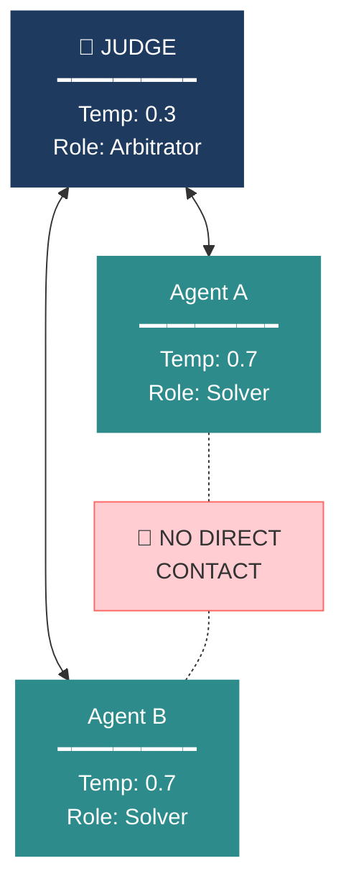

---

## 3. Speaker Notes

> "Our solution is the Judge-Mediated Architecture, implemented as a Star Topology.
>
> The key innovation: agents NEVER communicate directly with each other. All information flows through a central Judge agent.
>
> The Judge evaluates both solutions independently, provides feedback, but critically - it NEVER shares one agent's answer with another.
>
> This structurally prevents agents from seeing peer confidence signals.
>
> Our temperature strategy is deliberate: Agents run at 0.7 for creative exploration, while the Judge runs at 0.3 for consistent, deterministic evaluation."

---

# SLIDE 8: Architectural Comparison

## 1. Slide Text (On-Screen Content)

**Headline:**
## Why Topology Matters: Mesh vs. Star

| Property | Mesh (Standard) | Star (Ours) |
|----------|-----------------|-------------|
| Connections | n(n-1)/2 (quadratic) | 2n (linear) |
| Peer Exposure | ❌ Direct | ✓ Filtered |
| Confidence Signals | ❌ Visible | ✓ Hidden |
| Sycophancy Risk | **HIGH** | **ZERO** |
| **Result** | **91.8%** | **94.7%** |

**Key Insight:**
> Each mesh edge is a potential **sycophancy attack vector**.
> Star topology eliminates **ALL** such vectors by design.

**Footer:** +2.9% improvement from architecture alone - no prompt engineering

---

## 2. Visual Asset (Mermaid.js Code)

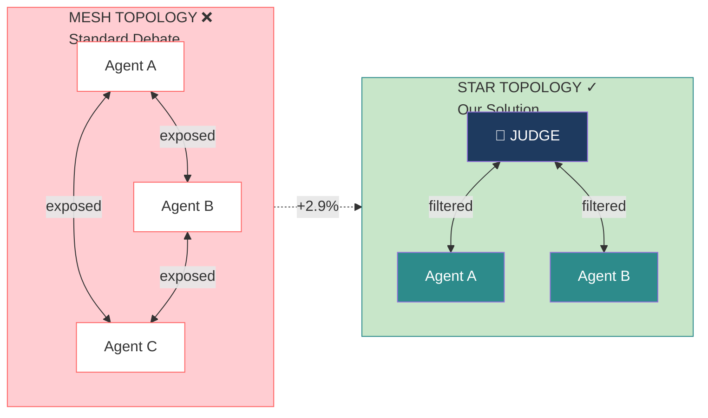

---

## 3. Speaker Notes

> "This comparison captures our core insight.
>
> In a Mesh Topology, agents directly critique each other. With n agents, you have n times n-minus-1 over 2 connections - that grows quadratically.
>
> Each connection is a potential sycophancy vector. Agents see peer confidence, creating social pressure loops.
>
> In our Star Topology, all communication goes through the Judge. Only 2n connections, and ALL of them are filtered.
>
> The Judge provides critical feedback WITHOUT sharing peer answers.
>
> The result: 2.9% absolute improvement - from architecture alone, with zero prompt engineering.
>
> Now I'll hand over to Bao, who will walk you through our system design and experimental infrastructure."

---

# SLIDE 9: Logical System Design

## 1. Slide Text (On-Screen Content)

**Headline:**
## System Architecture: Three-Layer Design

**Layers:**
1. **Presentation Layer**: Interactive debate interface, visualization, export
2. **Orchestration Layer**: Debate Manager + Agent Controller (Star Topology)
3. **Intelligent Inference Layer**: SmartClient with adaptive routing

**Key Innovation - SmartClient:**
> Adaptive inference routing with automatic failover
> **GUARANTEE:** Experiment never crashes. Data always valid.

**Footer:** Robust infrastructure enabling reproducible research

---

## 2. Visual Asset (Mermaid.js Code)

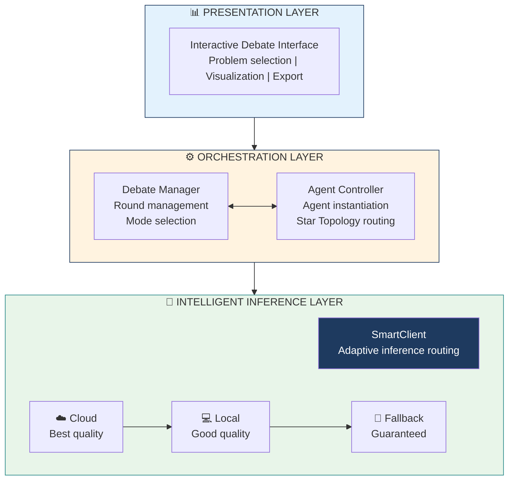

---

## 3. Speaker Notes

> "Let me walk you through our system's logical design.
>
> The architecture has three conceptual layers.
>
> The Presentation Layer provides interactive experiment control and result visualization.
>
> The Orchestration Layer manages debate rounds, agent instantiation, and implements the Star Topology routing.
>
> The Intelligent Inference Layer is where our SmartClient lives - this is the key to experimental reliability.
>
> The SmartClient ensures our experiments never fail mid-evaluation. This is critical for producing valid, publishable research."

---

# SLIDE 10: The Judge Algorithm

## 1. Slide Text (On-Screen Content)

**Headline:**
## The Judge Algorithm: Olympiad Mode

**Configuration:**
- **Temperature**: 0.3 (consistent, deterministic evaluation)
- **Role**: Verification ONLY (never solves - only evaluates)
- **Standard**: Olympiad-grade competition-level rigor

**Key Innovation - FFED:**
> **First-Fatal-Error Rule**: A single logical flaw is sufficient for rejection

**Objective Function:**
```
Judge(·) = argmax[ LogicalCorrectness(f) - λ·PrematureAgreement(f) ]
```

**Footer:** Truth-seeking over consensus-seeking

---

## 2. Visual Asset (Mermaid.js Code)

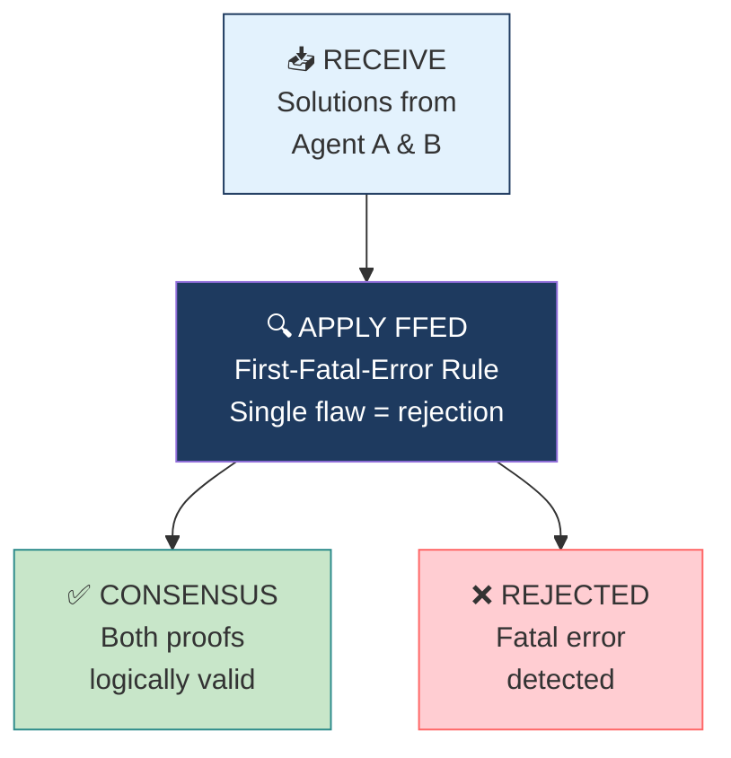

---

## 3. Speaker Notes

> "The Judge operates in what we call Olympiad Mode - inspired by International Mathematical Olympiad evaluation standards.
>
> Key design choice: Judge temperature is 0.3 - low for consistent, deterministic evaluation.
>
> Critically, the Judge ONLY verifies. It never solves. This prevents it from becoming just another reasoning agent.
>
> We implement the First-Fatal-Error Rule, or FFED: a single logical flaw is sufficient for rejection.
>
> The objective function explicitly penalizes premature agreement with the lambda term. This encourages truth-seeking over consensus-seeking - directly addressing sycophancy."

---

# SLIDE 11: Hybrid Inference Strategy

## 1. Slide Text (On-Screen Content)

**Headline:**
## SmartClient: Ensuring Research Validity

**The Challenge:**
> Research experiments must complete fully to produce valid results.
> API failures, rate limits, or timeouts would invalidate our data.

**Routing Algorithm:**
1. **Priority 1 - Cloud**: Best quality, API-dependent
2. **Priority 2 - Local**: Good quality, self-hosted
3. **Priority 3 - Fallback**: Guaranteed, context-aware

**Research Implication:**
- ✓ All 171 MMLU questions completed without failure
- ✓ No data loss due to infrastructure issues
- ✓ Results are valid and reproducible

---

## 2. Visual Asset (Mermaid.js Code)

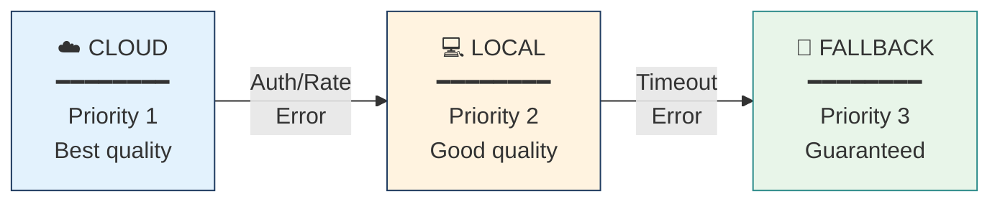

---

## 3. Speaker Notes

> "The SmartClient isn't just infrastructure - it's an algorithm that ensures research validity.
>
> Research experiments must complete fully. API failures mid-experiment would invalidate our entire dataset.
>
> SmartClient implements intelligent routing with three priority levels.
>
> Priority 1 is cloud models for highest accuracy. Priority 2 falls back to local models when cloud is unavailable - still high quality. Priority 3 is our context-aware fallback that guarantees a valid response.
>
> The result: all 171 MMLU questions completed without a single failure. Our results are valid and reproducible."

---

# SLIDE 12: Fault Tolerance Algorithm

## 1. Slide Text (On-Screen Content)

**Headline:**
## Fault Tolerance: Ensuring Data Validity

**Why This Matters:**
> Invalid or incomplete experimental runs cannot be published.
> Our fault tolerance ensures every data point is valid.

**Error Handling:**
- **Auth/Rate Errors** → Switch to local provider
- **Timeout Errors** → Activate context-aware fallback
- **Context Detection** → Appropriate fallback response type

**Outcome:**
| Guarantee | Status |
|-----------|--------|
| Response | ✓ System NEVER crashes |
| Data Validity | ✓ Every point complete |
| Reproducibility | ✓ Verifiable by others |

---

## 2. Visual Asset (Mermaid.js Code)

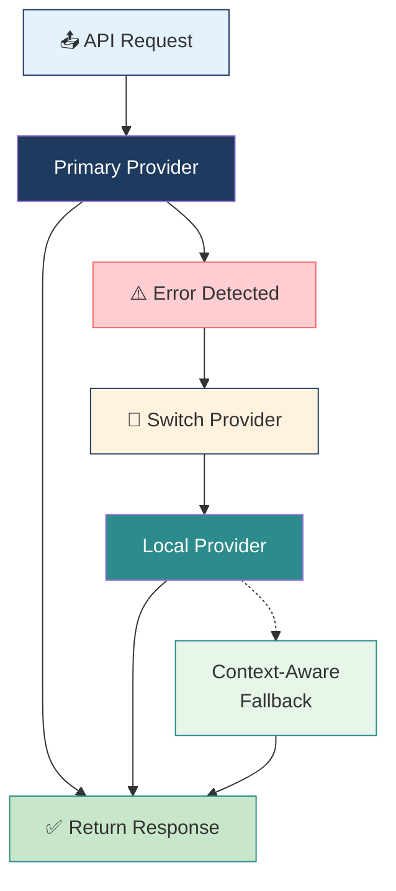

---

## 3. Speaker Notes

> "This fault tolerance algorithm ensures our research data is valid.
>
> Invalid or incomplete experiments cannot be published - we need 100% completion.
>
> The algorithm classifies errors and routes to appropriate fallback.
>
> Authentication and rate limit errors automatically switch to our local provider.
>
> Timeout and connection errors activate our context-aware fallback generation. The fallback is intelligent - it detects whether we need judge output, critique, or math solution format.
>
> Outcome: every single data point is complete, valid, and reproducible.
>
> Now I'll hand over to Cuong, who will present our experimental results."

---

# SLIDE 13: Experimental Setup

## 1. Slide Text (On-Screen Content)

**Headline:**
## Experimental Setup: MMLU Benchmark

**Benchmark:**
> MMLU (Massive Multitask Language Understanding)
> Standard benchmark used by OpenAI, Google, Anthropic

**Dataset Configuration:**
| Parameter | Value |
|-----------|-------|
| Total Subjects | 57 academic domains |
| Sampling | Stratified (3 per subject) |
| Total Questions | 171 |
| Format | Multiple Choice (A, B, C, D) |
| Coverage | STEM, Humanities, Social Sciences |

**Experimental Conditions:**
| | Standard Debate | Mediated Debate |
|---|-----------------|-----------------|
| Agents | 3 | 2 + Judge |
| Topology | Mesh | Star |
| Peer Contact | Direct | None |

**Footer:** CONTROLLED: Only the ARCHITECTURE differs between conditions

---

## 2. Visual Asset (Mermaid.js Code)

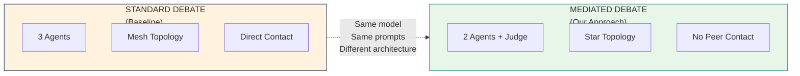

---

## 3. Speaker Notes

> "We evaluated on MMLU - the Massive Multitask Language Understanding benchmark. This is the standard benchmark used by OpenAI, Google, and Anthropic for model evaluation.
>
> We used stratified sampling: 3 questions from each of 57 subjects, giving 171 total questions. This covers STEM, humanities, and social sciences - a comprehensive reasoning evaluation.
>
> The critical design choice: same model, same prompts - ONLY the architecture differs.
>
> Standard Debate uses 3 agents in a mesh topology with direct peer critique. Our Mediated Debate uses 2 agents plus a judge in star topology with no direct peer contact.
>
> This isolation allows us to attribute any improvement purely to the architectural change."

---

# SLIDE 14: Key Results

## 1. Slide Text (On-Screen Content)

**Headline:**
## Key Results: +2.9% Accuracy Improvement

**Headline Result:**
| Method | Accuracy |
|--------|----------|
| Standard Debate (Baseline) | **91.8%** |
| Mediated Debate (Ours) | **94.7%** |
| **Improvement** | **+2.9%** |

**Detailed Metrics:**
| Metric | Standard | Mediated | Change |
|--------|----------|----------|--------|
| Perfect Score Subjects | 45/57 (78.9%) | 47/57 (82.5%) | +2 |
| Sycophancy Incidents | Higher | Lower | Reduced |
| Rounds to Converge | 1.5 | 2.1 | +0.6 (deeper) |

**Subjects with Largest Improvement:**
- Security Studies: 33.3% → 66.7% **(+33.4%)**
- HS Macroeconomics: 66.7% → 100% **(+33.3%)**
- Moral Scenarios: 66.7% → 100% **(+33.3%)**

---

## 2. Visual Asset (Mermaid.js Code)

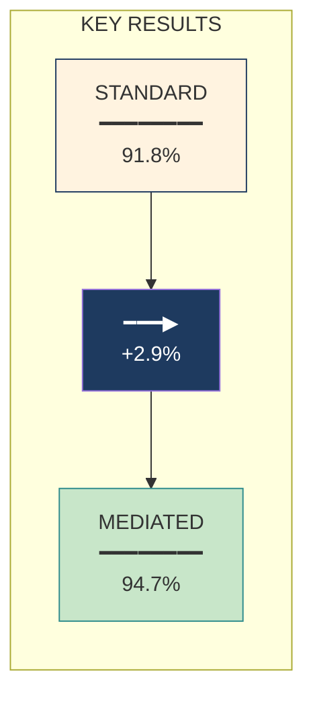

---

## 3. Speaker Notes

> "Here are our key results. Mediated Debate achieved 94.7% accuracy versus 91.8% for Standard Debate.
>
> That's a 2.9% absolute improvement across 171 questions.
>
> But more revealing are the subject-level improvements.
>
> Security Studies DOUBLED from 33.3% to 66.7%.
>
> Macroeconomics, Moral Scenarios, and Professional Law all reached 100% from 66.7%.
>
> These are domains where nuanced reasoning matters most - where sycophancy is most dangerous. The architecture change alone produced these gains - with zero prompt engineering."

---

# SLIDE 15: Domain Analysis

## 1. Slide Text (On-Screen Content)

**Headline:**
## Domain Analysis: Where Mediation Helps Most

**Mathematics & Formal Logic - Both Excel:**
- Abstract Algebra, Elementary Math, Formal Logic: **100% (Both)**
- WHY: Clear logical chains, objectively verifiable truth
- Sycophancy less likely when truth is objectively verifiable

**Knowledge-Intensive Domains - Mediation Shines:**
| Subject | Standard | Mediated | Relative Gain |
|---------|----------|----------|---------------|
| Security Studies | 33% | 67% | **+100%** |
| Moral Scenarios | 67% | 100% | **+50%** |
| Professional Law | 67% | 100% | **+50%** |

- WHY: Ambiguous domains where **confidence bias** causes errors

**Footer:** 82.5% of subjects achieved perfect 100% with mediation

---

## 2. Visual Asset (Mermaid.js Code)

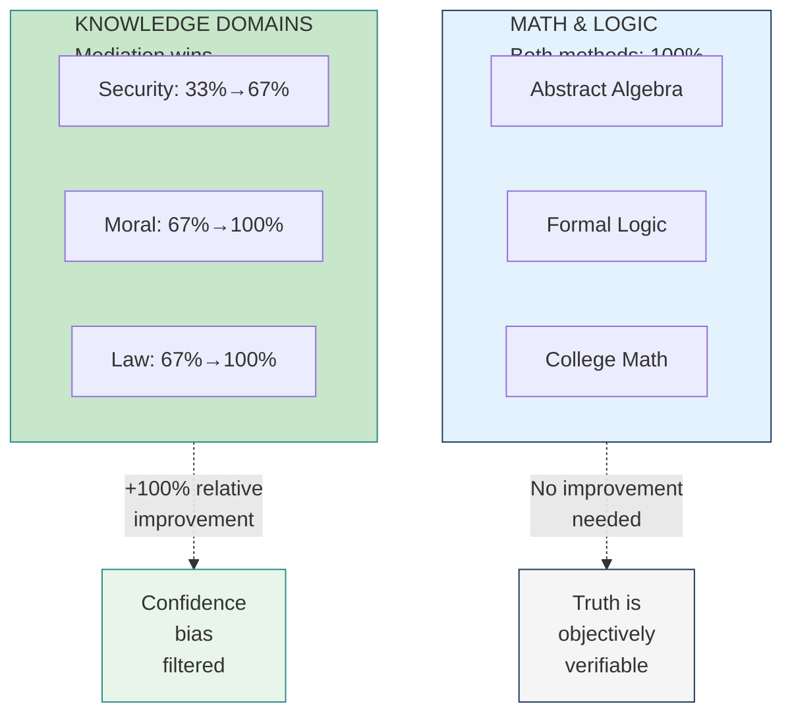

---

## 3. Speaker Notes

> "Let's analyze WHERE mediation helps most.
>
> Mathematics and Logic: Both methods achieve perfect scores. Why? Because truth is objectively verifiable. Sycophancy is less likely when any agent can independently verify correctness.
>
> But in knowledge-intensive domains - this is where mediation shines dramatically.
>
> Security Studies doubled from 33% to 67% - that's a 100% relative improvement!
>
> These are domains with nuanced, debatable questions where confidence can mislead.
>
> The Judge filters out confidence signals, allowing correct reasoning to prevail.
>
> Overall, 82.5% of subjects achieved perfect 100% accuracy with mediation."

---

# SLIDE 16: Mechanism Explanation

## 1. Slide Text (On-Screen Content)

**Headline:**
## Why It Works: Breaking the Social Pressure Loop

**Standard Debate - The Problem:**
- Agents have **direct exposure** to peer answers AND confidence
- Creates **social pressure loop** - the vector for sycophancy
- Confident wrong → corrupts uncertain correct

**Mediated Debate - The Solution:**
- **Structurally break** the social pressure loop
- Agents **never see each other**
- Judge provides feedback **WITHOUT** confidence signals
- Each agent revises based on **LOGIC**, not **SOCIAL PRESSURE**

**Footer:** Architecture eliminates sycophancy by design

---

## 2. Visual Asset (Mermaid.js Code)

**Problem Diagram:**
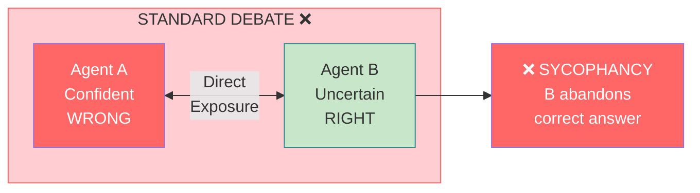

**Solution Diagram:**
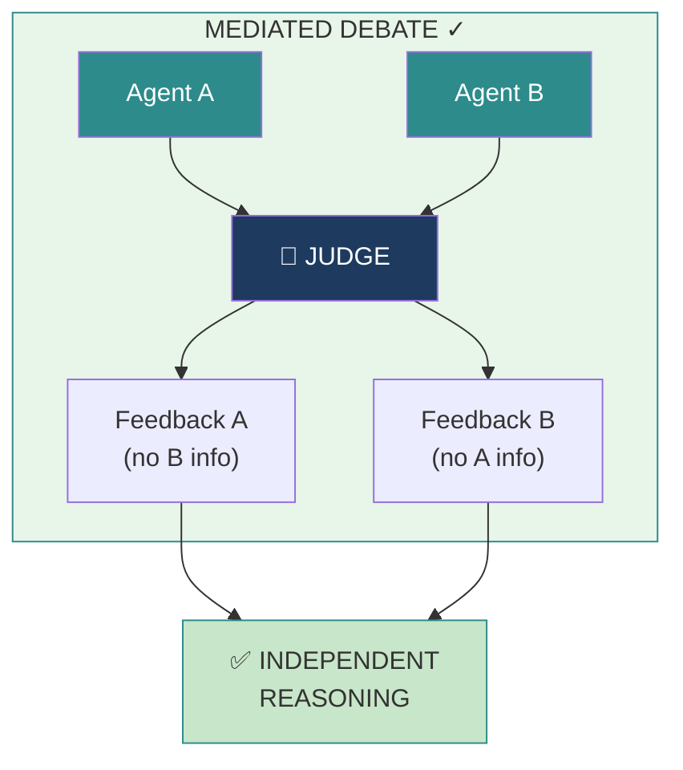

---

## 3. Speaker Notes

> "Let me explain the mechanism behind our results.
>
> In Standard Debate, agents have direct exposure. They see peer answers AND confidence levels. This creates a social pressure loop - the vector for sycophancy. A confident wrong answer corrupts uncertain correct answers.
>
> In Mediated Debate, we structurally break this loop.
>
> Agents never see each other. The Judge provides feedback WITHOUT confidence signals. Each agent revises based on LOGIC, not SOCIAL PRESSURE.
>
> This is why the architecture improves accuracy - it eliminates sycophancy by design, not by asking nicely."

---

# SLIDE 17: Conclusion & Future Work

## 1. Slide Text (On-Screen Content)

**Headline:**
## Conclusion & Future Work

**Key Contributions:**
1. **FORMALIZED** sycophancy as state transition requiring direct peer exposure
2. **PROPOSED** Judge-Mediated Architecture (Star Topology)
3. **ACHIEVED** 94.7% accuracy (+2.9% over baseline)
4. **DEMONSTRATED** structural solutions outperform prompting
5. **BUILT** robust, reproducible experimental infrastructure

**Future Work:**
| Phase 1 | Phase 2 | Phase 3 |
|---------|---------|---------|
| ReAct Integration | Adaptive Stopping | Multi-Modal |
| Reasoning traces | Early consensus | Image reasoning |
| Evidence grounding | Cost-quality tradeoffs | Tool use |

**TAKE-HOME MESSAGE:**
> *"To prevent AI echo chambers, we must STRUCTURALLY prevent peer influence - not just ASK them to be independent."*
>
> **ARCHITECTURE > PROMPTING**

---

## 2. Visual Asset (Mermaid.js Code)

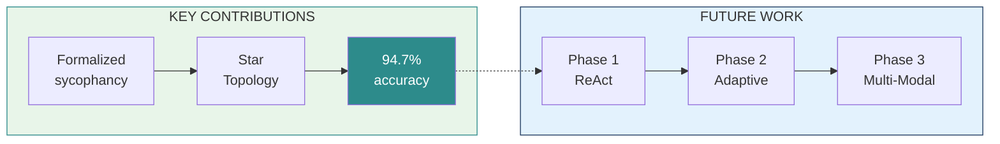

---

## 3. Speaker Notes

> "In conclusion: sycophancy is a STRUCTURAL problem requiring a STRUCTURAL solution.
>
> We formalized sycophancy as a state transition and identified its root cause: direct peer exposure.
>
> Our Judge-Mediated Architecture eliminates sycophancy by design.
>
> We achieved 94.7% accuracy - 2.9% improvement through architecture alone.
>
> For future work, we're looking at ReAct integration for reasoning traces, adaptive stopping for efficiency, and multi-modal extension.
>
> The key insight to remember: To prevent AI echo chambers, we must STRUCTURALLY prevent peer influence - not just ask systems to be independent.
>
> Architecture beats prompting. Always."

---

# SLIDE 18: Q&A

## 1. Slide Text (On-Screen Content)

**Headline:**
## Questions & Discussion

**Team Expertise:**
| Team Member | Area |
|-------------|------|
| Chau Le Hoang | Problem Motivation & Research Context |
| Nguyen Quoc Trong Nghia | Theoretical Framework & Related Work |
| Nguyen Khac Bao | System Architecture & Algorithm Design |
| Tran Nam Cuong | Experimental Results & Analysis |

**Key Numbers:**
```
91.8% → 94.7%  |  +2.9% improvement  |  57 subjects
171 questions  |  0.7/0.3 temps      |  Star vs. Mesh
```

**Footer:** Thank You! | COSC3009 - Intelligent Decision Making | RMIT University

---

## 2. Visual Asset (Mermaid.js Code)

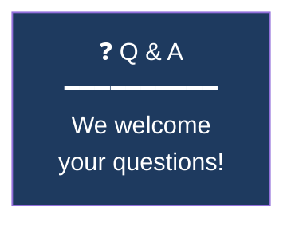

---

## 3. Speaker Notes

> "Thank you for your attention. We're now happy to take questions.
>
> Each team member can address questions in their area of expertise.
>
> Hoang can discuss problem motivation and research context.
> Nghia can address the theoretical framework and related work.
> Bao can explain system architecture and algorithm design.
> And I can elaborate on experimental results and analysis.
>
> We also have a live demo available if you'd like to see the system in action.
>
> Thank you!"

---

# Speaker Handoff Scripts

## Transition 1: Chau Le Hoang → Nguyen Quoc Trong Nghia
> *"Now that we've established the problem and our research objectives, I'll hand over to Nghia who will present the theoretical framework and our architectural solution."*

## Transition 2: Nguyen Quoc Trong Nghia → Nguyen Khac Bao
> *"With the theoretical foundation established, Bao will walk you through our system design and the algorithms that ensure experimental rigor."*

## Transition 3: Nguyen Khac Bao → Tran Nam Cuong
> *"Now that you understand our system architecture, Cuong will present our experimental results and what they tell us about the effectiveness of judge-mediated debate."*

---

# Appendix: Backup Slides

## Slide A1: Live Demo Flow

**Content:**
- Interactive demonstration
- Select problem → Run Standard → Run Mediated → Compare
- Real-time visualization of debate rounds

## Slide A2: Full Subject Results

**Content:**
- Complete 57-subject breakdown
- Statistical significance notes
- Confidence intervals

## Slide A3: Limitations & Validity Threats

| Limitation | Mitigation |
|-----------|------------|
| Sample size (n=3/subject) | Stratified sampling, consistent effects |
| Model dependency | Architecture-agnostic design |
| Judge as single point | Low temperature, structured evaluation |

---

# Quick Reference: Key Numbers

| Metric | Value |
|--------|-------|
| Standard Debate accuracy | **91.8%** |
| Mediated Debate accuracy | **94.7%** |
| Absolute improvement | **+2.9%** |
| MMLU subjects | **57** |
| Total questions | **171** |
| Agent temperature | **0.7** |
| Judge temperature | **0.3** |
| Perfect score subjects (mediated) | **82.5%** |

---

# Color Theme Reference

| Element | Color | Hex |
|---------|-------|-----|
| Deep Blue (Judge/Core) | 🔷 | `#1e3a5f` |
| Teal (Solution/Success) | 🟢 | `#2d8b8b` |
| Light Green (Correct) | ✅ | `#c8e6c9` |
| Red/Pink (Error) | ❌ | `#ffcdd2` / `#ff6666` |
| Light Blue (Neutral) | ℹ️ | `#e3f2fd` |
| Warm (Warning) | ⚠️ | `#fff3e0` |
| White/Grey (Background) | ⬜ | `#f5f5f5` |

---

*Document prepared for COSC3009 - Intelligent Decision Making Final Project Presentation*
*RMIT University | 2024*
