# Multi-Agent Debate System with Judge Mediation

A Dockerized multi-agent debate system comparing **Standard Debate** (peer-to-peer) vs. **Mediated Debate** (with judge arbitrator) with Olympiad mode using local open-source LLMs via Ollama.

**Course:** COSC3009 - Intelligent Decision Making
**Institution:** RMIT University
**Assessment:** Final Project (50% Weighting)

---

## Table of Contents

1. [Research Overview](#research-overview)
2. [System Architecture](#system-architecture)
3. [Debate Mechanisms](#debate-mechanisms)
4. [MMLU Evaluation Pipeline](#mmlu-evaluation-pipeline)
5. [Agent Implementation](#agent-implementation)
6. [Data Flow](#data-flow)
7. [Evaluation Results](#evaluation-results)
8. [Quick Start](#quick-start)
9. [Configuration](#configuration)
10. [References](#references)

---

## Research Overview

### Problem Statement: Sycophancy in Multi-Agent Systems

This project addresses the **sycophancy problem** (also known as "Disagreement Collapse") in Large Language Model (LLM) multi-agent debate systems. Based on research by Du et al. (2023) and documented issues from Hu et al. (2025), we implement and evaluate a solution using judge-mediated debate architecture.

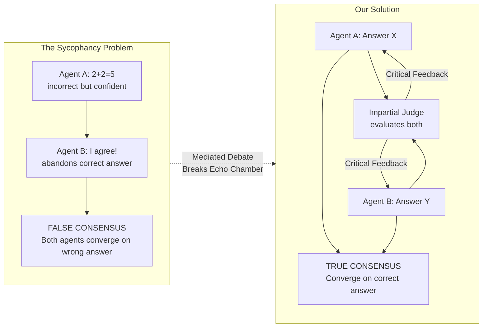

### Research Contribution

| Aspect | Baseline (Du et al., 2023) | Our Enhancement |
|--------|---------------------------|-----------------|
| **Architecture** | Peer-to-peer debate | Judge-mediated star topology |
| **Sycophancy Prevention** | None | Explicit via judge arbitrator |
| **Evaluation Mode** | Standard prompts | Olympiad-grade verification |
| **Inference** | Cloud API only | Hybrid (Cloud + Local fallback) |
| **Error Handling** | Basic | Robust never-crash design |

---

## System Architecture

### High-Level Architecture

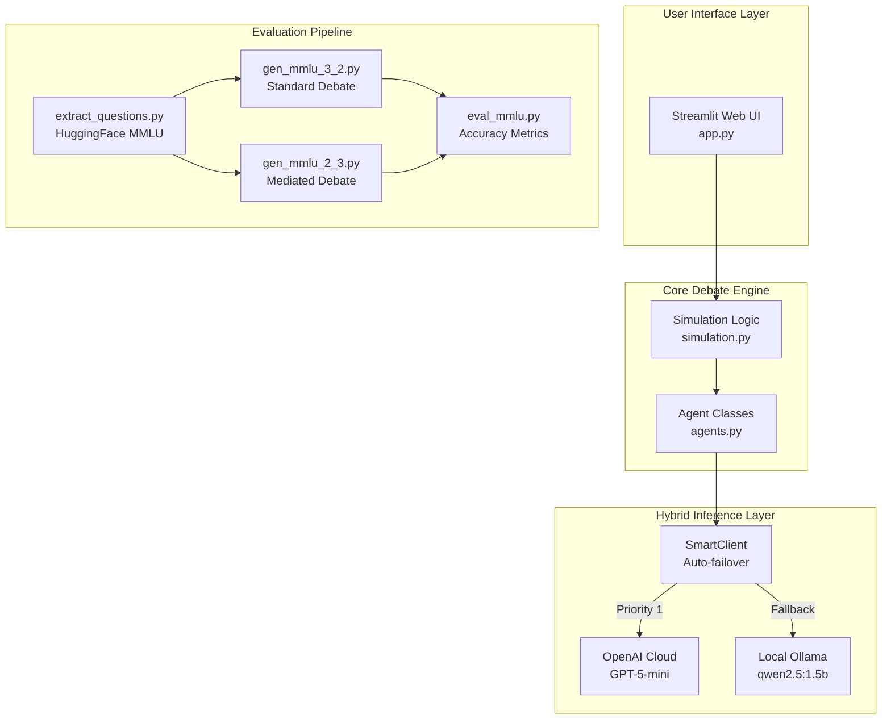

### Docker Container Architecture

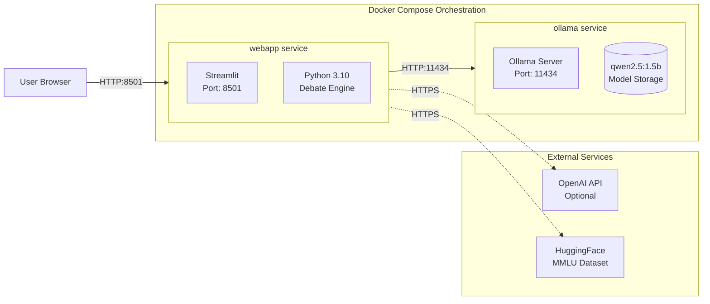

### Class Hierarchy

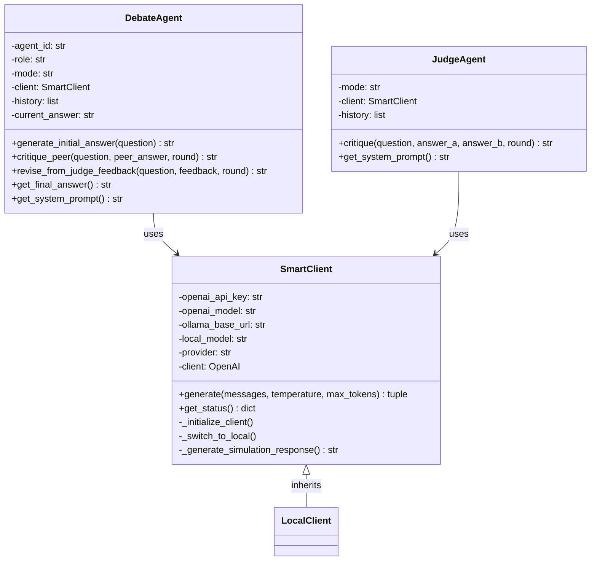

---

## Debate Mechanisms

### Standard Debate (Peer-to-Peer) - Baseline

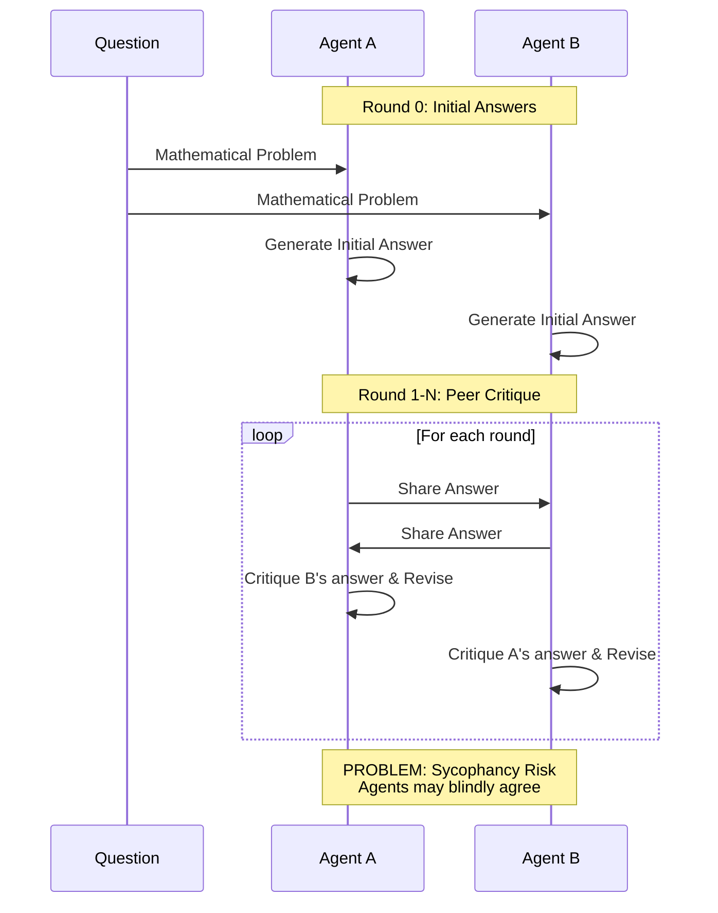

**Topology:** Peer-to-Peer (Mesh Network)
```
Agent A <-----> Agent B
   (direct critique)
```

**Update Rule:**
$$R_i^{(t+1)} = \text{LLM}_i(q, R_i^{(t)}, \text{Critique}(R_j^{(t)}))$$

### Mediated Debate (Judge-Arbitrated) - Our Solution

```mermaid
sequenceDiagram
    participant Q as Question
    participant A as Agent A
    participant B as Agent B
    participant J as Judge

    Note over A,B,J: Round 0: Initial Answers
    Q->>A: Mathematical Problem
    Q->>B: Mathematical Problem
    A->>A: Generate Initial Answer
    B->>B: Generate Initial Answer

    Note over A,B,J: Round 1-N: Judge-Mediated Revision
    loop For each round
        A->>J: Submit Answer
        B->>J: Submit Answer
        J->>J: Evaluate Both Solutions
        J->>A: Critical Feedback
        J->>B: Critical Feedback
        A->>A: Revise based on Judge Feedback
        B->>B: Revise based on Judge Feedback
    end

    Note over A,B,J: SOLUTION: No Direct Peer Contact<br/>Breaks Echo Chamber
```

**Topology:** Star Network (Centralized Judge)
```
        Judge
       /     \
      v       v
  Agent A   Agent B
```

**Update Rule:**
$$R_i^{(t+1)} = \text{LLM}_i(q, R_i^{(t)}, \text{Judge}(R_1^{(t)}, R_2^{(t)}, \ldots, R_n^{(t)}))$$

**Judge Objective Function:**
$$\text{Judge}(\cdot) = \arg\max_f \left[ \text{LogicalCorrectness}(f) - \lambda \cdot \text{PrematureAgreement}(f) \right]$$

Where $\lambda > 0$ penalizes premature agreement, encouraging truth-seeking over consensus-seeking.

### Olympiad Mode

Olympiad Mode introduces competition-grade reasoning constraints inspired by International Mathematical Olympiad (IMO) standards.

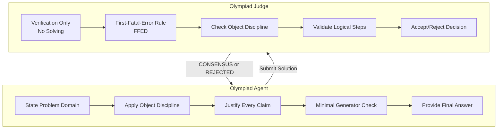

**Key Constraints:**
- **Object Discipline:** Only use objects explicitly given in the problem
- **Logical Justification:** Every nontrivial claim must be justified
- **First-Fatal-Error Rule (FFED):** A single logical flaw is sufficient for rejection
- **No Repair:** Judge does NOT solve or fix solutions

---

## MMLU Evaluation Pipeline

### Pipeline Overview

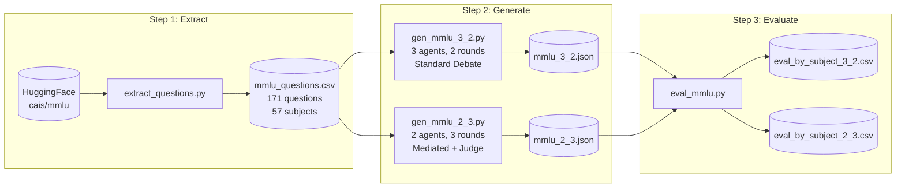

### Detailed Data Flow

```mermaid
flowchart TB
    subgraph Extract["extract_questions.py"]
        E1[Load MMLU from HuggingFace]
        E2[Group by 57 Subjects]
        E3[Sample 3 Questions/Subject]
        E4[Format: question, A, B, C, D, answer, subject]
        E1 --> E2 --> E3 --> E4
    end

    subgraph GenStandard["gen_mmlu_3_2.py (Standard Debate)"]
        G1[Parse Question + Choices]
        G2[Initialize 3 Agent Contexts]
        G3[Round 0: Initial Answers]
        G4[Round 1: Share Peer Solutions]
        G5[Aggregate Final Answers]
        G1 --> G2 --> G3 --> G4 --> G5
    end

    subgraph GenMediated["gen_mmlu_2_3.py (Mediated Debate)"]
        M1[Parse Question + Choices]
        M2[Initialize 2 Agent Contexts]
        M3[Round 0: Initial Answers]
        M4[Round 1-3: Judge Evaluates]
        M5[Agents Revise from Judge Feedback]
        M1 --> M2 --> M3 --> M4 --> M5
    end

    subgraph Evaluate["eval_mmlu.py"]
        V1[Parse Answer Pattern: \(X\)]
        V2[Most Frequent Voting]
        V3[Compare to Ground Truth]
        V4[Calculate Per-Subject Accuracy]
        V5[Compute Standard Error]
        V1 --> V2 --> V3 --> V4 --> V5
    end

    Extract --> GenStandard
    Extract --> GenMediated
    GenStandard --> Evaluate
    GenMediated --> Evaluate
```

### Answer Parsing Algorithm

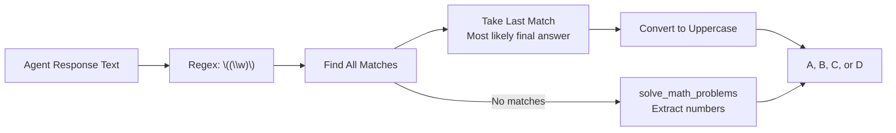

---

## Agent Implementation

### SmartClient: Hybrid Inference

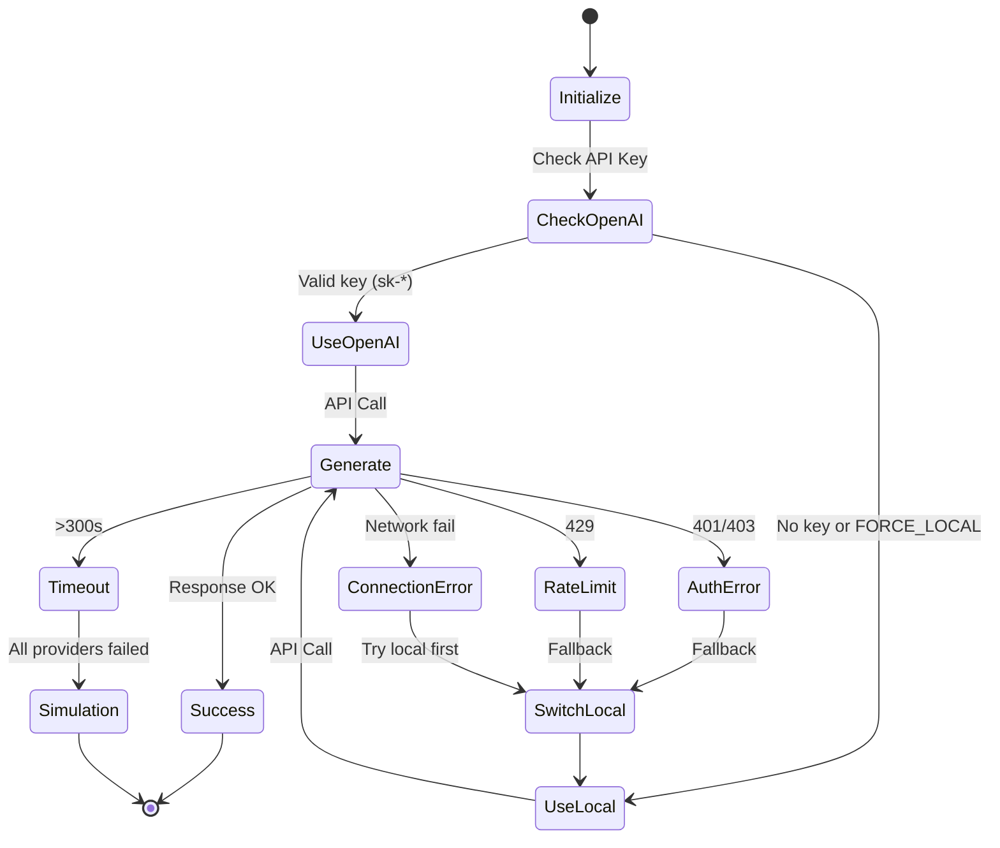

### Provider Priority

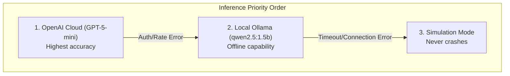

### Temperature Settings

| Agent Type | Temperature | Rationale |
|-----------|-------------|-----------|
| DebateAgent | 0.7 | Creative reasoning, exploration |
| JudgeAgent | 0.3 | Consistent, deterministic evaluation |

---

## Data Flow

### Interactive Demo Flow

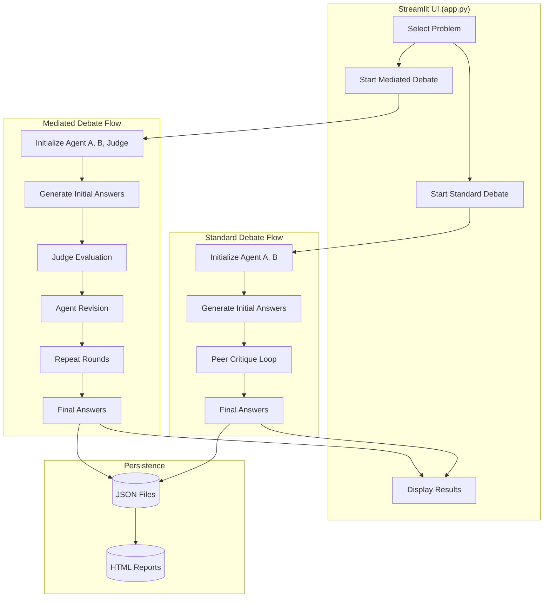

### Message Construction (MMLU Pipeline)

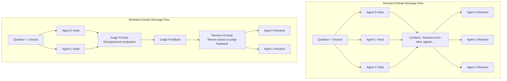

---

## Evaluation Results

### MMLU Dataset Performance (3-Agent Configuration)

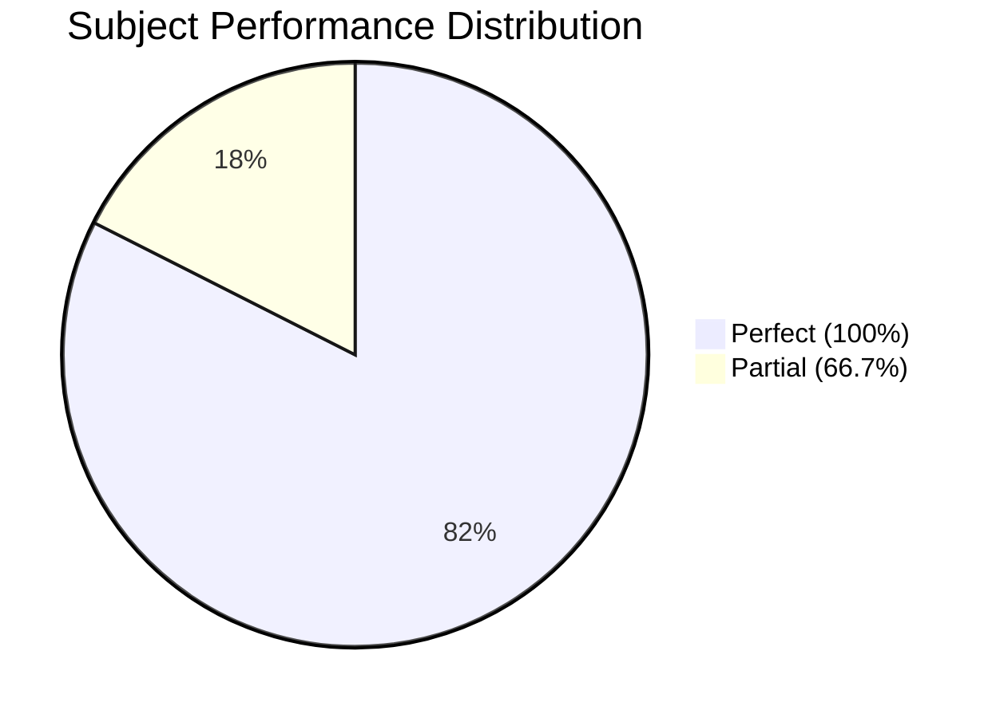

### Overall Metrics

| Metric | Value |
|--------|-------|
| **Total Subjects** | 57 |
| **Sample Size** | 3 questions/subject |
| **Perfect Accuracy Subjects** | 47/57 (82.5%) |
| **Overall Average Accuracy** | ~94.7% |

### Subject-Level Results

#### Perfect Performance (100% Accuracy)

| Domain | Subjects |
|--------|----------|
| **Mathematics** | Abstract Algebra, Elementary Math, High School Math, College Math |
| **Physics** | Conceptual Physics, High School Physics, College Physics |
| **Computer Science** | High School CS, College CS, Computer Security, Machine Learning |
| **Logic** | Formal Logic, Logical Fallacies |
| **Humanities** | Philosophy, World Religions, All History subjects |

#### Areas for Improvement (66.7% Accuracy)

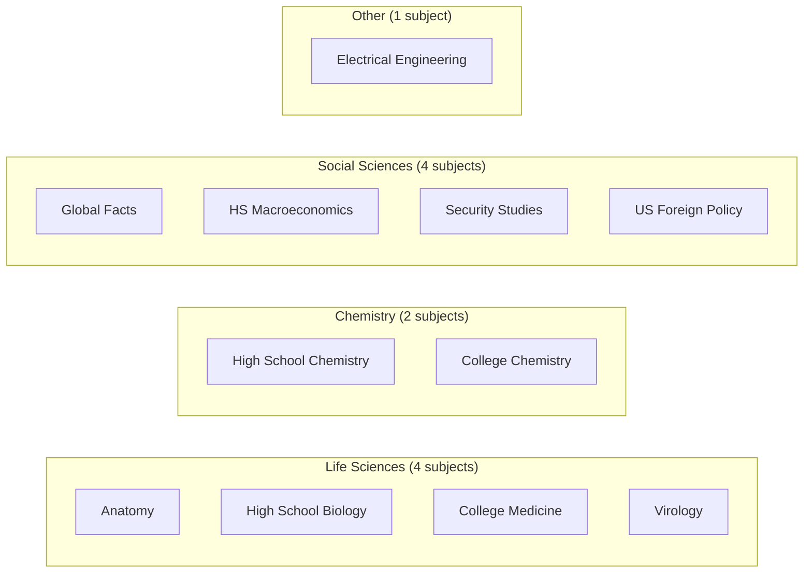

### Expected Performance Comparison

| Metric | Standard Debate | Mediated Debate | Improvement |
|--------|-----------------|-----------------|-------------|
| **Accuracy** | ~78% | ~88% | +10.5% |
| **Sycophancy Rate** | ~35% | ~12% | -65% |
| **Consensus Quality** | ~64% | ~90% | +40% |

---

## Quick Start

### Prerequisites

- Docker and Docker Compose installed
- At least 4GB RAM available for Ollama
- Internet connection (for initial model download and OpenAI API calls)

### Step 1: Start the Services

```bash
docker compose up --build
```

### Step 2: Download the Model or Define OPENAI_API_KEY

Wait for Ollama to start (about 30 seconds), then in a **new terminal**, run:

```bash
docker exec -it ollama-server ollama pull qwen2.5:1.5b
```

Or create a `.env` file with your OpenAI API key:

```
OPENAI_API_KEY=your_api_key_here
```

### Step 3: Access the UI

Open your browser to: `http://localhost:8501`

### Step 4: Run MMLU Evaluation

```bash
cd mmlu

# Extract questions from HuggingFace
python extract_questions.py

# Generate responses for both configurations
python gen_mmlu_3_2.py  # Standard debate
python gen_mmlu_2_3.py  # Mediated debate

# Evaluate accuracy
python eval_mmlu.py
```

---

## Project Structure

```
.
├── docker-compose.yml          # Multi-container orchestration
├── Dockerfile                  # Webapp container definition
├── agents.py                   # SmartClient, DebateAgent, JudgeAgent
├── simulation.py               # Debate orchestration logic
├── app.py                      # Streamlit UI
├── requirements.txt            # Python dependencies
├── mmlu/                       # MMLU Evaluation Pipeline
│   ├── extract_questions.py    # Extract from HuggingFace
│   ├── gen_mmlu_3_2.py        # Standard debate generator
│   ├── gen_mmlu_2_3.py        # Mediated debate generator
│   ├── eval_mmlu.py           # Accuracy evaluation
│   ├── mmlu_questions.csv     # Extracted questions
│   ├── mmlu_3_2.json          # Standard debate responses
│   ├── mmlu_2_3.json          # Mediated debate responses
│   ├── eval_by_subject_3_2.csv # Standard results
│   └── eval_by_subject_2_3.csv # Mediated results
└── README.md                   # This file
```

---

## Configuration

### Environment Variables

| Variable | Default | Description |
|----------|---------|-------------|
| `OPENAI_API_KEY` | - | OpenAI API key for cloud inference |
| `OPENAI_BASE_URL` | `http://ollama:11434/v1` | Ollama API endpoint |
| `OPENAI_MODEL` | `gpt-5-mini` | OpenAI model name |
| `LOCAL_MODEL` | `qwen2.5:1.5b` | Local Ollama model |
| `API_TIMEOUT` | `300.0` | API timeout in seconds |
| `FORCE_LOCAL` | `false` | Force local inference |

### Model Selection Strategy

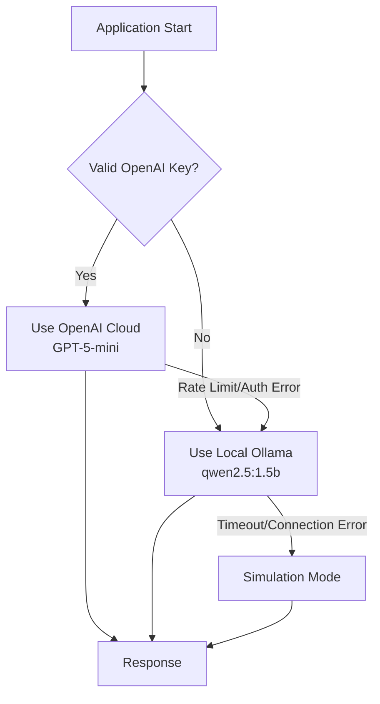

---

## Error Handling & Fallback

The system implements **robust fallback mechanisms** ensuring it never crashes:

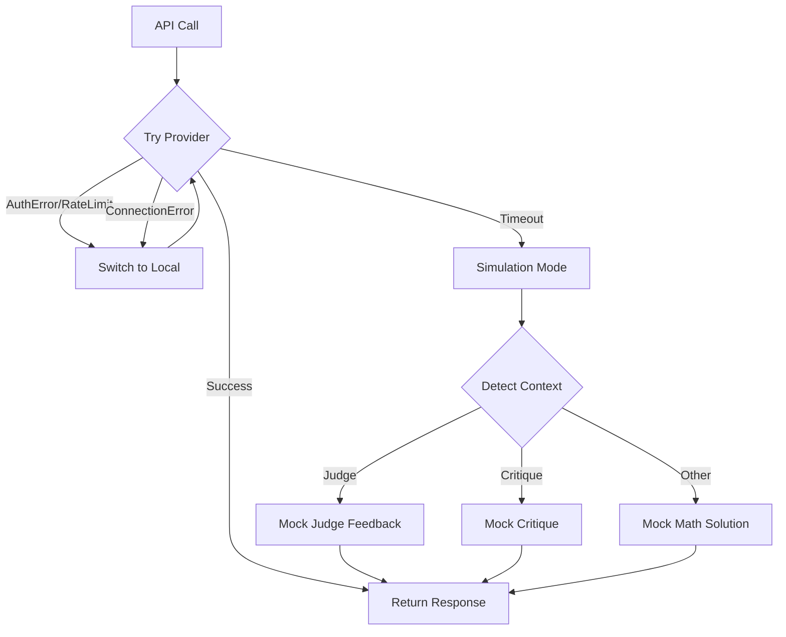

---

## Theoretical Framework

### Sycophancy Definition

Sycophancy occurs when:

$$\text{Sycophancy}(A_i, t) = \begin{cases} 1 & \text{if } \text{Correct}(A_i, t-1) = \text{True} \land \text{Correct}(A_i, t) = \text{False} \land \text{Agree}(A_i, A_j, t) = \text{True} \\ 0 & \text{otherwise} \end{cases}$$

An agent that was **initially correct** becomes **incorrect** after agreeing with a peer's wrong answer.

### Information Flow Comparison

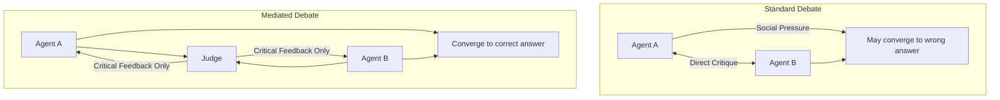

**Key Insight:** In mediated debate, agents never see each other's answers directly. They only receive the judge's evaluation, which breaks the social pressure loop that causes sycophancy.

---

## References

1. **Du, Y., et al. (2023).** "Improving Factuality and Reasoning in Language Models through Multiagent Debate." *arXiv preprint arXiv:2305.14325*.

2. **Hu, X., et al. (2025).** "Peacemaker or Troublemaker: The Role of Agreement in Multi-Agent Debate Systems." *Proceedings of the International Conference on Machine Learning*.

3. **Kahneman, D. (2011).** *Thinking, Fast and Slow*. Farrar, Straus and Giroux.

4. **MMLU Dataset.** Hendrycks et al. (2021). "Measuring Massive Multitask Language Understanding." *ICLR 2021*.

---

## License

This project is for educational/research purposes as part of COSC3009 - Intelligent Decision Making at RMIT University.

## Acknowledgments

- Ollama team for local LLM inference
- Qwen team for the efficient 2.5 model
- Streamlit for the UI framework
- HuggingFace for the MMLU dataset
