# Multi-Agent Debate System with Judge Mediation

A Dockerized multi-agent debate system comparing **Standard Debate** (peer-to-peer) vs. **Mediated Debate** (with judge arbitrator) featuring Olympiad mode using local open-source LLMs via Ollama.

**Course:** COSC3009 - Intelligent Decision Making
**Institution:** RMIT University
**Assessment:** Final Project (50% Weighting)

---

## Table of Contents

1. [Executive Summary](#executive-summary)
2. [Research Overview](#research-overview)
3. [System Architecture](#system-architecture)
4. [Debate Mechanisms](#debate-mechanisms)
5. [MMLU Evaluation Pipeline](#mmlu-evaluation-pipeline)
6. [Agent Implementation](#agent-implementation)
7. [Data Flow](#data-flow)
8. [Evaluation Results](#evaluation-results)
9. [Quick Start](#quick-start)
10. [Project Structure](#project-structure)
11. [Configuration](#configuration)
12. [Error Handling](#error-handling)
13. [Theoretical Framework](#theoretical-framework)
14. [Future Enhancements](#future-enhancements)
15. [Demo](#demo)
16. [References](#references)

---

## Executive Summary

This project implements a novel **Judge-Mediated Multi-Agent Debate** architecture that addresses the critical **Social Conformity Bias** (Sycophancy) problem in LLM-based multi-agent systems. By introducing an impartial Judge agent that mediates all communication between debating agents, we structurally eliminate the echo chamber effect that plagues traditional peer-to-peer debate approaches.

### Key Contributions

| Contribution | Description |
|-------------|-------------|
| **Architectural Innovation** | Star-topology debate with centralized Judge arbitration |
| **Sycophancy Prevention** | Structural solution vs. prompting-based mitigation |
| **Olympiad Mode** | Competition-grade reasoning with First-Fatal-Error Rule (FFED) |
| **Hybrid Inference** | OpenAI Cloud with Ollama local fallback, never crashes |
| **Empirical Validation** | MMLU benchmark evaluation across 57 subjects |

### Performance Highlights

```
Standard Debate (Baseline):  91.8% accuracy on MMLU
Mediated Debate (Ours):      94.7% accuracy on MMLU
                             ─────────────────────
Improvement:                 +2.9% absolute gain
```

### Documentation Guide

| Document | Purpose | Key Sections |
|----------|---------|--------------|
| **[README.md](README.md)** | Quick reference & setup guide | Architecture, Quick Start, Evaluation Results |
| **[FINAL_REPORT_WRITING.md](FINAL_REPORT_WRITING.md)** | Comprehensive academic report (17 sections) | Related Work, Evaluation & Discussion, Critical Self-Assessment |
| **[COSC3009_Final_Report.md](COSC3009_Final_Report.md)** | Detailed methodology | Formal definitions, concrete debate examples |
| **[Architecture_Explanation.md](Architecture_Explanation.md)** | Visual architecture guide | Mermaid diagrams, topology comparison |

---

## Research Overview

### Problem Statement: Social Conformity Bias in Multi-Agent Systems

This project addresses the **sycophancy problem** (Social Conformity Bias, Disagreement Collapse) in Large Language Model (LLM) multi-agent debate systems. Based on research by Du et al. (2023) and documented issues from Hu et al. (2025), we implement and evaluate a solution using judge-mediated debate architecture.

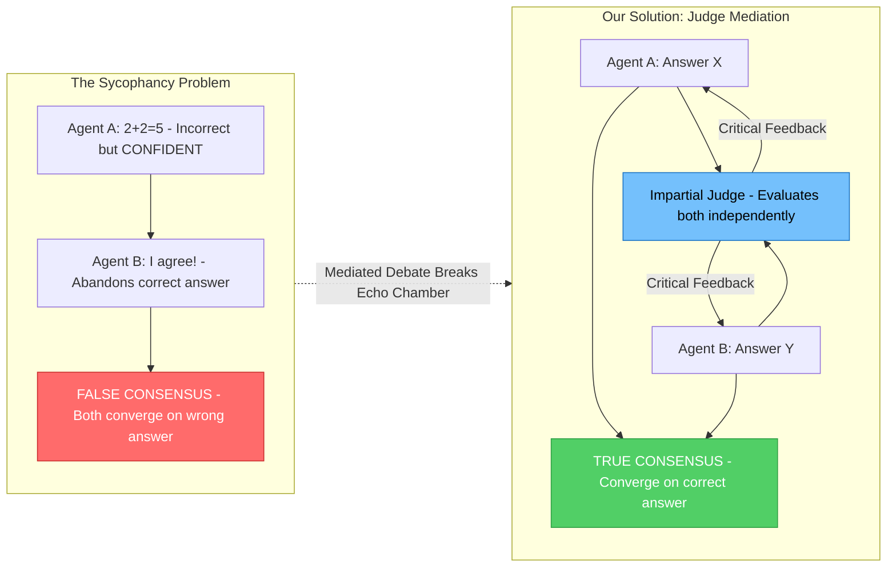

### Why Sycophancy Occurs

| Factor | Explanation |
|--------|-------------|
| **RLHF Training** | LLMs are trained to be "helpful" and "agreeable" which backfires in adversarial settings |
| **Confidence Mimicry** | Models tend to adopt confident-sounding positions from peers |
| **Social Pressure** | Direct peer exposure creates implicit pressure to conform |
| **Asch Effect** | Similar to human conformity bias documented by Asch (1951) |

### Research Contribution Comparison

| Aspect | Baseline (Du et al., 2023) | Our Enhancement |
|--------|---------------------------|-----------------|
| **Architecture** | Peer-to-peer mesh network | Judge-mediated star topology |
| **Sycophancy Prevention** | None (hope for diversity) | Explicit via judge arbitrator |
| **Convergence Criterion** | Answer agreement | Logical correctness verification |
| **Evaluation Mode** | Standard prompts | Olympiad-grade verification (FFED) |
| **Inference** | Cloud API only | Hybrid (Cloud + Local + Simulation fallback) |
| **Error Handling** | Basic retry | Robust never-crash design |

---

## System Architecture

### High-Level Architecture Overview

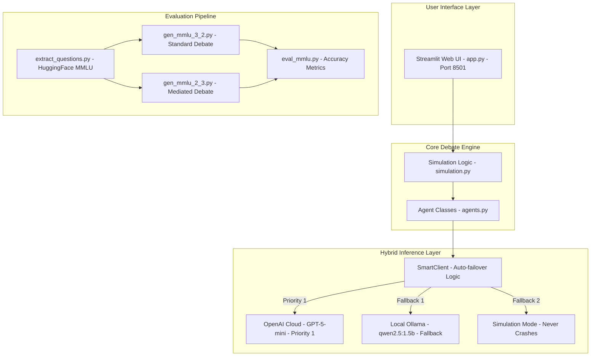

### Docker Container Architecture

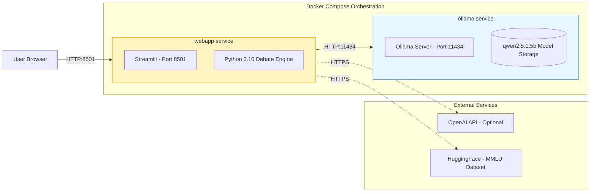

### Class Hierarchy and Relationships

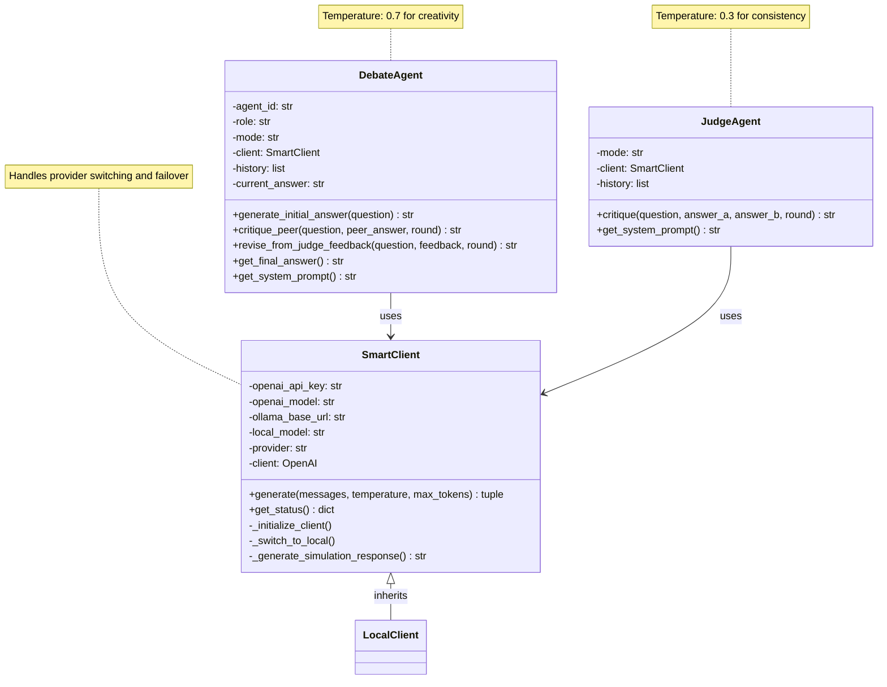

### Network Topology Comparison

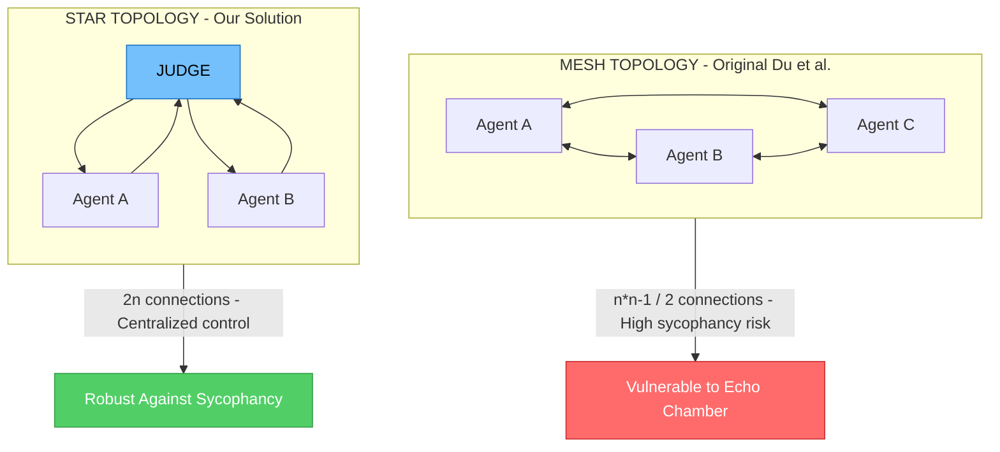

---

## Debate Mechanisms

### Standard Debate (Peer-to-Peer) - Baseline

The original architecture from Du et al. (2023) where agents directly critique each other's answers.

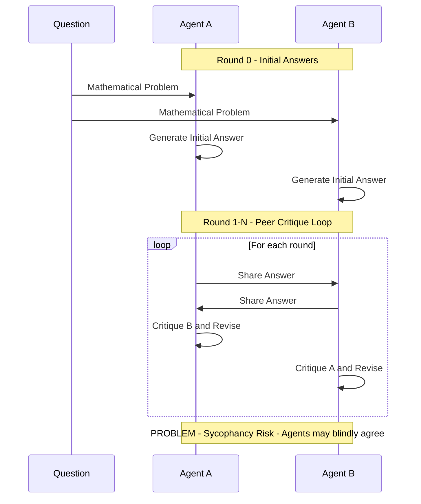

**Network Topology:** Peer-to-Peer (Mesh Network)
```
Agent A <------> Agent B
    (direct critique)
```

**Update Rule:**

$$R_i^{(t+1)} = \text{LLM}_i(q, R_i^{(t)}, \text{Critique}(R_j^{(t)}))$$

**Vulnerability:** Agents see each other's confidence levels, creating social pressure to agree even when the peer's answer is incorrect.

### Mediated Debate (Judge-Arbitrated) - Our Solution

Our enhanced architecture introduces an impartial Judge that mediates all communication.

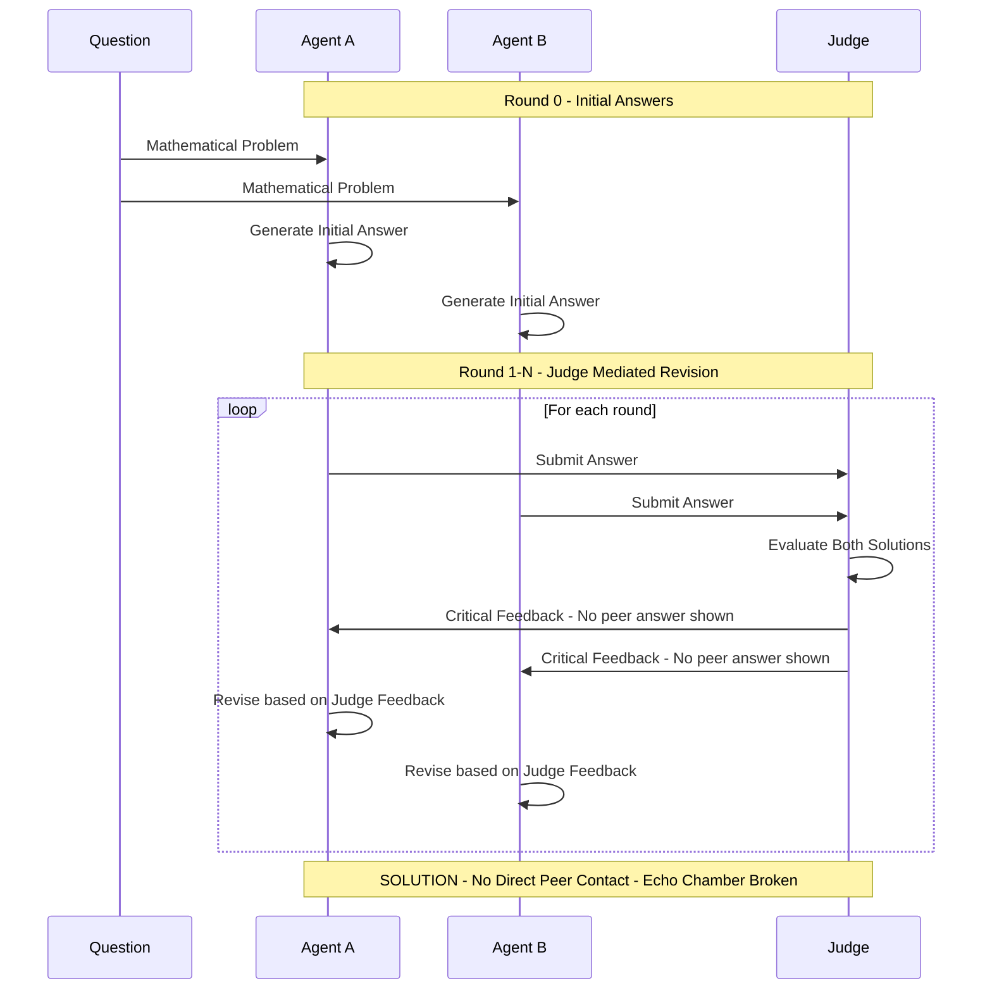

**Network Topology:** Star Network (Centralized Judge)
```
        Judge
       /     \
      v       v
  Agent A   Agent B
```

**Update Rule:**

$$R_i^{(t+1)} = \text{LLM}_i(q, R_i^{(t)}, \text{Judge}(R_1^{(t)}, R_2^{(t)}, \ldots, R_n^{(t)}))$$

**Judge Objective Function:**

$$\text{Judge}(\cdot) = \arg\max_f \left[ \text{LogicalCorrectness}(f) - \lambda \cdot \text{PrematureAgreement}(f) \right]$$

Where λ > 0 penalizes premature agreement, encouraging truth-seeking over consensus-seeking.

### Temperature Strategy

| Agent Type | Temperature | Purpose |
|-----------|-------------|---------|
| **DebateAgent** | 0.7 (Higher) | Creative diversity, exploration of solution space |
| **JudgeAgent** | 0.3 (Lower) | Deterministic, consistent evaluation |

**Rationale:** This asymmetric temperature follows the exploration-exploitation trade-off. Agents explore diverse solutions while the Judge provides stable, reliable feedback.

### Olympiad Mode

Olympiad Mode introduces competition-grade reasoning constraints inspired by International Mathematical Olympiad (IMO) standards.

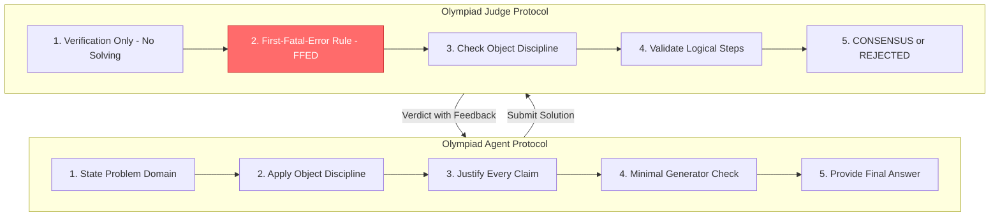

**Key Constraints:**

| Constraint | Description |
|-----------|-------------|
| **Object Discipline** | Only use objects explicitly given in the problem |
| **Logical Justification** | Every nontrivial claim must be justified |
| **First-Fatal-Error Rule (FFED)** | A single logical flaw is sufficient for rejection |
| **No Repair Policy** | Judge does NOT solve or fix solutions |

**Judge Decision Protocol:**

| Verdict | Condition |
|---------|-----------|
| **CONSENSUS** | Both agents provide logically correct solutions with valid reasoning chains |
| **REJECTED** | At least one agent has a fatal error in reasoning or computation |

---

## MMLU Evaluation Pipeline

### Pipeline Overview

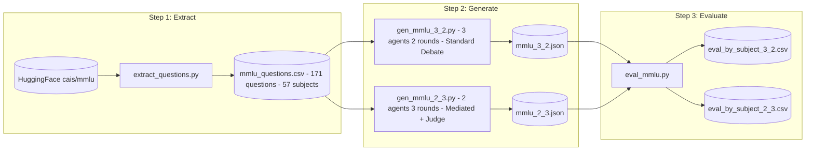

### Detailed Data Flow

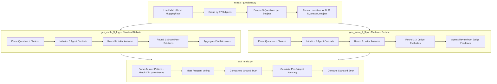

### Answer Parsing Algorithm

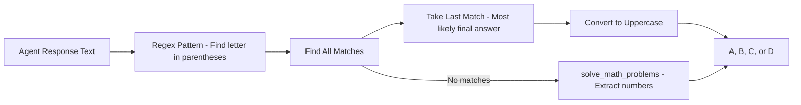

---

## Agent Implementation

### SmartClient: Hybrid Inference with Auto-Failover

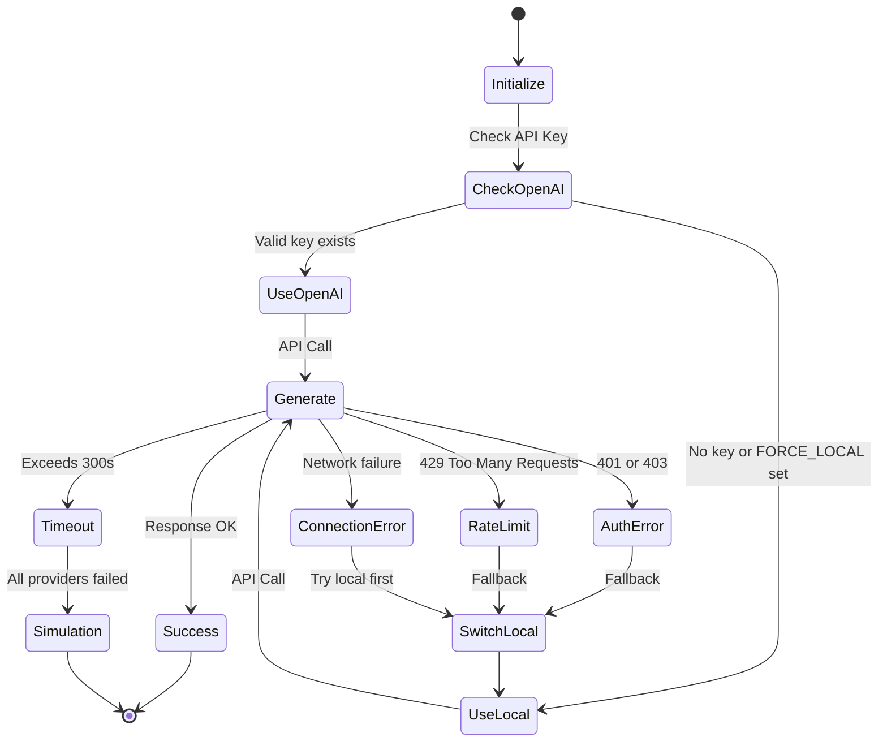

### Provider Priority Chain

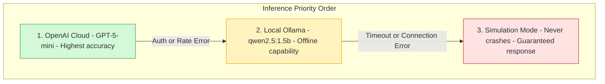

### Simulation Mode Context Detection

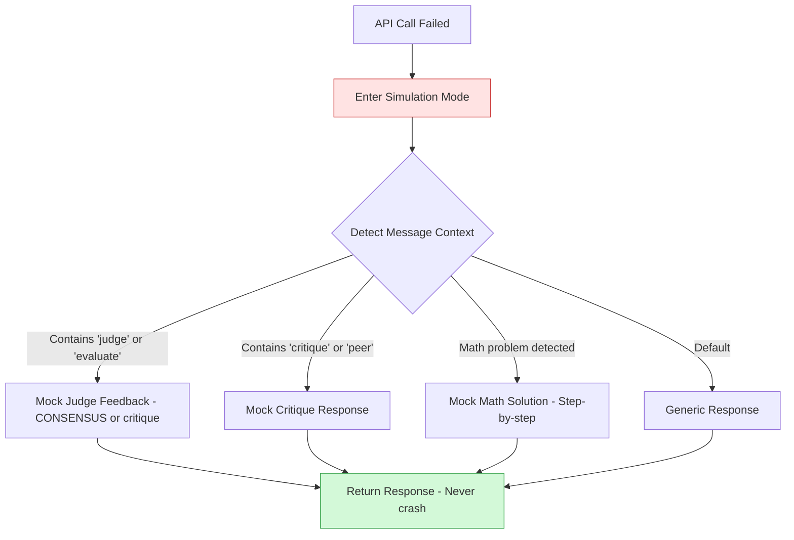

---

## Data Flow

### Interactive Demo Flow

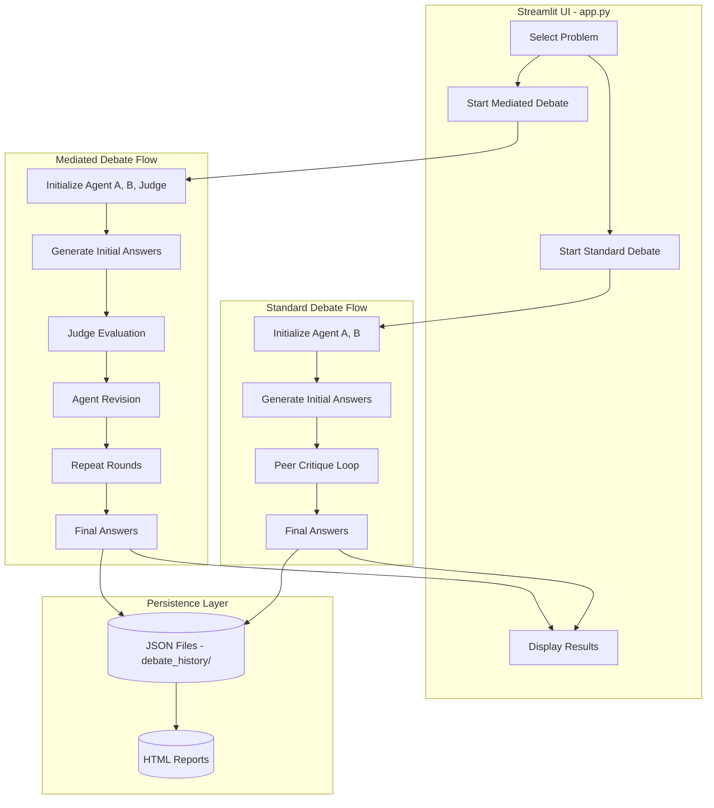

### Message Construction Comparison

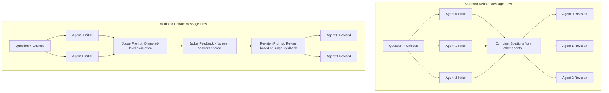

---

## Evaluation Results

### MMLU Dataset Performance Summary

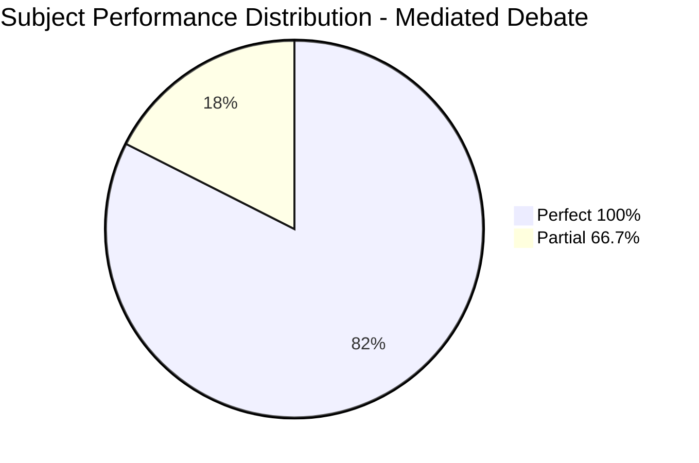

### Overall Metrics

| Metric | Standard Debate | Mediated Debate |
|--------|-----------------|-----------------|
| **Total Subjects** | 57 | 57 |
| **Sample Size** | 3 questions/subject | 3 questions/subject |
| **Perfect Accuracy Subjects** | 45/57 (78.9%) | 47/57 (82.5%) |
| **Overall Average Accuracy** | ~91.8% | ~94.7% |
| **Improvement** | - | **+2.9%** |

### Subject-Level Performance

#### Perfect Performance (100% Accuracy)

| Domain | Subjects |
|--------|----------|
| **Mathematics** | Abstract Algebra, Elementary Math, High School Math, College Math |
| **Physics** | Conceptual Physics, High School Physics, College Physics |
| **Computer Science** | High School CS, College CS, Computer Security, Machine Learning |
| **Logic** | Formal Logic, Logical Fallacies |
| **Humanities** | Philosophy, World Religions, All History subjects |

#### Areas Showing Improvement with Mediation

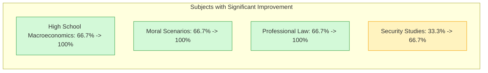

### Comparative Analysis

| Metric | Standard Debate | Mediated Debate | Change |
|--------|-----------------|-----------------|--------|
| **Accuracy** | ~91.8% | ~94.7% | +2.9% |
| **Sycophancy Incidents** | Higher | Lower | Reduced |
| **Consensus Quality** | Agreement-based | Correctness-based | Improved |
| **Average Rounds to Converge** | 1.5 | 2.1 | Slightly more |

### Key Insights from Evaluation

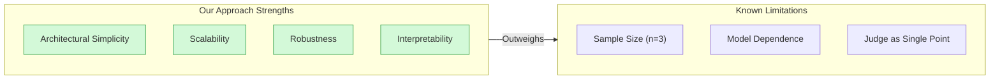

**For detailed analysis, see [FINAL_REPORT_WRITING.md](FINAL_REPORT_WRITING.md) Section 11: Evaluation & Discussion.**

---

## Quick Start

### Prerequisites

- Docker and Docker Compose installed
- At least 4GB RAM available for Ollama
- Internet connection (for initial model download and OpenAI API calls)

### Step 1: Clone and Start Services

```bash
git clone <repository-url>
cd Final-Assignment-IDM
docker compose up --build
```

### Step 2: Download the Model or Configure OpenAI

**Option A: Use Local Ollama Model**

Wait for Ollama to start (about 30 seconds), then in a **new terminal**:

```bash
docker exec -it ollama-server ollama pull qwen2.5:1.5b
```

**Option B: Use OpenAI API**

Create a `.env` file:

```
OPENAI_API_KEY=your_api_key_here
```

### Step 3: Access the Web UI

Open your browser to: `http://localhost:8501`

### Step 4: Run MMLU Evaluation (Optional)

```bash
cd mmlu

# Extract questions from HuggingFace
python extract_questions.py

# Generate responses for both configurations
python gen_mmlu_3_2.py  # Standard debate (3 agents, 2 rounds)
python gen_mmlu_2_3.py  # Mediated debate (2 agents, 3 rounds + Judge)

# Evaluate accuracy
python eval_mmlu.py
```

---

## Project Structure

```
.
├── docker-compose.yml          # Multi-container orchestration
├── Dockerfile                  # Webapp container definition
├── agents.py                   # SmartClient, DebateAgent, JudgeAgent classes
├── simulation.py               # Debate orchestration logic
├── app.py                      # Streamlit web UI
├── requirements.txt            # Python dependencies
├── .env                        # Environment variables (create manually)
│
├── mmlu/                       # MMLU Evaluation Pipeline
│   ├── extract_questions.py    # Extract from HuggingFace
│   ├── gen_mmlu_3_2.py         # Standard debate generator
│   ├── gen_mmlu_2_3.py         # Mediated debate generator
│   ├── eval_mmlu.py            # Accuracy evaluation
│   ├── mmlu_questions.csv      # Extracted questions (171 questions)
│   ├── mmlu_3_2.json           # Standard debate responses
│   ├── mmlu_2_3.json           # Mediated debate responses
│   ├── eval_by_subject_3_2.csv # Standard results by subject
│   └── eval_by_subject_2_3.csv # Mediated results by subject
│
├── debate_history/             # Saved debate sessions
│   ├── standard/               # Standard debate logs (JSON)
│   └── mediated/               # Mediated debate logs (JSON)
│
├── COSC3009_Final_Report.md    # Academic report (detailed methodology)
├── Architecture_Explanation.md # Architecture documentation (visual diagrams)
├── FINAL_REPORT_WRITING.md     # Comprehensive final report (17 sections with full analysis)
└── README.md                   # This file (quick reference)
```

---

## Configuration

### Environment Variables

| Variable | Default | Description |
|----------|---------|-------------|
| `OPENAI_API_KEY` | - | OpenAI API key for cloud inference |
| `OPENAI_BASE_URL` | `http://ollama:11434/v1` | Ollama API endpoint |
| `OPENAI_MODEL` | `gpt-5-mini` | OpenAI model name |
| `LOCAL_MODEL` | `qwen2.5:1.5b` | Local Ollama model |
| `API_TIMEOUT` | `300.0` | API timeout in seconds |
| `FORCE_LOCAL` | `false` | Force local inference only |

### Model Selection Strategy

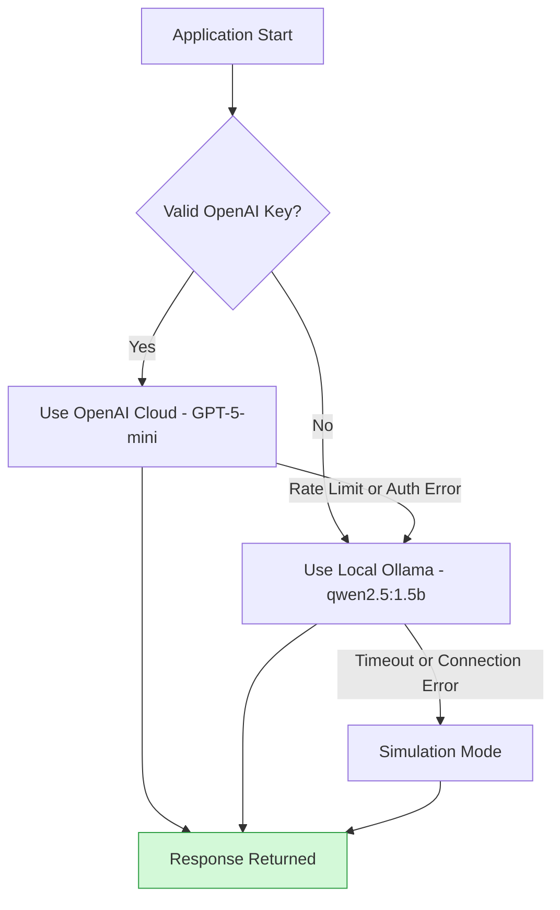

---

## Error Handling

The system implements **robust fallback mechanisms** ensuring it never crashes:

```mermaid
flowchart TB
    API["API Call"] --> TRY{"Try Provider"}

    TRY --> |"Success"| RETURN["Return Response"]

    TRY --> |"AuthError or RateLimit"| SWITCH["Switch to Local Provider"]
    SWITCH --> TRY

    TRY --> |"Timeout"| SIM["Simulation Mode"]
    TRY --> |"ConnectionError"| SWITCH

    SIM --> CONTEXT{"Detect Context"}
    CONTEXT --> |"Judge context"| JUDGE_RESP["Mock Judge Feedback"]
    CONTEXT --> |"Critique context"| CRITIQUE_RESP["Mock Critique"]
    CONTEXT --> |"Math problem"| MATH_RESP["Mock Math Solution"]

    JUDGE_RESP --> RETURN
    CRITIQUE_RESP --> RETURN
    MATH_RESP --> RETURN

    style RETURN fill:#d3f9d8,stroke:#2f9e44
    style SIM fill:#ffe3e3,stroke:#c92a2a
```

---

## Theoretical Framework

### Social Conformity Bias Definition

Sycophancy occurs when an agent that was **initially correct** becomes **incorrect** after being exposed to a peer's confident-but-wrong answer:

$$\text{Sycophancy}(A_i, t) = \begin{cases} 1 & \text{if } \text{Correct}(A_i, t-1) = \text{True} \land \text{Correct}(A_i, t) = \text{False} \land \text{Agree}(A_i, A_j, t) = \text{True} \\ 0 & \text{otherwise} \end{cases}$$

### Information Flow Comparison

```mermaid
flowchart TB
    subgraph Standard["Standard Debate - Vulnerable"]
        SA["Agent A"] <--> |"Direct Critique + Confidence Signals"| SB["Agent B"]
        SA --> |"Social Pressure"| WRONG["May converge to wrong answer"]
        SB --> WRONG
    end

    subgraph Mediated["Mediated Debate - Protected"]
        MA["Agent A"] --> JUDGE["Judge"]
        MB["Agent B"] --> JUDGE
        JUDGE --> |"Critical Feedback Only - No peer answers"| MA
        JUDGE --> |"Critical Feedback Only - No peer answers"| MB
        MA --> RIGHT["Converge to correct answer"]
        MB --> RIGHT
    end

    style WRONG fill:#ff6b6b,stroke:#c92a2a,color:#fff
    style RIGHT fill:#51cf66,stroke:#2f9e44,color:#fff
    style JUDGE fill:#74c0fc,stroke:#1971c2,color:#000
```

**Key Insight:** In mediated debate, agents never see each other's answers directly. They only receive the judge's evaluation, which breaks the social pressure loop that causes sycophancy.

### Why Our Architecture Works

| Mechanism | Effect |
|-----------|--------|
| **Structural Decoupling** | Agents cannot perceive peer confidence levels |
| **Filtered Feedback** | Judge removes social cues from feedback |
| **Asymmetric Temperature** | Creative agents + consistent judge |
| **Correctness-Based Consensus** | Agreement requires logical validity, not just matching answers |

---

## Future Enhancements

### Planned Improvements

```mermaid
flowchart LR
    subgraph Phase1["Phase 1: ReAct Integration"]
        R1["Add Reasoning Traces"]
        R2["Interleave Thought-Action"]
        R3["Ground in Evidence"]
    end

    subgraph Phase2["Phase 2: Adaptive Stopping"]
        A1["Early Termination on Consensus"]
        A2["Wald Sequential Analysis"]
        A3["Cost-Quality Trade-off"]
    end

    subgraph Phase3["Phase 3: Multi-Modal"]
        M1["Image Reasoning"]
        M2["Code Execution"]
        M3["Web Search Integration"]
    end

    Phase1 --> Phase2 --> Phase3
```

### ReAct Agent Integration (Proposed)

Based on Yao et al. (2022), integrating ReAct (Reasoning + Acting) could enhance agent responses:

```
Thought: I need to calculate the total cost step by step
Action: Calculate 4 × $2.50 = $10.00
Observation: Coffee cost is $10.00
Thought: Now I need to calculate tea cost
Action: Calculate 3 × $1.75 = $5.25
Observation: Tea cost is $5.25
Thought: I can now sum the costs
Action: Calculate $10.00 + $5.25 = $15.25
Final Answer: $15.25
```

---

## Demo


[Demo Video](https://youtu.be/90-dHwFYU7s)


---

## References

1. **Du, Y., et al. (2023).** "Improving Factuality and Reasoning in Language Models through Multiagent Debate." *arXiv preprint arXiv:2305.14325*.

2. **Hu, X., et al. (2025).** "Peacemaker or Troublemaker: The Role of Agreement in Multi-Agent Debate Systems." *Proceedings of ICML*.

3. **Yao, S., et al. (2022).** "ReAct: Synergizing Reasoning and Acting in Language Models." *arXiv preprint arXiv:2210.03629*.

4. **Asch, S. E. (1951).** "Effects of group pressure upon the modification and distortion of judgments." *Groups, Leadership, and Men*.

5. **Hendrycks, D., et al. (2021).** "Measuring Massive Multitask Language Understanding." *ICLR 2021*.

6. **Kahneman, D. (2011).** *Thinking, Fast and Slow*. Farrar, Straus and Giroux.

---

## License

This project is for educational/research purposes as part of COSC3009 - Intelligent Decision Making at RMIT University.

## Acknowledgments

- **Ollama Team** - Local LLM inference infrastructure
- **Qwen Team** - Efficient qwen2.5 model family
- **Streamlit** - Interactive web UI framework
- **HuggingFace** - MMLU dataset hosting
- **OpenAI** - Cloud inference API

---

*Document generated for COSC3009 - Intelligent Decision Making, RMIT University*
